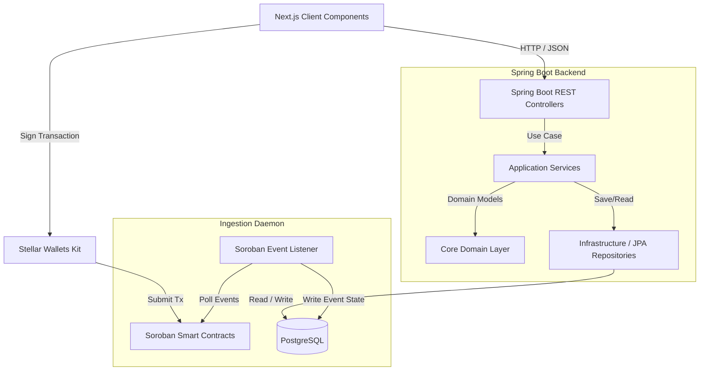

# PactFlow Project Constitution

> **Status:** Active & Non-Negotiable  
> **Target Version:** MVP 1.0 (Level 4 Goal) & Beyond (Level 5+)  
> **Last Updated:** 2026-07-12  

---

## 1. Vision
**PactFlow** is the world's most trusted freelance collaboration platform. We exist to bridge the trust gap between global companies and independent talent. By combining intuitive modern SaaS project management with decentralized escrow technology, PactFlow ensures that:
- **Companies** never pay for incomplete, late, or low-quality work.
- **Freelancers** never work without the absolute guarantee that funds are secured and will be released upon successful milestone completion.
- **Trust** is built into the protocol, not left to chance.

---

## 2. Mission
Create a seamless, enterprise-grade, milestone-based collaboration platform powered by the Stellar network. We replace manual billing, insecure wire transfers, and verbal promises with transparent, automated escrow contracts and automated cross-border payments. We aim to scale to millions of users while maintaining the security, efficiency, and robustness of a global financial system.

---

## 3. Core Principles
These seven core rules govern all architectural, design, and code decisions. They are **non-negotiable**.

*   **Rule 1: Blockchain is ONLY for Trust and Money.**  
    Never store project management details, chat history, comments, or UI state inside Soroban smart contracts. Soroban contracts must only handle:
    - Escrow holding
    - Funding authorization
    - Milestone payment release
    - Refunds (partial or full)
    - Chain events for state synchronization
*   **Rule 2: Spring Boot Handles Business Logic.**  
    The backend is the brain of the SaaS platform. It handles user management, authentication, project setup, milestone specifications, comments, activity streams, analytics, and notifications.
*   **Rule 3: PostgreSQL Stores Application State.**  
    Database is the source of truth for the application state. Under no circumstances should PII (Personally Identifiable Information) be stored on-chain. Only transaction hashes, contract IDs, and public keys belong on-chain.
*   **Rule 4: Frontend Never Directly Owns Business Logic.**  
    The frontend (Next.js 15) is a presentation layer. It must interact with the Spring Boot API for all business logic, reading data, and checking permissions. It only directly talks to the wallet (e.g., Freighter) to prompt signatures for transaction submission.
*   **Rule 5: Security Precedes Features.**  
    We never sacrifice security for velocity. Escrow safety, input validation, wallet signature verification, and private key safety are prioritized above any product feature.
*   **Rule 6: Every Module Must Be Independently Testable.**  
    Our architecture must enforce separation of concerns, enabling unit testing of business logic, database operations, smart contracts, and frontend components in isolation.
*   **Rule 7: Everything is Production-Ready.**  
    No hackathon shortcuts, mock smart contracts, hardcoded administrative overrides, or placeholder security architectures. Every file written must adhere to strict enterprise software standards.

---

## 4. Technical Principles

### Backend (Spring Boot)
- **Framework & Language:** Spring Boot 3.x, Java 21 LTS (utilizing Virtual Threads for I/O performance).
- **Architecture Pattern:** Clean Architecture with Domain-Driven Design (DDD) principles. The code is structured into Domain (pure models, business rules), Application (Use Cases, Services, DTOs), and Infrastructure (Controllers, Repositories, Wallet integration, External APIs).
- **Concurrency & Scaling:** Stateless controllers. Database connection pooling (HikariCP) optimized for high throughput. Use Redis for session caching and rate-limiting if required.
- **Validation:** Strict declarative bean validation (`jakarta.validation`) on all incoming request DTOs.

### Frontend (Next.js 15)
- **Framework & Rendering:** Next.js 15 using the App Router. Use Server Components for secure, search-engine-friendly initial loads, and Client Components for interactive forms, wallets, and stateful widgets.
- **State Management:** Use Zustand for lightweight client-side global state (e.g., UI theme, active wallet address). Use TanStack Query (React Query) for fetching, caching, and synchronizing backend API state.
- **Styling:** Vanilla CSS variables paired with Tailwind CSS for consistent layouts. UI components must be built on top of Radix UI primitives via **shadcn/ui**.
- **Wallet Integration:** Integrate `@stellar/stellar-wallets-kit` to support multiple wallet providers (Freighter, Rabe, xBull, etc.) transparently.

### Blockchain (Soroban & Stellar)
- **Smart Contracts:** Soroban smart contracts written in Rust. Enforce standard, audited, and minimal interfaces.
- **Interaction Model:** The frontend prompts the user to sign transaction envelopes locally via their browser wallet. Signed transactions are submitted to the Stellar network directly or co-signed/relayed by the backend where appropriate.
- **State Synchronization:** The backend runs a resilient ingestion worker monitoring Stellar/Soroban RPC endpoints for transaction and event logs. It parses `PactFlow` contract events to update the PostgreSQL application state asynchronously, ensuring high UI responsiveness.

---

## 5. Security Principles

### Threat Model & Defense-in-Depth
1.  **PII Encryption:** All user profile information, emails, and financial routing details in PostgreSQL must be encrypted at rest.
2.  **No Single Administrator Control:** Smart contracts are self-executing. PactFlow administrators must not possess the ability to unilaterally drain client escrows. Funds can only be moved through mutual agreement (Client release / Freelancer refund) or via multi-sig arbitration rules.
3.  **Wallet Signature Verification:** Every request to the Spring Boot backend that asserts ownership of a Stellar account or performs an on-chain related action must provide a valid cryptographic signature proving ownership of the corresponding public key.
4.  **Secrets Management:** Environment variables are injected at runtime via Docker/Kubernetes config maps. Production secrets must never exist in code repositories. Local developer secrets are stored in `.env.local` or Spring `application-local.yml` (git-ignored).
5.  **Rate Limiting & CORS:** Implement API rate limiting using Spring Cloud Gateway or Bucket4j. CORS policies must explicitly whitelist only authorized web origins.

---

## 6. Architecture Principles

### Clean Architecture Block Diagram


### Architectural Axioms
- **Dependency Rule:** Source code dependencies can only point inwards. The core Domain has no dependencies on database frameworks, Spring annotations, UI packages, or blockchain SDKs.
- **Eventual Consistency:** UI interactions that trigger blockchain state changes must display "Pending" states instantly. The database is updated when the backend event listener catches the on-chain event confirmation, which then triggers a real-time notification to the UI (via Server-Sent Events or WebSockets).

---

## 7. Product Philosophy

### The Pact Flow
The lifecycle of a project milestone must follow a strict state transition model:
1.  **Draft:** Project created; milestones defined, but not funded.
2.  **Funded:** Client transfers funds to the Soroban Escrow contract. The contract locks the funds.
3.  **In Progress:** Freelancer is actively working on the milestone.
4.  **Submitted:** Freelancer submits work delivery with links/documents on the platform.
5.  **Approved:** Client reviews the work and triggers the release function on the smart contract.
6.  **Paid:** Funds are transferred to the Freelancer's Stellar wallet.
7.  **Refunded:** Mutual agreement triggers a contract refund to the Client's Stellar wallet.

### Developer & User Experience
We design for both worlds: Web2 users should feel like they are using a modern SaaS platform (fast loading, clear status updates, clean dashboard), while Web3 power users benefit from full sovereignty, transparency, and minimal gas usage.

---

## 8. Design Philosophy
Inspired by **Linear**, **Stripe**, and **Vercel**:
- **Visuals:** Dark mode first. Use a professional, high-contrast palette (sleek grays, subtle brand colors, vibrant status indicators).
- **Typography:** Modern Sans-Serif fonts (Inter, Outfit) with strict sizing hierarchy and generous line-heights.
- **Interactions:** Layouts are fluid and highly responsive. Use micro-animations (Framer Motion) on page changes, list filtering, and state transitions to give a tactile, responsive feel.
- **No Placeholders:** Real dashboard visualizations, interactive analytics, and high-fidelity mock assets must be used from day one.

---

## 9. Development Standards

### Code Style Guidelines
- **Java:** Follow the Google Java Style Guide. Strict use of Lombok is allowed only for reducing boilerplate in DTOs; core Domain entities must remain clean.
- **TypeScript:** Strict TypeScript compiler rules (`noImplicitAny`, `strictNullChecks`). Avoid the use of `any` at all costs.
- **Rust (Soroban):** Code must be formatted using `cargo fmt` and checked with `cargo clippy`.

### Error Handling
- **Backend:** A unified global exception handler returning standardized RFC-7807 problem details JSON format.
- **Frontend:** Standardized HTTP client interceptors to catch API errors and display elegant toast alerts. React Error Boundaries must wrap routing sections.
- **Smart Contracts:** Soroban errors must return specific custom error codes defined in an enum for easy debugging.

### Testing Thresholds
- **Unit Tests:** Mandatory for all Domain logic, Services, and Soroban contract methods. Minimum 80% coverage.
- **Integration Tests:** Database and API layer verification using Testcontainers (PostgreSQL).
- **E2E Tests:** Core path (Create Project -> Fund -> Submit -> Approve) verified using Playwright.

---

## 10. Folder Standards

### Backend Structure (`/backend`)
```
backend/
├── src/
│   ├── main/
│   │   ├── java/com/pactflow/
│   │   │   ├── domain/               # Domain Models, Aggregates, Entities, Values, Domain Events
│   │   │   ├── application/          # Use Cases, Interfaces, Services, DTOs
│   │   │   └── infrastructure/       # Controllers, Persistence, Security Configs, Ingestion workers
│   │   └── resources/
│   │       ├── db/migration/         # Database migrations (Flyway)
│   │       └── application.yml
│   └── test/                         # Unit & Integration Tests (Testcontainers)
```

### Frontend Structure (`/frontend`)
```
frontend/
├── src/
│   ├── app/                          # Next.js App Router (pages & layouts)
│   ├── components/
│   │   ├── ui/                       # Reusable visual components (shadcn/ui)
│   │   └── shared/                   # Layouts, navigation, cards
│   ├── hooks/                        # Custom React hooks (wallet, data queries)
│   ├── store/                        # Zustand global state stores
│   ├── lib/                          # Utility clients (Stellar SDK, API fetcher)
│   ├── types/                        # TypeScript type definitions
│   └── styles/                       # Global CSS & Tailwind configuration
```

### Smart Contracts Structure (`/contracts`)
```
contracts/
├── escrow/
│   ├── src/                          # Soroban smart contract source code
│   │   ├── contract.rs               # Escrow logic implementation
│   │   ├── lib.rs                    # Module declarations
│   │   └── types.rs                  # Contract data structures & error codes
│   └── Cargo.toml
├── Cargo.toml                        # Cargo workspace configuration
└── Cargo.lock
```

---

## 11. Git Strategy
- **Branching Model:** Trunk-Based Development. All features and fixes are developed in short-lived branches (`feat/*`, `fix/*`, `chore/*`) and merged frequently.
- **Merge Process:** 
  1. Create a Pull Request (PR) against the `main` branch.
  2. The CI pipeline must run linting, static analysis, unit tests, and contract build checks automatically.
  3. A minimum of one peer review approval is required.
  4. Merging is strictly done via Squash Commit to keep a clean history.
- **Commit Messages:** Follow the Conventional Commits specification (e.g., `feat(escrow): implement multi-milestone release function`).

---

## 12. Documentation Standards
- **API Documentation:** The Spring Boot backend must auto-generate OpenAPI 3.0 documentation (Springdoc OpenAPI) available via `/swagger-ui.html` in dev profiles.
- **Smart Contract Docs:** All Soroban functions must be fully documented using rustdoc comments (`///`).
- **Architectural Decision Records (ADRs):** Major architecture changes or library choices must be documented in a markdown log under `docs/adr/`.

---

## 13. Definition of Done (DoD)
A ticket or task is considered complete only when it meets the following criteria:
1.  **Code Quality:** Clean compiled code, free of warning signs and deprecated calls. Code is formatted according to standard rules.
2.  **Automated Testing:** Unit and integration tests are written and successfully pass in the CI environment.
3.  **Security Review:** Code does not introduce SQL injection vectors, XSS, unauthorized endpoints, or smart contract vulnerabilities.
4.  **Database Migration:** A valid Flyway migration script is checked in if changes to the schema were made.
5.  **Documentation:** API endpoints, configuration parameters, and environmental changes are documented.
6.  **Deployment Verification:** The feature compiles and runs flawlessly in the Docker container simulation.

---

## 14. Future Expansion Rules (Level 5+)
To ensure PactFlow's architecture remains extensible for future phases, design patterns must adhere to these forward-looking rules:

- **AI Assistant Integration:** Do not hardcode prompt parsing. Design a modular pipeline where LLM agents interact through a standardized REST/WebSocket interface acting as clients of Spring Boot application services.
- **Arbitration and Dispute Resolution:** The Soroban escrow contract must reserve a metadata slot for an `arbitrator` address. If an arbitrator is defined, the release/refund functions can be bypassed or decided by the arbitrator signature in case of a locked dispute status.
- **Global Reputation System:** Do not calculate scores dynamically on read operations. Design an asynchronous event-driven system where user behaviors (successful payouts, milestones delivered on time) trigger reputation update events in Spring Boot, writing computed scores to PostgreSQL tables for fast display.
- **GitHub Integration:** Implement webhook handler interfaces under the `infrastructure` package that decouple raw GitHub event bodies from core project/milestone state updates.
