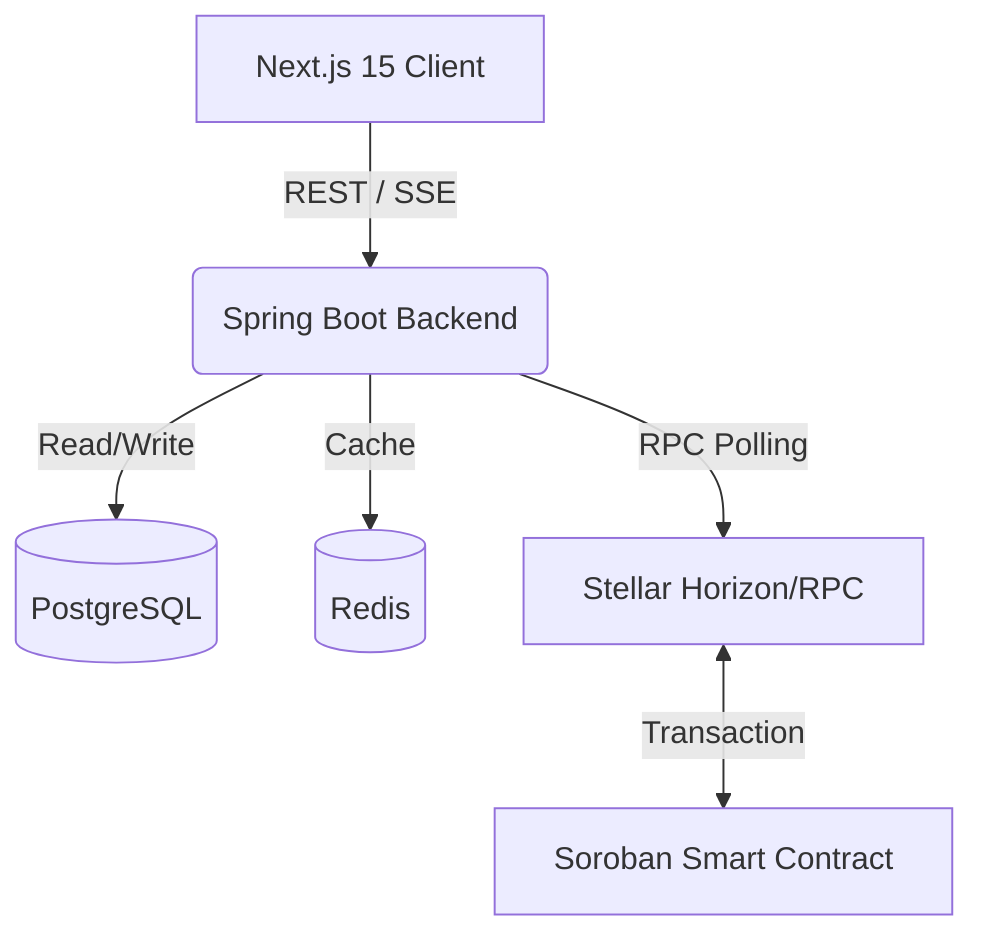

<div align="center">
  
  <h1>PactFlow 🤝</h1>
  <p><strong>Building Trust in Global Freelancing through Blockchain Escrow</strong></p>
  <p>
    
    
    
    
    
  </p>
</div>

---

## 🌎 The Problem

The global freelance economy is booming, but it suffers from a fundamental trust deficit:
- **Companies** fear paying upfront for work that may never be delivered or fails to meet quality standards.
- **Freelancers** fear doing weeks of work only to be ghosted, dealing with chargebacks, or facing arbitrary fee withholding.

Traditional freelance platforms (like Upwork or Fiverr) solve this by acting as centralized arbiters, but they extract **10% to 20% in fees**, dictate terms arbitrarily, and force participants into closed ecosystems.

## 💡 Why PactFlow Exists

**PactFlow** replaces the centralized middleman with a **trustless, decentralized escrow system** powered by the **Stellar Soroban smart contract platform**. 

By locking funds on-chain using XLM, both parties are guaranteed fairness. The company knows their money is protected until the deliverable is approved, and the freelancer knows the money is fully funded and reserved before they write a single line of code.

Zero massive platform fees. True mathematical trust.

---

## ✨ Features

> **[🎥 Watch the 5-Minute Demo Video Here](#)** *(Link placeholder)*

- **Milestone-Based Escrow:** Break large projects into funded milestones.
- **Soroban Smart Contracts:** 100% on-chain fund locking and releasing via Stellar.
- **Real-Time Dashboards:** Built with Server-Sent Events (SSE) and React Query for instant UI updates.
- **Premium Glassmorphism UI:** Next.js 15 App Router with full Light/Dark mode support.
- **Automated Workflow:** From `Draft` -> `Pending Funding` -> `Funded` -> `In Progress` -> `Delivered` -> `Approved` -> `Released`.

*([Insert UI Screenshot here])*

---

## 🏗️ Architecture

PactFlow is built on a robust, enterprise-grade technology stack separated into three core pillars:

### 1. Smart Contract Layer (Soroban / Stellar)
- **Rust-based Soroban Contracts:** Deployed on the Stellar Testnet.
- **Operations:** `deposit()`, `release()`, and `refund()`.
- **Event Emission:** Contract state changes emit on-chain events that are ingested by our backend listener daemon.

### 2. Backend API (Spring Boot 3 + Java 21)
- **Virtual Threads:** High-throughput concurrent processing utilizing Java 21 Project Loom.
- **Clean Architecture:** Strict separation of Domain, Application, Infrastructure, and Presentation layers.
- **Data Persistence:** PostgreSQL 16 managed by Flyway migrations.
- **Caching & Rate Limiting:** Redis 7 for high-performance state retrieval and API endpoint protection.
- **SSE Broadcasting:** Real-time push notifications to clients on contract status changes.

### 3. Frontend App (Next.js 15 + React)
- **React Query:** Intelligent caching, deduplication, and background synchronization of server state.
- **Tailwind CSS:** Fully semantic design tokens bridging Light/Dark mode seamlessly without hardcoded hex colors.
- **Zustand:** Lightweight global UI state management.



---

## 🔒 Security Posture

We treat security as a first-class citizen:
- **JWT Authentication:** Stateless, signed JWTs with strict expiration.
- **Argon2 Hashing:** Industry-standard password hashing protecting user credentials.
- **CORS Protection:** Strict Origin validation to prevent CSRF.
- **Rate Limiting:** IP-based token bucket rate limiting via Redis.
- **Optimistic Locking:** `@Version` entities preventing race conditions during concurrent escrow state transitions.

---

## 🚀 Deployment & Local Development

PactFlow uses a unified Docker Compose architecture for immediate local development.

### Prerequisites
- Node.js 20+
- Java 21
- Docker & Docker Compose

### 1-Click Start
We provide a unified launcher script that spins up the database, Redis, Mailhog, the Spring Boot API, and the Next.js frontend all at once:

```bash
./start-dev.sh
```
*Access the frontend at `http://localhost:3000` and the API at `http://localhost:8080`.*

### Environment Variables

**Backend (`backend/src/main/resources/application.yml`)**
```yaml
spring.datasource.url: jdbc:postgresql://localhost:5432/pactflow_app
spring.data.redis.host: localhost
stellar.network.passphrase: Test SDF Network ; September 2015
stellar.rpc.url: https://soroban-testnet.stellar.org
```

**Frontend (`frontend/.env.local`)**
```env
NEXT_PUBLIC_API_URL=http://localhost:8080/api/v1
NEXT_PUBLIC_STELLAR_NETWORK=TESTNET
```

---

## 📚 API Documentation

When the backend is running, the interactive OpenAPI/Swagger documentation is available at:
👉 **`http://localhost:8080/swagger-ui.html`**

---

## 📁 Folder Structure

```
pactflow/
├── backend/                  # Spring Boot 3 Java API
│   ├── src/main/java/...     # Clean Architecture (Domain, Auth, Escrow)
│   ├── src/main/resources/   # application.yml, Flyway V1-V14 migrations
│   └── build.gradle          # Dependency management
├── frontend/                 # Next.js 15 UI
│   ├── src/app/              # App Router (Pages, Layouts)
│   ├── src/components/       # React Components (UI, Layout, Landing)
│   ├── src/styles/           # globals.css, design-tokens.css
│   └── tailwind.config.ts    # Theme configuration
└── contracts/                # Soroban Rust Contracts (Upcoming)
```

---

## 🛣️ Roadmap

- [x] Level 4 MVP Submission.
- [ ] Mainnet deployment of Soroban contracts.
- [ ] Dispute resolution arbitration mechanism.
- [ ] Multi-sig corporate wallets.
- [ ] Automated code review integrations (GitHub Actions trigger).

## ⚠️ Known Limitations (Testnet Phase)
- Currently strictly deployed to **Stellar Testnet**. Do not send real XLM.
- Escrow timeouts and dispute triggers are currently mocked via admin override APIs to facilitate MVP demonstration.

---

## 🤝 Contributors

- Developed by the PactFlow Team for the Soroban ecosystem.

## 📄 License

This project is licensed under the [MIT License](LICENSE).