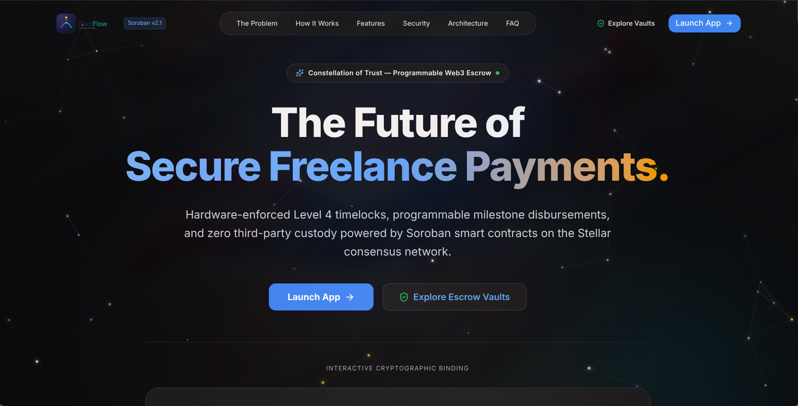
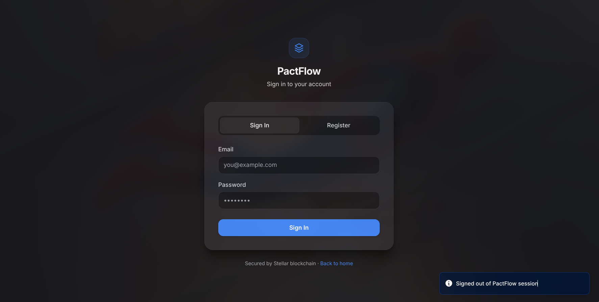
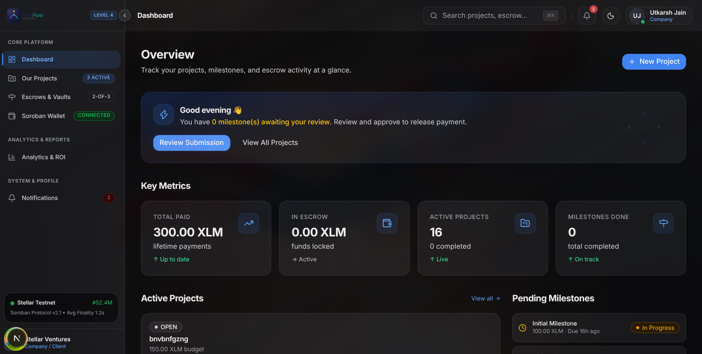
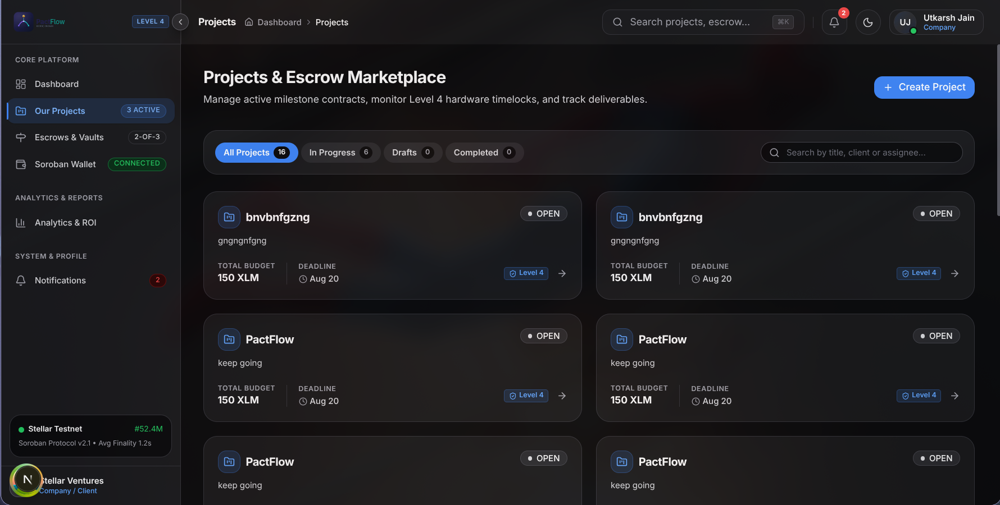
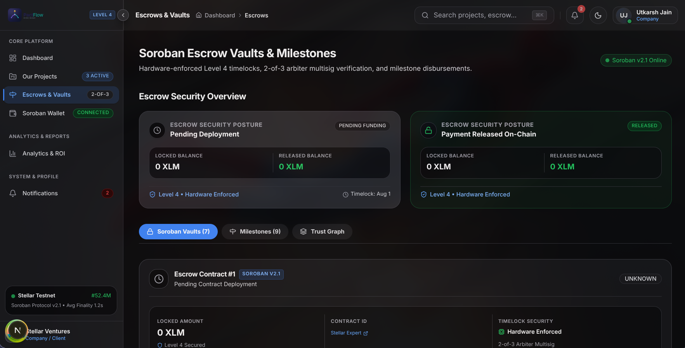
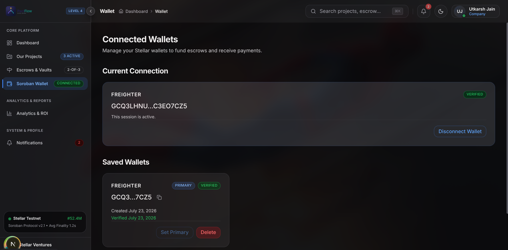
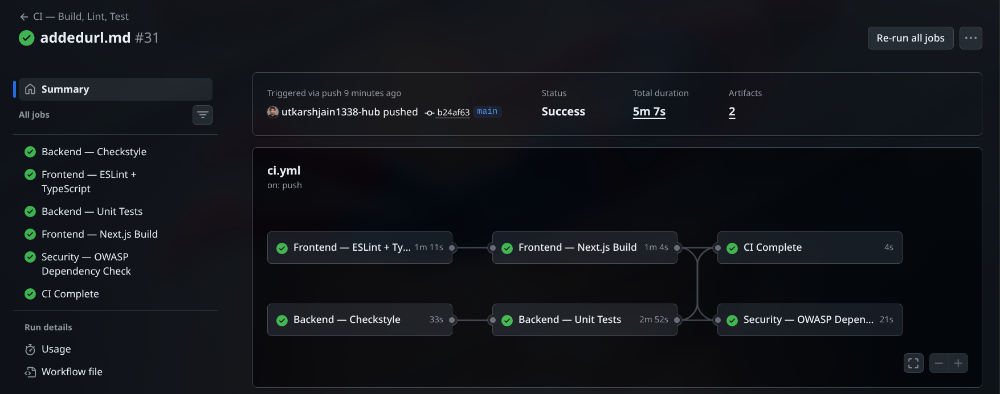
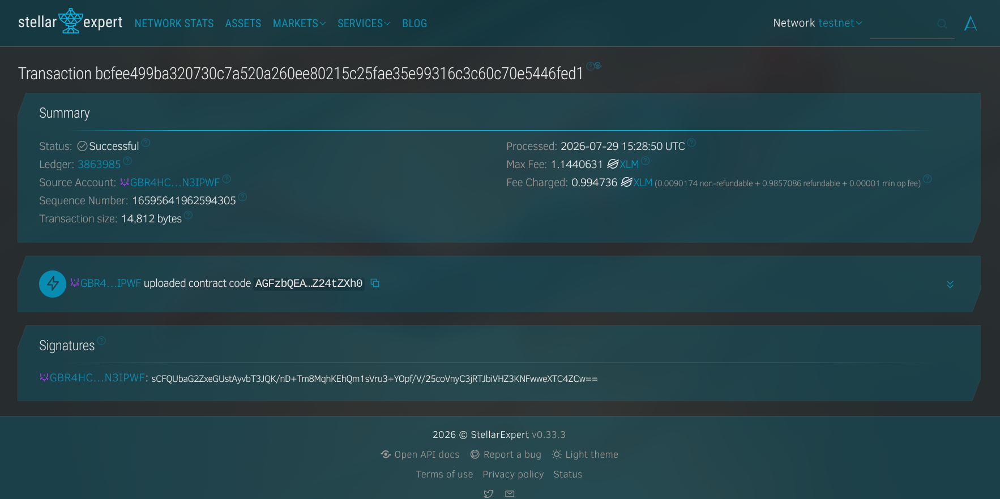

# PactFlow — Milestone-Based Escrow Platform on Stellar Soroban

> A production-grade, full-stack escrow dApp where companies and freelancers transact through milestone-gated Soroban smart contracts. Built for the Stellar Build Better certification.

[](https://github.com/utkarshjain1338-hub/PactFlow/actions/workflows/ci.yml)


---

## 🌐 Live Demo

| Service | URL |
|---------|-----|
| **Frontend** | `<!-- PASTE YOUR VERCEL URL HERE -->` |
| **Backend API** | `<!-- PASTE YOUR RENDER URL HERE -->` |
| **Network** | Stellar Testnet |

---

## 💡 Problem Statement

Freelancers and companies face a trust deficit in remote work. Clients fear paying for undelivered work; freelancers fear completing work and never getting paid. Traditional escrow services are slow, expensive, and opaque.

**PactFlow solves this** by locking funds in a Soroban smart contract on the Stellar blockchain. Funds are released only when milestones are approved — cryptographically enforced, transparent, and irreversible. No middleman. No trust required.

---

## ✨ Features

### Smart Contract (Rust / Soroban SDK)

| Function | Description |
|----------|-------------|
| `initialize` | Creates the escrow: records parties, token, amount, and milestone count |
| `deposit` | Transfers the exact escrow amount from client into the contract |
| `approveMilestone` | Approves a milestone (bitmap-based). Releases funds when all approved |
| `refund` | Returns the full amount to the client (only while funded) |
| `cancel` | Cancels the escrow before any deposit is made |
| `getEscrow` | Returns the full escrow snapshot to any caller |

**On-chain events**: `pactflow/created` · `pactflow/deposited` · `pactflow/approved` · `pactflow/released` · `pactflow/refunded`

### Backend (Spring Boot 3.4 / Java 21)

- **RESTful API** — 40+ endpoints across 8 controllers (Auth, Projects, Milestones, Escrows, Wallets, Users, Transactions, Health)
- **JWT Authentication** — Argon2id password hashing, access + refresh token rotation, session management
- **Rate Limiting** — Bucket4j-based: 300 req/min reads, 60 req/min writes, 3 req/hr password reset
- **Soroban Integration** — `SorobanEscrowGateway` builds unsigned XDRs, simulates via Soroban RPC, and broadcasts signed transactions
- **Domain-Driven Design** — Hexagonal architecture: domain → application → infrastructure
- **Observability** — Structured JSON logging, Spring Actuator health probes, JaCoCo coverage, OWASP dependency scanning
- **128 unit + integration tests** across 15 test suites

### Frontend (Next.js 16 / React 19 / TypeScript)

- **Stellar Wallets Kit** — Connect via Freighter, Albedo, LOBSTR, or WalletConnect
- **Real-time Dashboard** — Live project stats, escrow summaries, and milestone tracking
- **Light / Dark Mode** — System-aware theme toggle with semantic design tokens
- **Framer Motion Animations** — Smooth page transitions, card hover effects, and micro-interactions
- **TanStack Query** — Automatic cache invalidation, optimistic updates, and retry logic
- **Zustand State Management** — Minimal, performant global state for UI preferences
- **Vercel Analytics + PostHog** — Production monitoring and product analytics
- **Sentry Error Tracking** — Automated error capture with source maps

---

## 🏗️ Architecture

```
┌─────────────┐     JWT Bearer      ┌──────────────────────────────────────────┐
│  Next.js 16 │◄───────────────────►│         Spring Boot 3.4 API              │
│  React 19   │     REST / SSE      │  ┌──────────┐  ┌─────────────────────┐   │
│  Tailwind 4 │                     │  │ Auth     │  │ Project / Milestone │   │
│  Zustand    │                     │  │ Service  │  │ Service             │   │
│  TanStack Q │                     │  └──────────┘  └─────────────────────┘   │
└──────┬──────┘                     │  ┌──────────┐  ┌─────────────────────┐   │
       │                            │  │ Escrow   │  │ Wallet Service      │   │
       │  Freighter                 │  │ Service  │  │ (Signature Verify)  │   │
       │  Signs XDR                 │  └────┬─────┘  └─────────────────────┘   │
       ▼                            │       │                                   │
┌─────────────┐                     │       ▼                                   │
│  Freighter  │                     │  ┌──────────────────────┐                 │
│  Wallet     │                     │  │ SorobanEscrowGateway │                 │
└─────────────┘                     │  │ (Stellar Java SDK)   │                 │
                                    │  └──────────┬───────────┘                 │
                                    │             │                             │
                                    └─────────────┼─────────────────────────────┘
                                                  │ Simulate + Broadcast
                                                  ▼
                                    ┌─────────────────────────┐
                                    │  Stellar Soroban Testnet │
                                    │  PactFlowEscrow Contract │
                                    └────────────┬────────────┘
                                                 │
                              ┌──────────────────┼──────────────────┐
                              ▼                  ▼                  ▼
                        ┌───────────┐    ┌──────────────┐   ┌────────────┐
                        │PostgreSQL │    │    Redis      │   │  MailHog   │
                        │  16       │    │    7          │   │  (SMTP)    │
                        └───────────┘    └──────────────┘   └────────────┘
```

---

## 📜 Contract Address (Testnet)

**PactFlowEscrow Contract**:

```text
CBCXJVSGVYYEQDNMMF3E53SW22VYY2ESW7LNF7HEWLFECVJ27NV4T7AX
```

> Deploy your own: see [Deployment](#-deploy-contracts) below.

---

## 🧾 Sample Transaction

**Escrow Created**

```text
Hash: bcfee499ba320730c7a520a260ee80215c25fae35e99316c3c60c70e5446fed1
Explorer: https://stellar.expert/explorer/testnet/tx/bcfee499ba320730c7a520a260ee80215c25fae35e99316c3c60c70e5446fed1
```

---

## 🚀 Quick Start

### Prerequisites

- Java 21 (Temurin recommended)
- Node.js 20+ with npm
- Docker & Docker Compose
- Rust + `wasm32-unknown-unknown` target (for contract development)
- [Stellar CLI](https://developers.stellar.org/docs/tools/stellar-cli)

### 1. Clone & Install

```bash
git clone https://github.com/utkarshjain1338-hub/PactFlow.git
cd PactFlow
```

### 2. Start Infrastructure

```bash
docker-compose up -d postgres redis mailhog
```

### 3. Run Backend

```bash
cd backend
./gradlew bootRun --args='--spring.profiles.active=dev'
```

The API will be available at `http://localhost:8080`.

### 4. Run Frontend

```bash
cd frontend
npm install
npm run dev
```

Open [http://localhost:3000](http://localhost:3000) and register an account.

### 5. Deploy Contracts

```bash
cd contracts

# Build the WASM
cargo build --release --target wasm32-unknown-unknown

# Deploy to Testnet
stellar contract deploy \
  --wasm target/wasm32-unknown-unknown/release/pactflow_escrow.wasm \
  --source <YOUR_SECRET_KEY> \
  --network testnet
```

---

## 🧪 Tests

### Backend (128 tests)

```bash
cd backend
./gradlew test
```

| Suite | Tests | Coverage |
|-------|-------|----------|
| Domain model (User, Project, Escrow, Email) | 24 | State machines, invariants |
| Controller WebMvc (Auth, Escrow, Milestone, User, Wallet, Health) | 56 | HTTP verbs, status codes, validation |
| Security (JWT, Rate Limiting) | 16 | Token generation, AT-04, bucket limits |
| Integration (Persistence, Optimistic Locking) | 12 | Repository round-trips |
| Exception Handler (RFC 7807) | 12 | All exception → ProblemDetail mappings |
| Scheduled Jobs (Account Anonymization) | 4 | GDPR batch processing |

### Smart Contract (4 tests)

```bash
cd contracts
cargo test --all
```

- `initialize_deposit_and_release_happy_path` — Full lifecycle from creation to fund release
- `cannot_initialize_twice` — Prevents duplicate escrow creation
- `wrong_state_transitions_fail` — Rejects deposit/refund/approve on cancelled escrows
- `duplicate_milestone_approval_is_rejected` — Prevents double-approval of same milestone

---

## 🔐 Security

| Layer | Implementation |
|-------|---------------|
| **Password Hashing** | Argon2id (memory-hard, GPU-resistant) |
| **JWT Tokens** | HS256, 256-bit secret, 15-min access + 7-day refresh with rotation |
| **Rate Limiting** | Bucket4j per-IP: 300/min reads, 60/min writes, 3/hr password reset |
| **CORS** | Strict allowlist via `CORS_ALLOWED_ORIGINS` |
| **Contract Auth** | `require_auth()` on every write function (Soroban native) |
| **No Private Keys** | Backend and frontend never handle or store private keys |
| **Container Security** | Non-root Docker user, JRE-only runtime (200MB vs 600MB JDK) |
| **OWASP Scanning** | Automated dependency-check in CI pipeline |
| **GDPR Compliance** | Scheduled account anonymization job with batch processing |

---

## 📡 API Documentation

### Auth (`/api/v1/auth`)

| Method | Endpoint | Description |
|--------|----------|-------------|
| POST | `/register` | Create account (Argon2id hash) |
| POST | `/login` | Authenticate, receive JWT + refresh token |
| POST | `/refresh` | Rotate tokens |
| POST | `/logout` | Revoke session |
| POST | `/forgot-password` | Send reset email |
| POST | `/reset-password` | Complete password reset |
| POST | `/verify-email` | Verify email address |
| GET | `/me` | Current user profile |

### Projects (`/api/v1/projects`)

| Method | Endpoint | Description |
|--------|----------|-------------|
| POST | `/` | Create project |
| GET | `/` | List user's projects |
| GET | `/{id}` | Get project details |
| PATCH | `/{id}` | Update project |
| DELETE | `/{id}` | Delete project |
| POST | `/{id}/link-client-wallet` | Link client Stellar wallet |
| POST | `/{id}/link-freelancer-wallet` | Link freelancer Stellar wallet |
| POST | `/{id}/activate` | Activate project |
| POST | `/{id}/archive` | Archive project |
| GET | `/me` | List my projects |

### Milestones (`/api/v1/projects/{projectId}/milestones`)

| Method | Endpoint | Description |
|--------|----------|-------------|
| POST | `/` | Create milestone |
| GET | `/` | List project milestones |
| PUT | `/{milestoneId}` | Update milestone |
| DELETE | `/{milestoneId}` | Delete milestone |
| POST | `/{milestoneId}/submit` | Submit deliverable |
| POST | `/{milestoneId}/review` | Mark as in-review |
| POST | `/{milestoneId}/approve` | Approve milestone |
| POST | `/{milestoneId}/reject` | Reject milestone |

### Escrows (`/api/v1/escrows`)

| Method | Endpoint | Description |
|--------|----------|-------------|
| POST | `/` | Create escrow |
| GET | `/` | List escrows by project |
| GET | `/{id}` | Get escrow details |
| POST | `/{id}/initialization-transaction` | Build Soroban `initialize()` XDR |
| POST | `/{id}/funding-transaction` | Build Soroban `deposit()` XDR |
| POST | `/{id}/release` | Build Soroban `approveMilestone()` XDR |
| POST | `/{id}/refund` | Build Soroban `refund()` XDR |

### Transactions (`/api/v1/transactions`)

| Method | Endpoint | Description |
|--------|----------|-------------|
| POST | `/` | Submit signed XDR → broadcast to Stellar |
| GET | `/{id}` | Get transaction by ID |

### Wallets (`/api/v1/users/me/wallets`)

| Method | Endpoint | Description |
|--------|----------|-------------|
| POST | `/` | Link Stellar wallet |
| GET | `/` | List user wallets |
| POST | `/{id}/challenge` | Generate signature challenge |
| POST | `/{id}/verify` | Verify wallet ownership |
| PATCH | `/{id}/primary` | Set as primary wallet |
| DELETE | `/{id}` | Remove wallet |

---

## 🛠 CI/CD

GitHub Actions pipeline in `.github/workflows/ci.yml`:

| Job | Steps |
|-----|-------|
| **lint-backend** | Checkstyle (Google Java Style Guide) |
| **lint-frontend** | TypeScript type-check + ESLint |
| **test-backend-unit** | Gradle test + JaCoCo coverage report |
| **build-frontend** | Next.js production build |
| **security-scan** | OWASP dependency-check (main branch only) |
| **ci-complete** | All-green gate |

---

## 📁 Project Structure

```
PactFlow/
├── .github/workflows/ci.yml       # CI pipeline
├── contracts/
│   └── escrow/
│       ├── src/
│       │   ├── lib.rs              # PactFlowEscrow contract (6 functions, 4 tests)
│       │   └── types.rs            # EscrowData, EscrowStatus, Events, Errors
│       ├── tests/escrow.rs         # Integration tests
│       └── Cargo.toml
├── backend/
│   ├── Dockerfile                  # Multi-stage JDK 21 build
│   ├── build.gradle
│   └── src/
│       ├── main/java/com/pactflow/
│       │   ├── domain/             # Entities: User, Project, Milestone, Escrow, Wallet
│       │   ├── application/        # Services: Auth, Project, Milestone, Escrow, Wallet
│       │   └── infrastructure/
│       │       ├── web/controller/  # 8 REST controllers
│       │       ├── soroban/         # SorobanEscrowGateway (Stellar SDK)
│       │       ├── persistence/     # JPA repositories + Redis cache
│       │       └── config/          # Security, CORS, Rate Limiting
│       └── test/                   # 128 unit + integration tests
├── frontend/
│   ├── src/
│   │   ├── app/                    # Next.js 16 pages (App Router)
│   │   ├── components/
│   │   │   ├── layout/             # DashboardShell, Sidebar, Navbar, ThemeToggle
│   │   │   ├── pactflow/           # ProjectCard, EscrowVault, MilestoneTimeline
│   │   │   └── ui/                 # Button, Input, Dialog, EmptyState (shadcn/ui)
│   │   ├── contexts/               # AuthContext (JWT session management)
│   │   ├── hooks/                  # useDashboardData (TanStack Query)
│   │   ├── store/                  # Zustand UI store
│   │   └── lib/                    # API client, utils, mock data
│   └── package.json
├── docker-compose.yml              # PostgreSQL 16, Redis 7, MailHog
└── README.md
```

---

## 🧰 Tech Stack

| Layer | Technology |
|-------|-----------|
| **Smart Contract** | Rust, Soroban SDK, `contracttype` / `contracterror` macros |
| **Backend** | Java 21, Spring Boot 3.4, Spring Security, Spring Data JPA |
| **Database** | PostgreSQL 16 (Hibernate/JPA), Redis 7 (session cache, rate limits) |
| **Frontend** | Next.js 16, React 19, TypeScript 5, Tailwind CSS 4 |
| **UI Components** | shadcn/ui, Radix UI, Lucide Icons, Framer Motion |
| **State** | Zustand (UI), TanStack React Query (server state) |
| **Wallet** | Stellar Wallets Kit (Freighter, Albedo, LOBSTR, WalletConnect) |
| **Auth** | JWT (HS256) + Argon2id + Refresh Token Rotation |
| **Observability** | Vercel Analytics, PostHog, Sentry, Spring Actuator |
| **CI/CD** | GitHub Actions (Checkstyle, ESLint, JUnit, OWASP) |
| **Infra** | Docker, Docker Compose, Vercel (frontend), Render (backend) |

---

## 📸 Screenshots

### 🏠 Landing Page
<!--  -->
`<!-- PASTE SCREENSHOT HERE -->`

### 🔐 Auth Page (Login / Register)
<!--  -->
`<!-- PASTE SCREENSHOT HERE -->`

### 📊 Dashboard
<!--  -->
`<!-- PASTE SCREENSHOT HERE -->`

### 📁 Projects Page
<!--  -->
`<!-- PASTE SCREENSHOT HERE -->`

### ➕ Create Project
<!--  -->
`<!-- PASTE SCREENSHOT HERE -->`

### 🔒 Escrow Vaults
<!--  -->
`<!-- PASTE SCREENSHOT HERE -->`

### 💼 Wallet Connection
<!--  -->
`<!-- PASTE SCREENSHOT HERE -->`

### 🌙 Light / Dark Mode
<!--  -->
`<!-- PASTE SCREENSHOT HERE -->`

### ✅ CI Pipeline Passing
<!--  -->
`<!-- PASTE SCREENSHOT HERE -->`

### 🔗 Stellar Explorer — Transaction Hash
<!--  -->
`<!-- PASTE SCREENSHOT HERE -->`

---

## 🎥 Video Demo

<!-- PASTE YOUR VIDEO LINK BELOW -->
[Video Demo](<!-- PASTE GOOGLE DRIVE / YOUTUBE / LOOM LINK HERE -->)

---

## 🗺️ Roadmap

- [x] Soroban escrow smart contract with milestone-gated release
- [x] Full-stack Spring Boot + Next.js application
- [x] JWT authentication with refresh token rotation
- [x] Freighter wallet integration for transaction signing
- [x] Light / Dark mode with semantic design tokens
- [x] CI/CD with Checkstyle, ESLint, JUnit, and OWASP
- [x] Docker Compose local development environment
- [ ] Real-time notifications via Server-Sent Events
- [ ] Dispute resolution with arbiter multisig
- [ ] Mainnet deployment with production KYC
- [ ] Mobile-responsive PWA

---

## ⚠️ Known Limitations

- **Testnet Only** — Contract is deployed on Stellar Testnet. Testnet tokens have no monetary value.
- **Single-Milestone Escrow** — The backend currently treats each escrow as a single-milestone contract. Multi-milestone support exists in the smart contract but is not fully wired in the UI.
- **No Real Email Delivery** — Email verification uses MailHog in development. Production deployment requires configuring an SMTP provider.

---

## 👨‍💻 Contributors

| Name | Role |
|------|------|
| **Utkarsh Jain** | Full-Stack Developer |

---

## 📄 License

MIT — see [LICENSE](LICENSE) for details.
