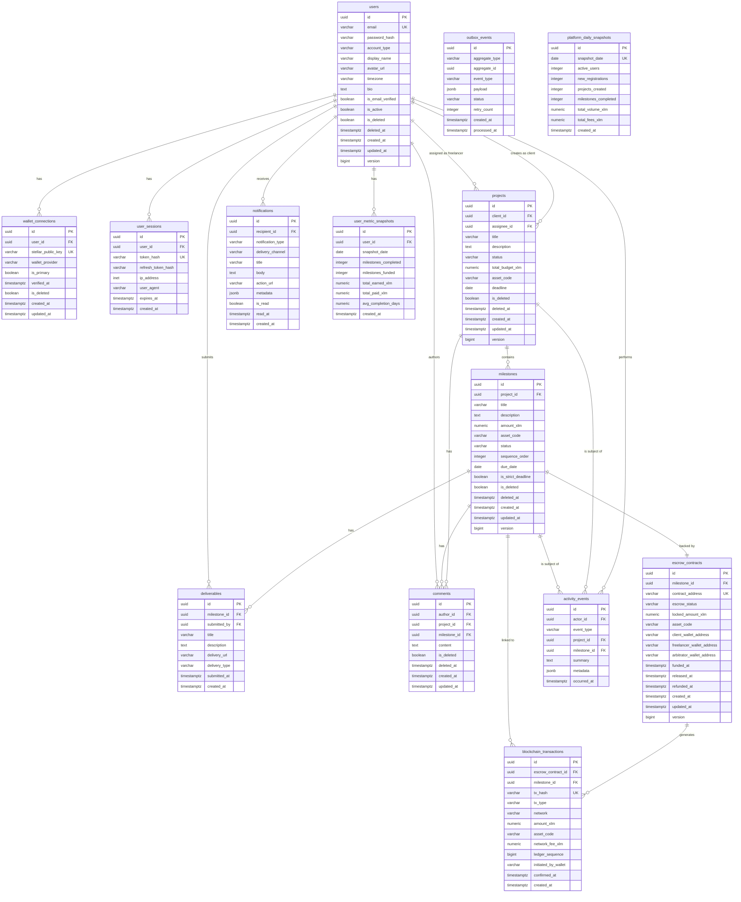

# PactFlow — Complete Domain Model & Database Architecture

> **Authority:** Governed by PROJECT_CONSTITUTION.md  
> **Scope:** Domain Model, DDD Structure, PostgreSQL Schema Design  
> **Version:** 1.0  
> **Last Updated:** 2026-07-12  

---

## Executive Summary

PactFlow's domain is organized into five bounded contexts: Identity, Collaboration, Escrow, Notification, and Analytics. Each context is fully autonomous, communicating via domain events rather than direct coupling. The PostgreSQL schema is designed for correctness first, query performance second, and horizontal scalability third. All entities use UUID v7 primary keys for time-ordered sortability without coordination. Soft deletes are enforced across all user-facing tables. Optimistic locking is applied to every aggregate root to prevent lost updates under concurrency.

The critical architectural invariant drawn from the Constitution is the clean separation between on-chain state (escrow funds, transaction hashes) and off-chain application state (projects, milestones, users). The database schema enforces this by maintaining a thin `escrow_contracts` table and a `blockchain_transactions` ledger that mirror chain state — both populated exclusively by the Soroban event ingestion daemon, never by direct user API calls.

---

## 1. Bounded Contexts

- **IDENTITY:** Users, WalletConnections, UserSessions
- **COLLABORATION:** Projects, Milestones, Deliverables, Comments
- **ESCROW:** EscrowContracts, BlockchainTransactions (Write-protected; owned by the Ingestion Daemon)
- **NOTIFICATION:** Notifications, ActivityEvents, OutboxEvents
- **ANALYTICS:** UserMetricSnapshots, PlatformDailySnapshots (Read Models)

---

## 2. Aggregates

### Identity Context
- **User** — Value Objects: Email, WalletAddress, UserProfile, PasswordHash
- **WalletConnection** — Value Objects: StellarPublicKey, WalletProvider

### Collaboration Context
- **Project** — Entities: ProjectMember | Value Objects: ProjectTitle, Budget, ProjectStatus
- **Milestone** — Entities: Deliverable, Comment | Value Objects: MilestoneAmount, MilestoneStatus, DueDate

### Escrow Context
- **EscrowContract** — Value Objects: ContractAddress, EscrowStatus, LockedAmount
- **BlockchainTransaction** — Value Objects: TxHash, TxType, LedgerSequence

### Notification Context
- **Notification** — Value Objects: NotificationType, DeliveryChannel, NotificationPayload
- **ActivityEvent** — Value Objects: EventType, EventMetadata

### Analytics Context
- **UserMetricSnapshot** — Value Objects: MilestoneStats, EarningsStats
- **PlatformDailySnapshot** — Value Objects: VolumeXLM, ActiveUsers

---

## 3. Domain Events

### Identity Context
- UserRegistered, WalletLinked, UserProfileUpdated

### Collaboration Context
- ProjectCreated, ProjectStatusChanged, MilestoneCreated, MilestoneStatusChanged, DeliverableSubmitted, CommentPosted

### Escrow Context (from Soroban via Ingestion Daemon)
- EscrowFunded, PaymentReleased, EscrowRefunded, TransactionConfirmed

---

## 4. State Machines

### Project Status
DRAFT → IN_PROGRESS → COMPLETED | CANCELLED

### Milestone Status (Core Flow)
DRAFT → FUNDED → IN_PROGRESS → SUBMITTED → PAID (terminal) | REFUNDED (terminal)
- FUNDED: triggered by on-chain EscrowFunded event confirmation
- PAID: triggered by on-chain PaymentReleased event confirmation
- REFUNDED: triggered by on-chain EscrowRefunded event confirmation

### EscrowContract Status
PENDING_DEPLOYMENT → ACTIVE → RELEASED (terminal) | REFUNDED (terminal)

---

## 5. ER Diagram

---

## 6. Table Specifications

### users
| Column | Type | Constraints | Notes |
|---|---|---|---|
| id | UUID | PK | UUID v7, application-generated |
| email | VARCHAR(320) | NOT NULL, UNIQUE | Stored lowercased |
| password_hash | TEXT | NULL | Argon2id encoded. NULL for wallet-only auth |
| account_type | VARCHAR(20) | NOT NULL, CHECK IN ('COMPANY','FREELANCER','ADMIN') | Immutable after creation |
| display_name | VARCHAR(100) | NOT NULL | |
| avatar_url | VARCHAR(2048) | NULL | CDN URL |
| timezone | VARCHAR(50) | NOT NULL, DEFAULT 'UTC' | IANA format |
| bio | TEXT | NULL, CHECK LENGTH <= 1000 | |
| is_email_verified | BOOLEAN | NOT NULL, DEFAULT false | |
| is_active | BOOLEAN | NOT NULL, DEFAULT true | |
| is_deleted | BOOLEAN | NOT NULL, DEFAULT false | Soft delete flag |
| deleted_at | TIMESTAMPTZ | NULL | |
| created_at | TIMESTAMPTZ | NOT NULL, DEFAULT NOW() | |
| updated_at | TIMESTAMPTZ | NOT NULL, DEFAULT NOW() | Auto-managed by trigger |
| version | BIGINT | NOT NULL, DEFAULT 1 | Optimistic lock counter |

**Indexes:** idx_users_email (unique partial WHERE is_deleted=false), idx_users_account_type, idx_users_created_at DESC

---

### wallet_connections
| Column | Type | Constraints | Notes |
|---|---|---|---|
| id | UUID | PK | UUID v7 |
| user_id | UUID | NOT NULL, FK → users(id) | |
| stellar_public_key | VARCHAR(56) | NOT NULL, UNIQUE | Ed25519 G-address |
| wallet_provider | VARCHAR(50) | NOT NULL, CHECK IN ('FREIGHTER','XBULL','RABET','LOBSTR','OTHER') | |
| is_primary | BOOLEAN | NOT NULL, DEFAULT false | |
| verified_at | TIMESTAMPTZ | NULL | NULL = unverified |
| is_deleted | BOOLEAN | NOT NULL, DEFAULT false | |
| created_at | TIMESTAMPTZ | NOT NULL, DEFAULT NOW() | |
| updated_at | TIMESTAMPTZ | NOT NULL, DEFAULT NOW() | |

**Key Constraint:** Partial unique index `(user_id) WHERE is_primary = true AND is_deleted = false`  
**Indexes:** idx_wallet_user_id, idx_wallet_public_key (unique)

---

### user_sessions
| Column | Type | Constraints | Notes |
|---|---|---|---|
| id | UUID | PK | UUID v7 |
| user_id | UUID | NOT NULL, FK → users(id) ON DELETE CASCADE | |
| token_hash | VARCHAR(128) | NOT NULL, UNIQUE | SHA-256 of JWT |
| refresh_token_hash | VARCHAR(128) | NULL, UNIQUE | SHA-256 of refresh token |
| ip_address | INET | NULL | PostgreSQL native INET type |
| user_agent | VARCHAR(512) | NULL | |
| expires_at | TIMESTAMPTZ | NOT NULL | |
| created_at | TIMESTAMPTZ | NOT NULL, DEFAULT NOW() | |

**Indexes:** idx_sessions_token_hash (unique), idx_sessions_user_id, idx_sessions_expires_at

---

### projects
| Column | Type | Constraints | Notes |
|---|---|---|---|
| id | UUID | PK | UUID v7 |
| client_id | UUID | NOT NULL, FK → users(id) | Must be COMPANY account type |
| assignee_id | UUID | NOT NULL, FK → users(id) | Must be FREELANCER account type |
| title | VARCHAR(200) | NOT NULL, CHECK LENGTH >= 5 | |
| description | TEXT | NULL, CHECK LENGTH <= 5000 | |
| status | VARCHAR(20) | NOT NULL, DEFAULT 'DRAFT', CHECK IN ('DRAFT','IN_PROGRESS','COMPLETED','CANCELLED') | |
| total_budget_xlm | NUMERIC(20,7) | NOT NULL, CHECK > 0 | Stellar precision (7 decimal places) |
| asset_code | VARCHAR(12) | NOT NULL, DEFAULT 'XLM' | |
| deadline | DATE | NULL | |
| is_deleted | BOOLEAN | NOT NULL, DEFAULT false | |
| deleted_at | TIMESTAMPTZ | NULL | |
| created_at | TIMESTAMPTZ | NOT NULL, DEFAULT NOW() | |
| updated_at | TIMESTAMPTZ | NOT NULL, DEFAULT NOW() | |
| version | BIGINT | NOT NULL, DEFAULT 1 | |

**Constraint:** chk_projects_client_ne_assignee: client_id <> assignee_id  
**Indexes:** idx_projects_client_id, idx_projects_assignee_id, idx_projects_status, idx_projects_created_at DESC

---

### milestones
| Column | Type | Constraints | Notes |
|---|---|---|---|
| id | UUID | PK | UUID v7 |
| project_id | UUID | NOT NULL, FK → projects(id) | |
| title | VARCHAR(200) | NOT NULL, CHECK LENGTH >= 3 | |
| description | TEXT | NULL, CHECK LENGTH <= 3000 | |
| amount_xlm | NUMERIC(20,7) | NOT NULL, CHECK > 0 | |
| asset_code | VARCHAR(12) | NOT NULL, DEFAULT 'XLM' | |
| status | VARCHAR(20) | NOT NULL, DEFAULT 'DRAFT', CHECK IN ('DRAFT','FUNDED','IN_PROGRESS','SUBMITTED','APPROVED','PAID','REFUNDED') | |
| sequence_order | INTEGER | NOT NULL, CHECK >= 1 | Processing/display order |
| due_date | DATE | NULL | |
| is_strict_deadline | BOOLEAN | NOT NULL, DEFAULT false | Level 5+: auto-refund |
| is_deleted | BOOLEAN | NOT NULL, DEFAULT false | |
| deleted_at | TIMESTAMPTZ | NULL | |
| created_at | TIMESTAMPTZ | NOT NULL, DEFAULT NOW() | |
| updated_at | TIMESTAMPTZ | NOT NULL, DEFAULT NOW() | |
| version | BIGINT | NOT NULL, DEFAULT 1 | |

**Constraint:** uq_milestone_sequence_per_project: UNIQUE (project_id, sequence_order) WHERE is_deleted = false  
**Indexes:** idx_milestones_project_id, idx_milestones_status, idx_milestones_project_status (composite)

---

### deliverables
| Column | Type | Constraints | Notes |
|---|---|---|---|
| id | UUID | PK | UUID v7 |
| milestone_id | UUID | NOT NULL, FK → milestones(id) | |
| submitted_by | UUID | NOT NULL, FK → users(id) | Must be the project assignee |
| title | VARCHAR(200) | NOT NULL | |
| description | TEXT | NULL | |
| delivery_url | VARCHAR(2048) | NOT NULL | GitHub, Figma, Doc link |
| delivery_type | VARCHAR(30) | NOT NULL, CHECK IN ('LINK','GITHUB_PR','FIGMA','DOCUMENT','OTHER') | |
| submitted_at | TIMESTAMPTZ | NOT NULL, DEFAULT NOW() | |
| created_at | TIMESTAMPTZ | NOT NULL, DEFAULT NOW() | |

**Note:** Deliverables are immutable submission records. No soft delete.  
**Indexes:** idx_deliverables_milestone_id, idx_deliverables_submitted_by

---

### comments
| Column | Type | Constraints | Notes |
|---|---|---|---|
| id | UUID | PK | UUID v7 |
| author_id | UUID | NOT NULL, FK → users(id) | |
| project_id | UUID | NULL, FK → projects(id) | XOR constraint with milestone_id |
| milestone_id | UUID | NULL, FK → milestones(id) | XOR constraint with project_id |
| content | TEXT | NOT NULL, CHECK LENGTH BETWEEN 1 AND 5000 | Sanitized before storage |
| is_deleted | BOOLEAN | NOT NULL, DEFAULT false | |
| deleted_at | TIMESTAMPTZ | NULL | |
| created_at | TIMESTAMPTZ | NOT NULL, DEFAULT NOW() | |
| updated_at | TIMESTAMPTZ | NOT NULL, DEFAULT NOW() | |

**Constraint:** chk_comments_parent_xor: (project_id IS NOT NULL AND milestone_id IS NULL) OR (project_id IS NULL AND milestone_id IS NOT NULL)  
**Indexes:** idx_comments_project_id, idx_comments_milestone_id, idx_comments_author_id

---

### escrow_contracts
| Column | Type | Constraints | Notes |
|---|---|---|---|
| id | UUID | PK | UUID v7 |
| milestone_id | UUID | NOT NULL, FK → milestones(id), UNIQUE | 1:1 with milestone |
| contract_address | VARCHAR(56) | NOT NULL, UNIQUE | Soroban contract ID |
| escrow_status | VARCHAR(30) | NOT NULL, CHECK IN ('PENDING_DEPLOYMENT','ACTIVE','RELEASED','REFUNDED') | |
| locked_amount_xlm | NUMERIC(20,7) | NOT NULL, CHECK >= 0 | |
| asset_code | VARCHAR(12) | NOT NULL, DEFAULT 'XLM' | |
| client_wallet_address | VARCHAR(56) | NOT NULL | |
| freelancer_wallet_address | VARCHAR(56) | NOT NULL | |
| arbitrator_wallet_address | VARCHAR(56) | NULL | Level 5+: dispute arbitration slot |
| funded_at | TIMESTAMPTZ | NULL | Set by ingestion daemon only |
| released_at | TIMESTAMPTZ | NULL | Set by ingestion daemon only |
| refunded_at | TIMESTAMPTZ | NULL | Set by ingestion daemon only |
| created_at | TIMESTAMPTZ | NOT NULL, DEFAULT NOW() | |
| updated_at | TIMESTAMPTZ | NOT NULL, DEFAULT NOW() | |
| version | BIGINT | NOT NULL, DEFAULT 1 | |

**CRITICAL:** This table is write-protected from the main API. Only the SorobanIngestionService writes here. Enforced via PostgreSQL Row-Level Security (RLS) + Spring Security role checks.  
**Indexes:** idx_escrow_milestone_id (unique), idx_escrow_contract_address (unique), idx_escrow_status

---

### blockchain_transactions
| Column | Type | Constraints | Notes |
|---|---|---|---|
| id | UUID | PK | UUID v7 |
| escrow_contract_id | UUID | NOT NULL, FK → escrow_contracts(id) | |
| milestone_id | UUID | NOT NULL, FK → milestones(id) | Denormalized for fast history queries |
| tx_hash | VARCHAR(64) | NOT NULL, UNIQUE | Stellar transaction hash |
| tx_type | VARCHAR(30) | NOT NULL, CHECK IN ('ESCROW_FUND','PAYMENT_RELEASE','REFUND','CONTRACT_DEPLOY') | |
| network | VARCHAR(20) | NOT NULL, CHECK IN ('TESTNET','MAINNET') | |
| amount_xlm | NUMERIC(20,7) | NOT NULL, CHECK >= 0 | |
| asset_code | VARCHAR(12) | NOT NULL, DEFAULT 'XLM' | |
| network_fee_xlm | NUMERIC(20,7) | NOT NULL, CHECK >= 0 | Stellar base fee |
| ledger_sequence | BIGINT | NOT NULL, CHECK > 0 | For ordering and audit |
| initiated_by_wallet | VARCHAR(56) | NOT NULL | Transaction signer |
| confirmed_at | TIMESTAMPTZ | NOT NULL | Ledger close time |
| created_at | TIMESTAMPTZ | NOT NULL, DEFAULT NOW() | |

**IMMUTABLE:** No UPDATE or DELETE ever. Enforced by PostgreSQL RLS policy.  
**Indexes:** idx_blockchain_tx_hash (unique), idx_blockchain_escrow_id, idx_blockchain_milestone_id, idx_blockchain_wallet, idx_blockchain_confirmed_at DESC (BRIN)

---

### notifications
| Column | Type | Constraints | Notes |
|---|---|---|---|
| id | UUID | PK | UUID v7 |
| recipient_id | UUID | NOT NULL, FK → users(id) | |
| notification_type | VARCHAR(50) | NOT NULL | e.g., MILESTONE_FUNDED, PAYMENT_RELEASED |
| delivery_channel | VARCHAR(20) | NOT NULL, DEFAULT 'IN_APP', CHECK IN ('IN_APP','EMAIL','BOTH') | |
| title | VARCHAR(200) | NOT NULL | |
| body | TEXT | NOT NULL | |
| action_url | VARCHAR(2048) | NULL | Deep link into app |
| metadata | JSONB | NULL | Context extras |
| is_read | BOOLEAN | NOT NULL, DEFAULT false | |
| read_at | TIMESTAMPTZ | NULL | |
| created_at | TIMESTAMPTZ | NOT NULL, DEFAULT NOW() | |

**Indexes:** idx_notifications_recipient_unread (partial WHERE is_read=false), idx_notifications_recipient_id, idx_notifications_created_at DESC

---

### activity_events
| Column | Type | Constraints | Notes |
|---|---|---|---|
| id | UUID | PK | UUID v7 |
| actor_id | UUID | NOT NULL, FK → users(id) | |
| event_type | VARCHAR(60) | NOT NULL | e.g., PROJECT_CREATED, MILESTONE_PAID |
| project_id | UUID | NULL, FK → projects(id) | |
| milestone_id | UUID | NULL, FK → milestones(id) | |
| summary | VARCHAR(500) | NOT NULL | Human-readable description |
| metadata | JSONB | NULL | Machine-readable context |
| occurred_at | TIMESTAMPTZ | NOT NULL, DEFAULT NOW() | |

**Immutable log.** Never update or delete. Future: partition by `occurred_at` month at >10M rows.  
**Indexes:** idx_activity_actor_id, idx_activity_project_id, idx_activity_milestone_id, idx_activity_occurred_at DESC (BRIN), idx_activity_event_type

---

### outbox_events (Transactional Outbox Pattern)
| Column | Type | Constraints | Notes |
|---|---|---|---|
| id | UUID | PK | UUID v7 |
| aggregate_type | VARCHAR(50) | NOT NULL | e.g., 'Project', 'Milestone' |
| aggregate_id | UUID | NOT NULL | The entity's ID |
| event_type | VARCHAR(80) | NOT NULL | e.g., 'MilestoneStatusChanged' |
| payload | JSONB | NOT NULL | Full event body |
| status | VARCHAR(20) | NOT NULL, DEFAULT 'PENDING', CHECK IN ('PENDING','PROCESSED','FAILED') | |
| retry_count | INTEGER | NOT NULL, DEFAULT 0, CHECK <= 5 | |
| created_at | TIMESTAMPTZ | NOT NULL, DEFAULT NOW() | |
| processed_at | TIMESTAMPTZ | NULL | |

**Indexes:** idx_outbox_status_pending (partial WHERE status='PENDING'), idx_outbox_created_at

---

### user_metric_snapshots
| Column | Type | Constraints | Notes |
|---|---|---|---|
| id | UUID | PK | UUID v7 |
| user_id | UUID | NOT NULL, FK → users(id) | |
| snapshot_date | DATE | NOT NULL | One row per user per day |
| milestones_completed | INTEGER | NOT NULL, DEFAULT 0 | |
| milestones_funded | INTEGER | NOT NULL, DEFAULT 0 | |
| total_earned_xlm | NUMERIC(20,7) | NOT NULL, DEFAULT 0 | Freelancer: total received |
| total_paid_xlm | NUMERIC(20,7) | NOT NULL, DEFAULT 0 | Company: total released |
| avg_completion_days | NUMERIC(6,2) | NULL | Average days per milestone |
| created_at | TIMESTAMPTZ | NOT NULL, DEFAULT NOW() | |

**Constraint:** UNIQUE (user_id, snapshot_date)  
**Indexes:** idx_user_metrics_user_date (composite)

---

### platform_daily_snapshots
| Column | Type | Constraints | Notes |
|---|---|---|---|
| id | UUID | PK | UUID v7 |
| snapshot_date | DATE | NOT NULL, UNIQUE | One row per calendar day |
| active_users | INTEGER | NOT NULL, DEFAULT 0 | |
| new_registrations | INTEGER | NOT NULL, DEFAULT 0 | |
| projects_created | INTEGER | NOT NULL, DEFAULT 0 | |
| milestones_completed | INTEGER | NOT NULL, DEFAULT 0 | |
| total_volume_xlm | NUMERIC(20,7) | NOT NULL, DEFAULT 0 | |
| total_fees_xlm | NUMERIC(20,7) | NOT NULL, DEFAULT 0 | Level 5+: platform fee tracking |
| created_at | TIMESTAMPTZ | NOT NULL, DEFAULT NOW() | |

---

## 7. Index Strategy Summary

### Tier 1 — Critical (Always)
- PKs on all tables, unique indexes on all UK columns, FK indexes on all FK columns

### Tier 2 — High Frequency Queries
- idx_milestones_project_status — composite (project_id, status) for dashboard
- idx_notifications_recipient_unread — partial WHERE is_read=false for badge counts
- idx_activity_occurred_at DESC — BRIN for timeline pagination
- idx_blockchain_confirmed_at DESC — BRIN for transaction history

### Tier 3 — Soft Delete Aware
- All unique business key indexes are partial: WHERE is_deleted = false

### Tier 4 — Future Scaling
- Full-text search tsvector on projects.title + description
- Table partitioning on activity_events and blockchain_transactions by month at >10M rows
- GIN index on JSONB metadata columns when AI/filter features are added

---

## 8. Data Integrity Rules

### UUID Strategy
- UUID v7 (time-ordered) for all PKs — generated at the application layer before persistence
- Benefits: natural time-sort, no B-tree fragmentation, cursor-based pagination without `created_at` overhead

### Audit Fields on All Aggregate Roots
- created_at: Set once on insert, never changed
- updated_at: Auto-managed via BEFORE UPDATE PostgreSQL trigger
- version: Incremented on every UPDATE; used for optimistic locking

### Optimistic Locking Pattern
UPDATE ... WHERE id = :id AND version = :expectedVersion
→ rowsAffected == 0 throws OptimisticLockingFailureException in the application layer

### Soft Delete Rules
- Hard deletes prohibited except: user_sessions (TTL) and GDPR erasure
- GDPR erasure anonymizes PII fields (email, display_name, avatar_url, bio) to NULL
- User id is preserved for audit log integrity
- All queries include WHERE is_deleted = false in base filters

### Referential Integrity — ON DELETE Behaviors
- user_sessions → users: CASCADE
- wallet_connections → users: RESTRICT
- milestones → projects: RESTRICT
- escrow_contracts → milestones: RESTRICT
- blockchain_transactions → escrow_contracts: RESTRICT (permanent ledger)

### Normalization
- Operational tables: 3NF
- Analytics tables: Intentionally denormalized read models
- blockchain_transactions.milestone_id: deliberate denormalization for tx history queries

---

## 9. Security at Schema Level

1. Email stored lowercased; consider pgcrypto at-rest encryption for high-security deployments
2. Wallet addresses are pseudonymous, not PII — safe as plain text
3. Password hashes: Argon2id only. Raw passwords never touch the DB
4. Session tokens: SHA-256 hashes only. Raw tokens are ephemeral
5. PostgreSQL Row-Level Security (RLS) policies:
   - pactflow_app role: read/write on all tables EXCEPT escrow writes
   - pactflow_ingestion role: write access to escrow_contracts, blockchain_transactions only
   - pactflow_readonly role: SELECT only, for analytics/reporting
6. blockchain_transactions: RLS policy prohibits UPDATE and DELETE operations entirely
7. GDPR: anonymize_user() procedure nullifies PII while preserving audit references

---

## 10. Naming Conventions

| Category | Convention | Example |
|---|---|---|
| Tables | snake_case, plural | wallet_connections |
| Columns | snake_case | stellar_public_key |
| PKs | Always named id | id UUID |
| FKs | {referenced_singular}_id | project_id |
| Boolean columns | is_ prefix | is_deleted, is_primary |
| Timestamp columns | _at suffix | created_at, deleted_at |
| Index names | idx_{table}_{columns} | idx_milestones_project_status |
| Unique constraints | uq_{table}_{columns} | uq_wallet_primary_per_user |
| Check constraints | chk_{table}_{description} | chk_projects_client_ne_assignee |

---

## 11. Future Expansion Strategy (Level 5+)

| Feature | Pre-built Hook | Location |
|---|---|---|
| Dispute Resolution | arbitrator_wallet_address column | escrow_contracts |
| Reputation System | user_metric_snapshots + avg_completion_days | Analytics context |
| GitHub Integration | delivery_type = 'GITHUB_PR' | deliverables |
| Agency Accounts | account_type enum extensible to AGENCY | users |
| AI Suggestions | metadata JSONB on activity_events, notifications | Multiple tables |
| Payroll / Recurring | is_strict_deadline + sequence_order | milestones |
| Mobile App | wallet_provider enum extensible | wallet_connections |
| Multi-asset Support | asset_code on all monetary columns | All financial tables |
| Mainnet | network column on blockchain_transactions | Escrow context |
| Platform Fees | total_fees_xlm in platform_daily_snapshots | Analytics context |
| Table Partitioning | activity_events + blockchain_transactions | Scale at >10M rows |
