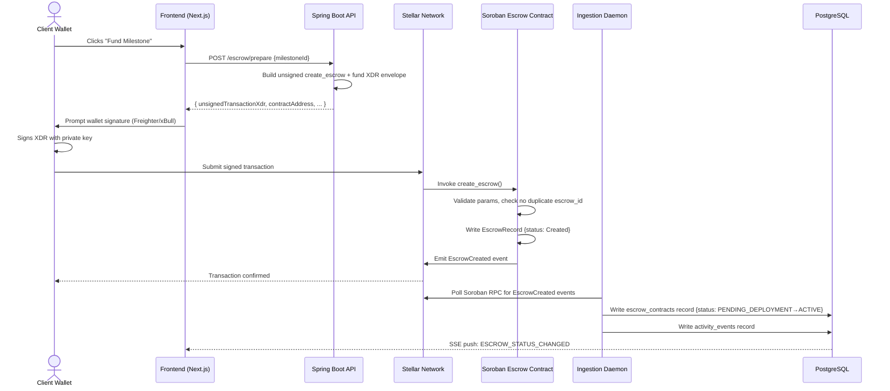
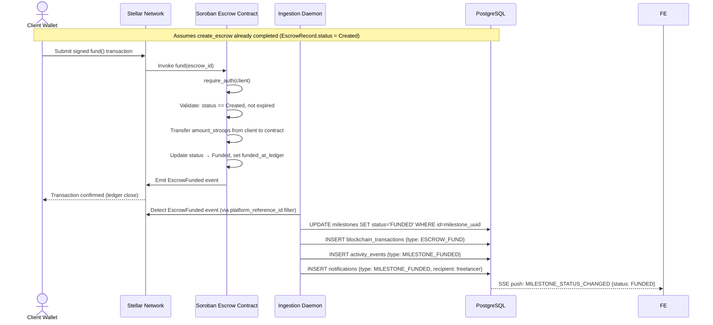
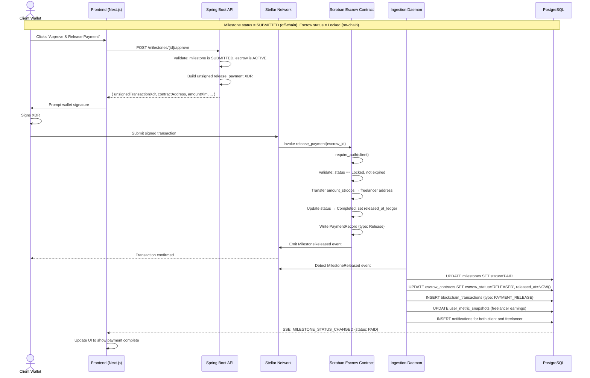
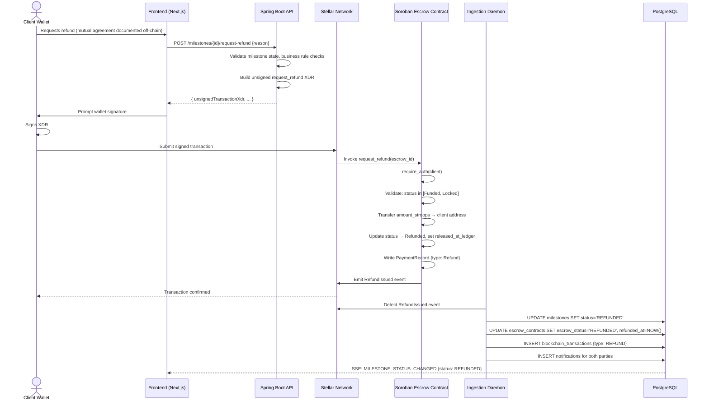
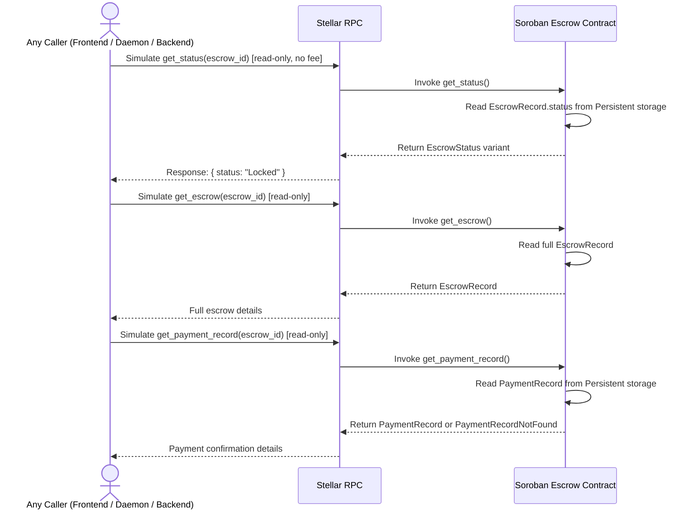

# PactFlow — Soroban Escrow Smart Contract Specification

> **Document Type:** Technical Specification (RFC-style)  
> **Authority:** Governed by PROJECT_CONSTITUTION.md, DOMAIN_MODEL.md, API_SPECIFICATION.md  
> **Contract Name:** `pactflow_escrow`  
> **Target Network:** Stellar / Soroban (Testnet v1, Mainnet-ready design)  
> **Version:** 1.0.0  
> **Status:** Approved for Implementation  
> **Last Updated:** 2026-07-12  

---

## Table of Contents

1. [Executive Summary](#1-executive-summary)
2. [Escrow Lifecycle & State Machine](#2-escrow-lifecycle--state-machine)
3. [Contract Responsibilities](#3-contract-responsibilities)
4. [Contract Storage Model](#4-contract-storage-model)
5. [Data Structures](#5-data-structures)
6. [Public Functions](#6-public-functions)
7. [Authorization Model](#7-authorization-model)
8. [Events](#8-events)
9. [Error Codes](#9-error-codes)
10. [Validation Rules](#10-validation-rules)
11. [Security Model](#11-security-model)
12. [Gas & Storage Optimization](#12-gas--storage-optimization)
13. [Upgrade Strategy](#13-upgrade-strategy)
14. [Testing Strategy](#14-testing-strategy)
15. [Sequence Diagrams](#15-sequence-diagrams)
16. [Future Compatibility](#16-future-compatibility)

---

## 1. Executive Summary

### 1.1 Purpose

The `pactflow_escrow` contract is the on-chain trust layer of the PactFlow platform. Its sole purpose is to **secure, hold, and conditionally release funds** between a client (Company) and a freelancer based on the outcome of a milestone-level work agreement.

The contract does not know about projects, users, comments, UI state, or any other SaaS concern. It knows only about addresses, amounts, authorization, and state.

Trust is encoded as cryptographic authorization, not business rules. If both authorized parties agree (or a defined time window expires), funds move. Nothing else.

### 1.2 Responsibilities (IN-SCOPE)

| Responsibility | Description |
|---|---|
| **Escrow Initialization** | Deploy a new escrow instance bound to a client and freelancer address |
| **Fund Locking** | Accept and hold XLM (or Stellar Classic assets) from the client |
| **Milestone Payment Release** | Transfer locked funds to the freelancer upon client authorization |
| **Refund Issuance** | Return locked funds to the client upon mutual authorization or expiration |
| **Time-Based Expiration** | Automatically make an escrow refundable after a configured deadline |
| **Authorization Enforcement** | Verify that only the designated parties can call state-changing functions |
| **Event Emission** | Emit structured events consumed by the PactFlow ingestion daemon |
| **State Queries** | Allow read-only inspection of escrow state by any caller |

### 1.3 Non-Responsibilities (OUT-OF-SCOPE)

The following concerns explicitly **do not belong** in the smart contract. Violating this boundary is an architectural defect.

| Out-of-Scope | Correct Location |
|---|---|
| User identity, profiles, accounts | Spring Boot / PostgreSQL |
| Project metadata (title, description) | Spring Boot / PostgreSQL |
| Milestone definitions and sequencing | Spring Boot / PostgreSQL |
| Comment and communication threads | Spring Boot / PostgreSQL |
| Business rule validation (e.g., milestone order) | Spring Boot Application Layer |
| Analytics and reporting | Spring Boot / PostgreSQL Analytics Tables |
| Notification delivery | Spring Boot Notification Context |
| Access control beyond wallet addresses | Spring Boot Security Layer |
| Dispute arbitration logic (Level 5+) | Future contract extension |

> **Constitutional Mandate (Rule 1):** "Blockchain is ONLY responsible for trust and money. Never store project management logic inside Soroban."

### 1.4 Design Philosophy

- **Minimal surface area** — fewer functions mean fewer attack vectors.
- **Deterministic** — given the same inputs and state, the output is always identical.
- **Explicit authorization** — every state-changing function requires a verifiable signature from the authorized party.
- **Fail loudly** — invalid operations return typed error codes, never silently succeed.
- **One contract per escrow** — each milestone gets its own isolated contract instance, preventing cross-contamination between projects.

---

## 2. Escrow Lifecycle & State Machine

### 2.1 States

```
UNINITIALIZED
      │
      │  initialize()
      ▼
   CREATED
      │
      │  fund()
      ▼
   FUNDED
      │
      │  lock()  ← called by client to signal work has begun
      ▼
   LOCKED
      │
      ├──────────────────────────────────────────────────────────┐
      │  release_payment()                    request_refund()   │
      │  (client signature required)          (client signature) │
      ▼                                               ▼
   RELEASED                                      REFUNDED (terminal)
      │
      │  (automatic — upon successful transfer)
      ▼
  COMPLETED (terminal)

   FUNDED / LOCKED
      │
      │  expiration timestamp passed AND client calls expire()
      ▼
   EXPIRED → refund auto-authorized → REFUNDED (terminal)

   CREATED / FUNDED
      │
      │  cancel() — only before funds locked
      ▼
  CANCELLED (terminal)
```

### 2.2 State Transition Table

| From State | Trigger Function | Required Authorizer | To State | Notes |
|---|---|---|---|---|
| `CREATED` | `fund()` | Client | `FUNDED` | Client deposits exact milestone amount |
| `FUNDED` | `lock()` | Client | `LOCKED` | Signals freelancer work begins. Irreversible. |
| `FUNDED` | `cancel()` | Client | `CANCELLED` | Allowed only before locking |
| `LOCKED` | `release_payment()` | Client | `RELEASED → COMPLETED` | Client approves delivered work |
| `LOCKED` | `request_refund()` | Client | `REFUNDED` | Client requests refund; may require freelancer countersignature |
| `LOCKED` | `expire()` | Anyone | `REFUNDED` | Only callable after expiration timestamp |
| `RELEASED` | _(auto)_ | Contract | `COMPLETED` | Atomic with release — transfer confirmed |
| Any active | _(none)_ | — | — | `COMPLETED` and `REFUNDED` are terminal and immutable |

### 2.3 State Invariants

- **Terminal states are immutable.** No function may modify state once `COMPLETED`, `REFUNDED`, or `CANCELLED` is reached.
- **`LOCKED` is irreversible to `FUNDED`.** Once the client signals work has begun, the escrow cannot be cancelled outright — only released or refunded with appropriate authorization.
- **Only one escrow per contract address.** A single deployed contract manages a single escrow lifecycle.
- **Funds cannot be partially released.** Level 4 supports full release only. Partial release is a Level 5+ feature.

---

## 3. Contract Responsibilities

### 3.1 Decision Boundary Matrix

The following table precisely defines the separation between on-chain (Soroban) and off-chain (Spring Boot) concerns.

| Concern | Soroban Contract | Spring Boot Backend |
|---|---|---|
| Verify Ed25519 wallet signature | ✅ Yes (built-in Soroban auth) | ✅ Also (for API operations) |
| Hold XLM/asset funds | ✅ Yes | ❌ No |
| Enforce fund release authorization | ✅ Yes | ❌ No |
| Determine *when* to approve release | ❌ No | ✅ Yes (off-chain milestone review) |
| Emit on-chain events for state changes | ✅ Yes | ❌ No |
| Parse and react to on-chain events | ❌ No | ✅ Yes (ingestion daemon) |
| Store milestone metadata | ❌ No | ✅ Yes (PostgreSQL) |
| Validate project business rules | ❌ No | ✅ Yes (Application layer) |
| Rate-limit operations | ❌ No | ✅ Yes (Bucket4j) |
| Send notifications | ❌ No | ✅ Yes (Notification context) |
| Track user analytics | ❌ No | ✅ Yes (Analytics snapshots) |

### 3.2 The Ingestion Daemon Interface

The contract communicates with Spring Boot **exclusively through events**. The `SorobanIngestionService` (backend daemon) subscribes to Soroban RPC event streams and reacts to:

- `EscrowFunded` → Update milestone status to `FUNDED`
- `FundsLocked` → Update milestone status to `IN_PROGRESS`
- `MilestoneReleased` → Update milestone status to `PAID`, write blockchain_transaction record
- `RefundIssued` → Update milestone status to `REFUNDED`, write blockchain_transaction record
- `EscrowCancelled` → Update milestone status to `DRAFT` (re-openable)
- `EscrowExpired` → Update milestone status to `REFUNDED`

**No Spring Boot API call triggers a contract write directly.** The frontend wallet signs and submits transactions to the network. The backend only ever reads from the contract (via queries) and reacts to events.

---

## 4. Contract Storage Model

Soroban provides three storage types with distinct cost and persistence profiles. The design below explicitly assigns each datum to the appropriate tier.

### 4.1 Storage Type Reference

| Storage Type | Persistence | Cost | TTL | Use Case |
|---|---|---|---|---|
| **Instance Storage** | Contract lifetime | Moderate | Managed by ledger | Contract-wide metadata, admin config |
| **Persistent Storage** | Until explicitly deleted or TTL expiry | Higher | Renewable, long-lived | Core escrow state, payment records |
| **Temporary Storage** | Single transaction | Lowest | Expires end of ledger | Nonces, reentrancy guards |

### 4.2 Instance Storage Layout

Stored once per deployed contract. Keyed by simple symbol literals.

| Storage Key | Type | Description | Mutable |
|---|---|---|---|
| `ADMIN` | Address | The PactFlow platform admin address (for emergency pause only) | No (set at init) |
| `VERSION` | u32 | Contract version number | On upgrade only |
| `INITIALIZED` | bool | Guards against double-initialization | No (set once) |
| `PAUSED` | bool | Emergency pause flag (admin only) | Yes (admin) |

### 4.3 Persistent Storage Layout

One entry per escrow. The escrow itself is the single logical record.

| Storage Key Pattern | Type | Description | TTL Policy |
|---|---|---|---|
| `Escrow(escrow_id)` | EscrowRecord | The full escrow state | Renewed on every state transition; never expires while active |
| `Payment(escrow_id)` | PaymentRecord | Immutable record of a completed payment or refund | Retained permanently (ledger archival threshold) |
| `Nonce(client_address)` | u64 | Monotonically increasing nonce per address | Never expires |

### 4.4 Temporary Storage Layout

Used within a single transaction's context to prevent reentrancy.

| Storage Key Pattern | Type | Description |
|---|---|---|
| `ReentrancyGuard(escrow_id)` | bool | Set at function entry, cleared at exit; panics if already set |

### 4.5 Storage Key Design Rationale

- **All keys are typed enums** (e.g., `DataKey::Escrow(BytesN<32>)`), not raw strings. This prevents key collisions and enables compile-time safety.
- **Escrow IDs are 32-byte values** derived from a combination of client address + freelancer address + creation timestamp, hashed to prevent enumeration.
- **Nonces per address** prevent replay attacks on authorization signatures without requiring a global counter.
- **Instance storage for contract metadata** keeps admin config separate from per-escrow state, enabling efficient upgrades.

### 4.6 Storage TTL Management

- Active escrow records (state ≠ terminal) have their TTL extended (bumped) on every successful state transition.
- Terminal escrow records (`COMPLETED`, `REFUNDED`, `CANCELLED`) have TTL set to the platform's archival window (e.g., ~100,000 ledgers ≈ ~5.8 days minimum, platform may choose to extend via maintenance calls).
- Payment records have the longest TTL (maximum allowed by network) as they serve as the permanent on-chain audit trail.

---

## 5. Data Structures

The following are conceptual definitions. Implementations will map these to Soroban-compatible types.

### 5.1 `EscrowRecord`

The central data structure persisted in Persistent storage. Represents the complete state of one escrow.

| Field | Logical Type | Description |
|---|---|---|
| `escrow_id` | Bytes32 | Unique deterministic identifier for this escrow |
| `client` | Address | The Stellar address of the paying party (Company wallet) |
| `freelancer` | Address | The Stellar address of the receiving party (Freelancer wallet) |
| `arbitrator` | Option\<Address\> | Future Level 5+ slot. NULL in Level 4. Reserved for dispute resolution. |
| `amount` | i128 | Amount locked in escrow, in stroops (1 XLM = 10,000,000 stroops) |
| `asset` | Asset | The Stellar asset being escrowed (XLM or Classic asset) |
| `status` | EscrowStatus | Current state machine status (enum) |
| `expiration_ledger` | u32 | Ledger number after which the escrow is auto-refundable |
| `platform_reference_id` | Bytes32 | Opaque off-chain reference (milestone UUID, hashed). NOT stored as plaintext. |
| `created_at_ledger` | u32 | Ledger sequence number at creation time |
| `funded_at_ledger` | Option\<u32\> | Ledger sequence when funded |
| `locked_at_ledger` | Option\<u32\> | Ledger sequence when locked |
| `released_at_ledger` | Option\<u32\> | Ledger sequence when released or refunded |
| `version` | u32 | Record schema version for upgrade compatibility |

> **Privacy Note:** `platform_reference_id` stores a one-way hash of the off-chain milestone UUID. It enables the ingestion daemon to correlate on-chain events to off-chain records without storing any PII or business data on-chain. The raw UUID never appears in contract storage or events.

### 5.2 `EscrowStatus` (Enum)

| Variant | Ordinal | Description |
|---|---|---|
| `Created` | 0 | Contract initialized, awaiting funding |
| `Funded` | 1 | Client has deposited funds |
| `Locked` | 2 | Funds locked; freelancer work has begun |
| `Released` | 3 | Client approved release; transfer in progress |
| `Completed` | 4 | Funds successfully transferred to freelancer |
| `Refunded` | 5 | Funds returned to client |
| `Cancelled` | 6 | Escrow cancelled before locking |
| `Expired` | 7 | Expiration triggered (immediately followed by Refunded) |

### 5.3 `PaymentRecord`

An immutable audit record written upon terminal state transitions (completion or refund). Stored in Persistent storage alongside the EscrowRecord.

| Field | Logical Type | Description |
|---|---|---|
| `escrow_id` | Bytes32 | Reference to parent EscrowRecord |
| `payment_type` | PaymentType | `Release` or `Refund` |
| `recipient` | Address | Who received the funds |
| `amount` | i128 | Amount transferred, in stroops |
| `asset` | Asset | The transferred asset |
| `authorized_by` | Address | Address whose signature authorized the transfer |
| `ledger_sequence` | u32 | Ledger when transfer was confirmed |
| `platform_reference_id` | Bytes32 | Hashed off-chain reference (same as EscrowRecord) |

### 5.4 `ContractMetadata` (Instance Storage)

| Field | Logical Type | Description |
|---|---|---|
| `admin` | Address | Admin address — only for pause/unpause |
| `version` | u32 | Contract version (incremented on upgrades) |
| `initialized` | bool | One-time initialization guard |
| `paused` | bool | Emergency pause switch |
| `total_escrows_created` | u64 | Counter for observability |
| `total_volume_stroops` | i128 | Cumulative funds processed (for analytics event) |

### 5.5 `ExpirationInfo` (Derived — not stored separately)

Expiration data is embedded in `EscrowRecord`. The following fields constitute the logical concept:

| Field | Logical Type | Description |
|---|---|---|
| `expiration_ledger` | u32 | Ledger number at which escrow becomes auto-refundable |
| `is_expired` | bool (derived) | `current_ledger >= expiration_ledger` |
| `seconds_per_ledger` | u32 | ~5 seconds (Stellar approximate) — used for off-chain display only |

---

## 6. Public Functions

### 6.1 `initialize`

**Purpose:** One-time contract setup. Sets the admin address and contract version. Guards against re-initialization.

**Parameters:**
| Name | Type | Description |
|---|---|---|
| `admin` | Address | Platform admin address |
| `version` | u32 | Initial version number (typically 1) |

**Authorization:** Any caller (first call wins; subsequent calls fail).

**Preconditions:**
- `INITIALIZED` flag in Instance Storage must be `false` (or absent).

**Postconditions:**
- `INITIALIZED` set to `true`.
- `admin`, `version` written to Instance Storage.
- `PAUSED` set to `false`.

**Events Emitted:** `ContractInitialized`

**Failure Cases:**
| Error | Condition |
|---|---|
| `AlreadyInitialized` | `INITIALIZED` is `true` |

---

### 6.2 `create_escrow`

**Purpose:** Deploy a new escrow record. Called by the client wallet (via the Spring Boot-constructed transaction envelope) to initialize the escrow binding between client and freelancer before funds are deposited.

**Parameters:**
| Name | Type | Description |
|---|---|---|
| `escrow_id` | Bytes32 | Deterministic ID pre-computed off-chain (hash of client + freelancer + nonce) |
| `client` | Address | Client Stellar wallet address |
| `freelancer` | Address | Freelancer Stellar wallet address |
| `amount` | i128 | Expected deposit amount in stroops |
| `asset` | Asset | Asset to be escrowed (e.g., native XLM) |
| `expiration_ledger` | u32 | Ledger number at which escrow auto-expires |
| `platform_reference_id` | Bytes32 | One-way hash of off-chain milestone UUID |

**Authorization:** Requires `client` address authorization (signature).

**Preconditions:**
- Contract must not be paused.
- `escrow_id` must not already exist in storage.
- `client` ≠ `freelancer`.
- `amount` > 0.
- `expiration_ledger` > current ledger + minimum buffer (e.g., 1000 ledgers ≈ ~83 minutes).
- `asset` must be a valid Stellar asset.

**Postconditions:**
- `EscrowRecord` written to Persistent storage with `status = Created`.
- TTL bumped for the new record.

**Events Emitted:** `EscrowCreated`

**Failure Cases:**
| Error | Condition |
|---|---|
| `ContractPaused` | Platform pause is active |
| `EscrowAlreadyExists` | `escrow_id` exists in storage |
| `InvalidAmount` | `amount` ≤ 0 |
| `InvalidAddresses` | `client == freelancer` or either is zero address |
| `InvalidExpiration` | `expiration_ledger` is in the past or within minimum buffer |
| `Unauthorized` | Caller is not the `client` address |

---

### 6.3 `fund`

**Purpose:** Transfer the exact escrow amount from the client's wallet into the contract. The contract becomes the custodian of these funds.

**Parameters:**
| Name | Type | Description |
|---|---|---|
| `escrow_id` | Bytes32 | The target escrow to fund |

**Authorization:** Requires `client` address authorization. Client must have approved the contract to transfer funds on their behalf (via Stellar token allowance or native transfer).

**Preconditions:**
- Contract must not be paused.
- `EscrowRecord` must exist for `escrow_id`.
- `EscrowRecord.status` must be `Created`.
- Caller must be the `client` address on the `EscrowRecord`.
- Client's wallet must hold at least `EscrowRecord.amount` of the specified asset.
- Escrow must not be expired at the time of funding.

**Postconditions:**
- `EscrowRecord.status` updated to `Funded`.
- `EscrowRecord.funded_at_ledger` set to current ledger.
- Funds transferred from client to contract account.
- TTL of `EscrowRecord` bumped.

**Events Emitted:** `EscrowFunded`

**Failure Cases:**
| Error | Condition |
|---|---|
| `EscrowNotFound` | No record for `escrow_id` |
| `InvalidState` | Status is not `Created` |
| `Unauthorized` | Caller is not `client` |
| `InsufficientFunds` | Client wallet balance < escrow amount |
| `EscrowExpired` | Current ledger ≥ `expiration_ledger` |
| `ContractPaused` | Platform pause is active |

---

### 6.4 `lock`

**Purpose:** The client signals that the freelancer has begun work. This transitions the escrow from `Funded` to `Locked`, making the escrow non-cancellable. After locking, funds can only exit via `release_payment`, `request_refund`, or `expire`.

**Parameters:**
| Name | Type | Description |
|---|---|---|
| `escrow_id` | Bytes32 | The escrow to lock |

**Authorization:** Requires `client` address authorization.

**Preconditions:**
- `EscrowRecord.status` must be `Funded`.
- Escrow must not be expired.

**Postconditions:**
- `EscrowRecord.status` updated to `Locked`.
- `EscrowRecord.locked_at_ledger` set to current ledger.
- TTL bumped.

**Events Emitted:** `FundsLocked`

**Failure Cases:**
| Error | Condition |
|---|---|
| `EscrowNotFound` | No record for `escrow_id` |
| `InvalidState` | Status is not `Funded` |
| `Unauthorized` | Caller is not `client` |
| `EscrowExpired` | Current ledger ≥ `expiration_ledger` |

---

### 6.5 `release_payment`

**Purpose:** The client authorizes full release of locked funds to the freelancer. This is the primary "happy path" terminal action — it atomically transfers funds and marks the escrow `Completed`.

**Parameters:**
| Name | Type | Description |
|---|---|---|
| `escrow_id` | Bytes32 | The escrow to release |

**Authorization:** Requires `client` address authorization. This is the most security-critical function — only the client may release funds to the freelancer. No other party (not even the contract admin) may trigger this.

**Preconditions:**
- `EscrowRecord.status` must be `Locked`.
- Escrow must not be expired.
- Contract must not be paused.

**Postconditions:**
- Funds atomically transferred from contract to `freelancer` address.
- `EscrowRecord.status` updated to `Completed`.
- `EscrowRecord.released_at_ledger` set to current ledger.
- `PaymentRecord` written to Persistent storage.
- TTL of both records bumped to archival window.

**Events Emitted:** `MilestoneReleased`

**Failure Cases:**
| Error | Condition |
|---|---|
| `EscrowNotFound` | No record for `escrow_id` |
| `InvalidState` | Status is not `Locked` |
| `Unauthorized` | Caller is not `client` |
| `EscrowExpired` | Escrow expired before release (must use `expire()` instead) |
| `ContractPaused` | Platform pause is active |
| `TransferFailed` | Underlying Stellar token transfer failed |

---

### 6.6 `request_refund`

**Purpose:** The client requests that locked funds be returned to their wallet. In Level 4, this is a unilateral client action once funds are `Locked` (freelancer's agreement is managed off-chain by Spring Boot before calling this). Future Level 5 may require dual signatures.

**Parameters:**
| Name | Type | Description |
|---|---|---|
| `escrow_id` | Bytes32 | The escrow to refund |

**Authorization:** Requires `client` address authorization.

**Preconditions:**
- `EscrowRecord.status` must be `Locked` or `Funded`.
- Contract must not be paused.

> **Design Decision:** Allowing refund from `Funded` (not just `Locked`) provides a safer path if the client changes their mind immediately after funding but before the freelancer starts. The Spring Boot layer enforces the mutual agreement requirement at the business logic level before constructing this transaction.

**Postconditions:**
- Funds atomically transferred from contract to `client` address.
- `EscrowRecord.status` updated to `Refunded`.
- `EscrowRecord.released_at_ledger` set to current ledger.
- `PaymentRecord` written with `payment_type = Refund`.
- TTL bumped to archival window.

**Events Emitted:** `RefundIssued`

**Failure Cases:**
| Error | Condition |
|---|---|
| `EscrowNotFound` | No record for `escrow_id` |
| `InvalidState` | Status is not `Funded` or `Locked` |
| `Unauthorized` | Caller is not `client` |
| `ContractPaused` | Platform pause is active |
| `TransferFailed` | Underlying Stellar token transfer failed |

---

### 6.7 `cancel`

**Purpose:** Cancel an escrow before it has been locked. Allowed only in `Created` or `Funded` states. If already `Funded`, funds are returned to the client automatically.

**Parameters:**
| Name | Type | Description |
|---|---|---|
| `escrow_id` | Bytes32 | The escrow to cancel |

**Authorization:** Requires `client` address authorization.

**Preconditions:**
- `EscrowRecord.status` must be `Created` or `Funded`.

**Postconditions:**
- If `Funded`: funds returned to `client` atomically.
- `EscrowRecord.status` set to `Cancelled`.
- `PaymentRecord` written if funds were returned.
- TTL bumped to archival window.

**Events Emitted:** `EscrowCancelled` (and `RefundIssued` if funds were present)

**Failure Cases:**
| Error | Condition |
|---|---|
| `EscrowNotFound` | No record for `escrow_id` |
| `InvalidState` | Status is `Locked`, `Completed`, `Refunded`, or `Cancelled` |
| `Unauthorized` | Caller is not `client` |

---

### 6.8 `expire`

**Purpose:** Anyone may call this function to trigger an expiration-based refund once the `expiration_ledger` has been passed. This is a safety valve — if the client becomes unresponsive, the freelancer or any third party can trigger the expiration to unlock the system. The refund still goes to the client (not the caller).

**Parameters:**
| Name | Type | Description |
|---|---|---|
| `escrow_id` | Bytes32 | The escrow to expire |

**Authorization:** Any address may call this function (permissionless). The refund recipient is always the `client` from the `EscrowRecord`, regardless of who triggers expiration.

**Preconditions:**
- `EscrowRecord` must exist.
- `EscrowRecord.status` must be `Funded` or `Locked`.
- `current_ledger >= EscrowRecord.expiration_ledger`.

**Postconditions:**
- Funds transferred to `client` address.
- `EscrowRecord.status` updated to `Refunded`.
- `PaymentRecord` written with `payment_type = Refund`.

**Events Emitted:** `EscrowExpired`, `RefundIssued`

**Failure Cases:**
| Error | Condition |
|---|---|
| `EscrowNotFound` | No record for `escrow_id` |
| `InvalidState` | Status is not `Funded` or `Locked` |
| `NotExpired` | Current ledger < `expiration_ledger` |

---

### 6.9 `get_escrow`

**Purpose:** Read-only query returning the full `EscrowRecord` for a given ID. The ingestion daemon and frontend may call this to verify on-chain state.

**Parameters:**
| Name | Type | Description |
|---|---|---|
| `escrow_id` | Bytes32 | The escrow to query |

**Authorization:** Any caller. Permissionless read.

**Response:** `EscrowRecord` or `EscrowNotFound` error.

**Events Emitted:** None (read-only).

**Failure Cases:**
| Error | Condition |
|---|---|
| `EscrowNotFound` | No record exists for `escrow_id` |

---

### 6.10 `get_payment_record`

**Purpose:** Read-only query returning the `PaymentRecord` for a completed or refunded escrow. Used by the ingestion daemon to confirm final amounts after terminal transitions.

**Parameters:**
| Name | Type | Description |
|---|---|---|
| `escrow_id` | Bytes32 | The escrow whose payment record to retrieve |

**Authorization:** Any caller. Permissionless read.

**Response:** `PaymentRecord` or `PaymentRecordNotFound` error.

**Failure Cases:**
| Error | Condition |
|---|---|
| `PaymentRecordNotFound` | Escrow has not yet reached a terminal state |

---

### 6.11 `get_status`

**Purpose:** Lightweight query returning only the current `EscrowStatus` enum for a given escrow ID. More gas-efficient than `get_escrow` for status polling.

**Parameters:**
| Name | Type | Description |
|---|---|---|
| `escrow_id` | Bytes32 | The escrow to query |

**Authorization:** Any caller. Permissionless read.

**Response:** `EscrowStatus` enum variant.

**Failure Cases:**
| Error | Condition |
|---|---|
| `EscrowNotFound` | No record exists for `escrow_id` |

---

### 6.12 `pause` / `unpause` (Admin Only)

**Purpose:** Emergency circuit breaker. Allows the platform admin to halt all state-changing operations in the event of a discovered vulnerability. Read-only functions (`get_*`) are never affected by pause state.

**Parameters:**
| Name | Type | Description |
|---|---|---|
| _(none)_ | — | — |

**Authorization:** Requires `admin` address authorization (Instance Storage `ADMIN` key).

**Postconditions:**
- `PAUSED` instance storage flag set to `true` (`pause`) or `false` (`unpause`).

**Events Emitted:** `ContractPaused` / `ContractUnpaused`

**Critical Security Constraint:** The admin address cannot release funds or redirect them to any address. The pause function only prevents new operations. It does not give the admin custody of funds. This satisfies the Constitutional requirement: "No single admin can steal escrow funds."

---

## 7. Authorization Model

### 7.1 Function Authorization Matrix

| Function | Client | Freelancer | Admin | Any Caller |
|---|---|---|---|---|
| `initialize` | — | — | — | ✅ (first call only) |
| `create_escrow` | ✅ Required | ❌ | ❌ | ❌ |
| `fund` | ✅ Required | ❌ | ❌ | ❌ |
| `lock` | ✅ Required | ❌ | ❌ | ❌ |
| `release_payment` | ✅ Required | ❌ | ❌ | ❌ |
| `request_refund` | ✅ Required | ❌ | ❌ | ❌ |
| `cancel` | ✅ Required | ❌ | ❌ | ❌ |
| `expire` | ❌ (unnecessary) | ✅ May call | ❌ | ✅ Permissionless |
| `get_escrow` | ✅ | ✅ | ✅ | ✅ |
| `get_payment_record` | ✅ | ✅ | ✅ | ✅ |
| `get_status` | ✅ | ✅ | ✅ | ✅ |
| `pause` / `unpause` | ❌ | ❌ | ✅ Required | ❌ |

### 7.2 Soroban Native Authorization

Soroban's built-in authorization framework (`soroban_sdk::auth`) is used exclusively. This means:
- All authorization checks use `address.require_auth()` — the Soroban runtime verifies that the invoking transaction was signed by the specified address's private key.
- There are no custom signature schemes, manual base64 decoding, or bespoke key verification inside the contract.
- The contract never receives or stores private keys.
- Multi-signature (multisig) accounts are automatically supported by the Soroban auth framework without any contract changes.

### 7.3 Role Enforcement Principles

1. **Client is the gatekeeper for fund release.** Funds can only leave the contract at the client's explicit authorization. This is the core trust guarantee.
2. **The admin cannot access funds.** The `pause`/`unpause` admin role has no access to the `EscrowRecord` funds path. This is a hard invariant enforced by function design, not configuration.
3. **Freelancer has no write access in Level 4.** The freelancer is a passive recipient. They cannot trigger releases. Work submission and approval are off-chain (Spring Boot).
4. **`expire` is permissionless by design.** Any actor (including the freelancer) may trigger expiration after the deadline, but the funds always flow back to the client. This prevents the client from being trapped if a DDoS prevents them from acting.

### 7.4 Address Validation

- Client and freelancer addresses are validated at `create_escrow` time to ensure they are valid Stellar G-addresses (32-byte Ed25519 public keys).
- `client ≠ freelancer` is enforced at creation.
- The `arbitrator` field (Level 5+) is reserved but `None` in Level 4.

---

## 8. Events

All events are emitted using Soroban's `env.events().publish()` mechanism. Events are indexed by topics (for filtering) and carry a data payload.

### 8.1 Event Design Principles

- Events are the **exclusive communication channel** between the contract and the Spring Boot ingestion daemon.
- Every event includes the `escrow_id` and `platform_reference_id` as topics for efficient filtering.
- Events carry the minimum data required for the ingestion daemon to update PostgreSQL state without making additional contract queries.
- All amounts in events are in **stroops** (integer, no decimal). Conversion to XLM display values happens in the ingestion daemon.

### 8.2 `ContractInitialized`

| Field | Type | Description |
|---|---|---|
| `admin` | Address | The admin address set at initialization |
| `version` | u32 | Initial contract version |
| `ledger` | u32 | Initialization ledger sequence |

**Topics:** `["pactflow", "contract_initialized"]`  
**Consumers:** PactFlow operational monitoring  
**Purpose:** Confirms successful deployment.

---

### 8.3 `EscrowCreated`

| Field | Type | Description |
|---|---|---|
| `escrow_id` | Bytes32 | The new escrow's identifier |
| `client` | Address | Client wallet address |
| `freelancer` | Address | Freelancer wallet address |
| `amount_stroops` | i128 | Expected deposit in stroops |
| `asset` | Asset | The asset being escrowed |
| `expiration_ledger` | u32 | Expiration ledger number |
| `platform_reference_id` | Bytes32 | Hashed off-chain reference |
| `ledger` | u32 | Creation ledger sequence |

**Topics:** `["pactflow", "escrow_created", escrow_id, platform_reference_id]`  
**Consumers:** SorobanIngestionService — creates `escrow_contracts` record in PostgreSQL  
**Purpose:** Signals that a new escrow has been initialized and is awaiting funding.

---

### 8.4 `EscrowFunded`

| Field | Type | Description |
|---|---|---|
| `escrow_id` | Bytes32 | The funded escrow |
| `client` | Address | Who deposited funds |
| `amount_stroops` | i128 | Amount deposited |
| `asset` | Asset | Asset deposited |
| `platform_reference_id` | Bytes32 | Off-chain reference |
| `ledger` | u32 | Funding ledger |

**Topics:** `["pactflow", "escrow_funded", escrow_id, platform_reference_id]`  
**Consumers:** SorobanIngestionService — updates milestone status to `FUNDED`; creates `blockchain_transactions` record  
**Purpose:** Triggers the off-chain milestone state transition from `DRAFT` to `FUNDED`.

---

### 8.5 `FundsLocked`

| Field | Type | Description |
|---|---|---|
| `escrow_id` | Bytes32 | The locked escrow |
| `client` | Address | Who initiated the lock |
| `platform_reference_id` | Bytes32 | Off-chain reference |
| `expiration_ledger` | u32 | Expiration deadline (echoed) |
| `ledger` | u32 | Lock ledger |

**Topics:** `["pactflow", "funds_locked", escrow_id, platform_reference_id]`  
**Consumers:** SorobanIngestionService — updates milestone status to `IN_PROGRESS`  
**Purpose:** Signals that the client has committed to the escrow and work has formally begun.

---

### 8.6 `MilestoneReleased`

| Field | Type | Description |
|---|---|---|
| `escrow_id` | Bytes32 | The released escrow |
| `client` | Address | Authorizing party |
| `freelancer` | Address | Recipient of funds |
| `amount_stroops` | i128 | Amount transferred |
| `asset` | Asset | Asset transferred |
| `platform_reference_id` | Bytes32 | Off-chain reference |
| `ledger` | u32 | Release ledger |

**Topics:** `["pactflow", "milestone_released", escrow_id, platform_reference_id]`  
**Consumers:** SorobanIngestionService — transitions milestone to `PAID`; creates `blockchain_transactions` record; triggers `PaymentReleased` domain event for notifications and analytics  
**Purpose:** The most important event. Confirms an irreversible fund transfer to the freelancer.

---

### 8.7 `RefundIssued`

| Field | Type | Description |
|---|---|---|
| `escrow_id` | Bytes32 | The refunded escrow |
| `client` | Address | Recipient of refund |
| `amount_stroops` | i128 | Amount refunded |
| `asset` | Asset | Asset refunded |
| `refund_reason` | RefundReason | Enum: `ClientRequest`, `Expiration`, `Cancellation` |
| `platform_reference_id` | Bytes32 | Off-chain reference |
| `ledger` | u32 | Refund ledger |

**Topics:** `["pactflow", "refund_issued", escrow_id, platform_reference_id]`  
**Consumers:** SorobanIngestionService — transitions milestone to `REFUNDED`; creates `blockchain_transactions` record  
**Purpose:** Confirms funds have been returned to the client.

---

### 8.8 `EscrowCancelled`

| Field | Type | Description |
|---|---|---|
| `escrow_id` | Bytes32 | Cancelled escrow |
| `client` | Address | Who cancelled |
| `had_funds` | bool | Whether a refund was also issued |
| `platform_reference_id` | Bytes32 | Off-chain reference |
| `ledger` | u32 | Cancellation ledger |

**Topics:** `["pactflow", "escrow_cancelled", escrow_id, platform_reference_id]`  
**Consumers:** SorobanIngestionService — resets milestone to `DRAFT`  
**Purpose:** Allows the escrow to be recreated (e.g., for refunding then re-funding after disagreement).

---

### 8.9 `EscrowExpired`

| Field | Type | Description |
|---|---|---|
| `escrow_id` | Bytes32 | Expired escrow |
| `triggered_by` | Address | Who called `expire()` |
| `client` | Address | Refund recipient |
| `platform_reference_id` | Bytes32 | Off-chain reference |
| `ledger` | u32 | Expiration ledger |

**Topics:** `["pactflow", "escrow_expired", escrow_id, platform_reference_id]`  
**Consumers:** SorobanIngestionService — transitions milestone to `REFUNDED`; triggers notifications for both parties  
**Purpose:** Signals that the time-based safety valve was triggered.

---

### 8.10 `ContractPaused` / `ContractUnpaused`

| Field | Type | Description |
|---|---|---|
| `admin` | Address | Admin who toggled the state |
| `ledger` | u32 | Toggle ledger |

**Topics:** `["pactflow", "contract_paused" | "contract_unpaused"]`  
**Consumers:** PactFlow operational alerting and monitoring  
**Purpose:** Emergency operational visibility.

---

## 9. Error Codes

All errors are typed enum variants. No magic strings. No numeric codes embedded in strings. Every error variant maps to exactly one failure condition.

| Error Variant | Category | Description |
|---|---|---|
| `AlreadyInitialized` | Setup | `initialize` called more than once |
| `EscrowAlreadyExists` | Conflict | `escrow_id` already in storage |
| `EscrowNotFound` | Not Found | No `EscrowRecord` for given `escrow_id` |
| `PaymentRecordNotFound` | Not Found | Escrow has not reached terminal state |
| `InvalidState` | State Machine | Operation not valid for current `EscrowStatus` |
| `Unauthorized` | Auth | Caller's address does not match required authorizer |
| `InvalidAmount` | Validation | `amount` ≤ 0 or exceeds i128 bounds |
| `InvalidAddresses` | Validation | `client == freelancer` or either is zero/invalid |
| `InvalidExpiration` | Validation | `expiration_ledger` is in the past or within minimum buffer |
| `InvalidAsset` | Validation | Asset descriptor is malformed or unsupported |
| `EscrowExpired` | Expiration | Operation blocked because escrow deadline has passed |
| `NotExpired` | Expiration | `expire()` called before `expiration_ledger` reached |
| `InsufficientFunds` | Balance | Caller's balance insufficient to fund escrow |
| `TransferFailed` | Runtime | Stellar token transfer operation failed unexpectedly |
| `ContractPaused` | Admin | State-changing operations blocked by admin pause |
| `DuplicateOperation` | Safety | Same operation replayed (nonce or state guard violation) |
| `ArithmeticOverflow` | Safety | Amount arithmetic produced an overflow (defense-in-depth) |
| `InvalidPlatformReference` | Validation | `platform_reference_id` is malformed (not 32 bytes) |

### 9.1 Error Handling Principles

- **Never swallow errors.** Every failure must return a typed error, not silently succeed.
- **Errors do not emit events.** Failed transactions do not produce side-effects.
- **Errors are stable across versions.** New variants may be added; existing variants are never renamed or reordered.
- **All errors are documented.** The ingestion daemon and Spring Boot layer have a complete mapping from Soroban contract error to application-layer behavior.

---

## 10. Validation Rules

### 10.1 Amount Validation

| Rule | Check | Error |
|---|---|---|
| Amount must be positive | `amount > 0` | `InvalidAmount` |
| Amount must not overflow i128 | `amount <= i128::MAX` | `ArithmeticOverflow` |
| Deposited amount must exactly match agreed amount | `deposited == EscrowRecord.amount` | `InvalidAmount` |
| Amounts in stroops only | Amount must be an integer (no decimals on-chain) | `InvalidAmount` |

### 10.2 Address Validation

| Rule | Check | Error |
|---|---|---|
| Addresses must be non-zero | Neither client nor freelancer is the zero address | `InvalidAddresses` |
| Client ≠ Freelancer | `client != freelancer` | `InvalidAddresses` |
| Addresses are valid Ed25519 public keys | Validated by Soroban Address type itself | Type error (pre-validation) |

### 10.3 Expiration Validation

| Rule | Check | Error |
|---|---|---|
| Expiration must be in the future | `expiration_ledger > current_ledger` | `InvalidExpiration` |
| Expiration must have a minimum buffer | `expiration_ledger >= current_ledger + MIN_EXPIRATION_BUFFER` (e.g., 1000 ledgers) | `InvalidExpiration` |
| Expiration must not be unreasonably far | `expiration_ledger <= current_ledger + MAX_EXPIRATION_LEDGERS` (e.g., 1,000,000 ledgers ≈ ~58 days) | `InvalidExpiration` |

### 10.4 State Machine Validation

| Operation | Valid From States | Error if invalid |
|---|---|---|
| `fund` | `Created` only | `InvalidState` |
| `lock` | `Funded` only | `InvalidState` |
| `release_payment` | `Locked` only | `InvalidState` |
| `request_refund` | `Funded`, `Locked` | `InvalidState` |
| `cancel` | `Created`, `Funded` | `InvalidState` |
| `expire` | `Funded`, `Locked` | `InvalidState` |

All terminal states (`Completed`, `Refunded`, `Cancelled`) reject all write operations with `InvalidState`.

### 10.5 Ownership Validation

| Operation | Required Owner | Error |
|---|---|---|
| `create_escrow` | Caller must be `client` parameter | `Unauthorized` |
| `fund` | Caller must be `EscrowRecord.client` | `Unauthorized` |
| `lock` | Caller must be `EscrowRecord.client` | `Unauthorized` |
| `release_payment` | Caller must be `EscrowRecord.client` | `Unauthorized` |
| `request_refund` | Caller must be `EscrowRecord.client` | `Unauthorized` |
| `cancel` | Caller must be `EscrowRecord.client` | `Unauthorized` |
| `expire` | Any caller (permissionless) | — |

### 10.6 Duplicate Operation Prevention

- **Nonce tracking per client address:** The `Nonce(client_address)` key in Persistent storage is incremented on every `create_escrow`. If an off-chain component attempts to replay a `create_escrow` transaction, the `escrow_id` (which encodes the nonce) will already exist, triggering `EscrowAlreadyExists`.
- **State machine itself prevents duplicates:** A funded escrow cannot be funded again (`InvalidState`). A released escrow cannot be released again (`InvalidState`).
- **Reentrancy guard:** `ReentrancyGuard(escrow_id)` in Temporary storage blocks recursive calls within the same transaction.

### 10.7 Platform Reference Validation

| Rule | Check | Error |
|---|---|---|
| Must be exactly 32 bytes | `len(platform_reference_id) == 32` | `InvalidPlatformReference` |
| Must be non-zero | Not all zeros | `InvalidPlatformReference` |

---

## 11. Security Model

### 11.1 Threat Analysis & Mitigations

#### Threat 1: Double Spending
**Attack:** Client attempts to fund the same escrow twice, or release the same escrow twice to double-extract value.  
**Mitigation:** State machine transition validation. `fund` can only be called from `Created`. `release_payment` can only be called from `Locked`. After `Completed`, all writes are rejected with `InvalidState`. The state is the single source of truth — there is no code path that allows double execution.

---

#### Threat 2: Replay Attacks
**Attack:** An adversary captures a valid signed transaction (e.g., a `release_payment` XDR envelope) and resubmits it later to trigger an unintended payment.  
**Mitigation:**
- Stellar's native transaction replay protection: every Stellar transaction includes a source account sequence number. A replayed transaction with an outdated sequence number is rejected by the network's consensus layer before the contract is invoked.
- Once an escrow reaches a terminal state, all write operations return `InvalidState`. A replayed `release_payment` after completion is a no-op.

---

#### Threat 3: Unauthorized Fund Release
**Attack:** A malicious actor (including the freelancer, the admin, or a third party) attempts to trigger `release_payment` without the client's private key.  
**Mitigation:**
- Soroban's `address.require_auth()` enforces that the invoking transaction envelope must contain a valid signature from the client address.
- The contract has no fallback authorization path. If `require_auth()` fails, the entire transaction is rejected by the Soroban runtime before any storage is read or written.
- The admin has zero access to `release_payment`, `request_refund`, or `cancel`. The admin role is strictly limited to `pause`/`unpause`.

---

#### Threat 4: Race Conditions
**Attack:** Two concurrent transactions attempt to change the escrow state simultaneously (e.g., `release_payment` and `request_refund` submitted in the same ledger).  
**Mitigation:**
- Stellar's ledger processes transactions sequentially within a ledger close. If both transactions are included in the same ledger, exactly one will succeed and the other will fail with `InvalidState` (because the first one transitioned the state away from `Locked`).
- Soroban's transaction footprint declaration mechanism means conflicting transactions on the same storage key are identified at the protocol level and one is rejected.
- No application-level locking is needed or applicable.

---

#### Threat 5: State Corruption
**Attack:** A buggy invocation or malicious payload attempts to set `EscrowRecord.status` to an arbitrary value, bypassing the state machine.  
**Mitigation:**
- `EscrowStatus` is a typed enum. The Soroban serialization layer (XDR/ScVal) will reject any value not in the valid enum set.
- All state transitions are explicit code paths in dedicated functions. There is no generic `set_status` function.
- Storage writes only occur in postcondition blocks after all preconditions and authorizations have been verified.

---

#### Threat 6: Fund Theft by Admin
**Attack:** The admin uses the privileged admin key to redirect escrow funds to themselves.  
**Mitigation:**
- The admin key only controls `pause`/`unpause`. These functions have no access to `EscrowRecord` funds.
- There is no `admin_withdraw`, `emergency_transfer`, or equivalent function.
- Even in a paused state, funds are not accessible to the admin — they remain locked in the contract until the contract is unpaused and legitimate parties complete their transactions.
- This directly satisfies Constitutional Rule 5: "No single admin can steal escrow funds."

---

#### Threat 7: Signature Spoofing
**Attack:** An adversary forges a client signature to pass `require_auth()`.  
**Mitigation:**
- Ed25519 signatures on the Stellar network are verified by the consensus validators, not by contract code. Forgery would require breaking Ed25519, which is computationally infeasible.
- The contract does not implement custom signature verification — it delegates entirely to Soroban's native `require_auth()` mechanism, which is the most battle-tested code path in the runtime.

---

#### Threat 8: Reentrancy
**Attack:** A malicious callee (e.g., a token contract callback) re-enters the escrow contract during a transfer, potentially exploiting mid-state state.  
**Mitigation:**
- Soroban's execution model is fundamentally different from EVM. There are no `CALL` opcodes that can re-enter in the Ethereum sense.
- Cross-contract calls in Soroban are synchronous and checked-at-compile-time in terms of footprint.
- The `ReentrancyGuard(escrow_id)` Temporary storage key is set at the start of every state-changing function and cleared at exit, providing defense-in-depth even if the execution model changes in future network versions.
- State is updated **before** fund transfers are executed (checks-effects-interactions pattern), so even hypothetical reentrancy cannot observe intermediate state.

---

#### Threat 9: Storage Abuse / State Bloat
**Attack:** An adversary creates millions of escrow records with `create_escrow` to inflate contract storage costs.  
**Mitigation:**
- `create_escrow` requires client authorization (`require_auth()`), so only valid Stellar wallet holders can create escrows.
- Each escrow creation requires a valid, non-reused `escrow_id`. The off-chain Spring Boot layer validates business-level requirements (e.g., user must have a COMPANY account) before constructing the transaction.
- Soroban's resource fee model means storage operations have direct XLM cost to the transaction submitter. Spam attacks are economically costly.
- Expired and terminal escrow records have TTLs set appropriately. Records that are never accessed will be archived by the ledger automatically after their TTL, preventing permanent bloat.

---

#### Threat 10: Denial of Service via Pause Abuse
**Attack:** The admin key is compromised and used to repeatedly pause and unpause the contract, disrupting legitimate operations.  
**Mitigation:**
- The admin key should be a multi-signature account (2-of-3 or 3-of-5 hardware signers) in production.
- An event is emitted on every pause/unpause, providing immediate operational visibility.
- In-progress escrows (already `Locked`) are not harmed by a pause — they retain their state and will resume the moment the contract is unpaused.
- Future Level 5+ governance may introduce a time-lock on the pause function (e.g., pause cannot be re-activated within 24 hours of an unpause).

---

## 12. Gas & Storage Optimization

### 12.1 Storage Minimization

| Strategy | Implementation |
|---|---|
| **Store amounts as stroops (i128)** | Avoids floating-point; single integer field. No need for decimal pair storage. |
| **Hashed platform reference** | 32 bytes vs. 36-byte UUID string. Also removes PII risk. |
| **Option types for timestamps** | `Option<u32>` instead of defaulting to 0 for unset ledger numbers. Reduces confusion and avoids sentinel values. |
| **Single EscrowRecord per contract** | No array iteration, no multi-key lookups. O(1) storage reads. |
| **Enum for status** | Single u32 ordinal vs. string comparison. |

### 12.2 Read Optimization

- `get_status` reads only one field from `EscrowRecord`. Consider storing `status` as a separate Instance Storage key alongside `EscrowRecord` for absolute minimum read cost on status polls (trade-off: two writes on every state change vs. cheaper reads).
- Read-only queries (`get_escrow`, `get_payment_record`, `get_status`) declare a **read-only footprint** in the transaction resource declaration. This is cheaper than read-write footprint.

### 12.3 Write Optimization

| Pattern | Benefit |
|---|---|
| **Minimize write operations per function** | Most functions write to exactly one key (`EscrowRecord`) and one derived key (`PaymentRecord` at terminal state). |
| **Batch TTL bumps** | TTL bump is included in the same storage operation as the state update, not a separate call. |
| **No intermediate state writes** | Functions execute atomically. No "partial progress" writes that would require additional cleanup transactions. |

### 12.4 Event Optimization

- Events include only fields needed by consumers. No redundant data.
- The `platform_reference_id` in event topics enables O(1) filtered event subscription by the ingestion daemon, without scanning all `pactflow` events.
- `RefundReason` enum in `RefundIssued` event eliminates the need for consumers to infer reason from context.

### 12.5 Compute Optimization

- Authorization checks (`require_auth()`) are first. Functions fail fast before any storage reads.
- State machine checks are second. Reading only the `status` field is cheaper than reading the full record when the state check will fail anyway.
- Storage writes and token transfers are last (after all validation passes).

---

## 13. Upgrade Strategy

### 13.1 Versioning

The contract uses a two-layer versioning system:

| Layer | Mechanism | Description |
|---|---|---|
| **Contract Code Version** | Wasm binary upgrade via Soroban's `upgrade` mechanism | New Wasm binary deployed to same contract address |
| **Data Schema Version** | `version` field in `EscrowRecord` | Enables schema migration for stored records |

### 13.2 Wasm Upgrade Process

Soroban supports in-place Wasm binary upgrades for contracts. The process:

1. New Wasm binary is compiled, tested, and audited.
2. The admin submits an upgrade transaction calling the Soroban host function to upload the new Wasm.
3. Existing storage (all `EscrowRecord`s, `PaymentRecord`s) remains intact — storage is decoupled from code.
4. The contract address does not change. Existing integrations (frontend, ingestion daemon) are unaffected.

**Upgrade Constraints:**
- Upgrades require the admin signature.
- The admin key must be a multi-sig for production upgrades.
- A time-lock period (e.g., 48 hours) between announcing and executing an upgrade is recommended (Level 5+ governance enhancement).

### 13.3 Data Migration Compatibility

- All new fields added to `EscrowRecord` in future versions must be wrapped in `Option<T>` to maintain backward compatibility with records written by older contract versions.
- The `version` field in `EscrowRecord` enables the contract to apply migration logic when reading old-format records.
- The `PaymentRecord` schema is considered stable (frozen) — once a payment is recorded, it should never need migration.

### 13.4 Function Compatibility

- New public functions may be added without breaking existing callers.
- Existing function signatures (parameter order and types) are frozen for the lifetime of Level 4.
- **No function may be removed.** Deprecation is handled by adding a replacement function (e.g., `release_payment_v2`) while keeping the original callable.

### 13.5 Event Compatibility

- New fields may be added to events by adding new topics or extending the data payload.
- Existing topic order is frozen. The ingestion daemon parses topics by position.
- New event types may be added without breaking existing consumer subscriptions (they filter by known topic values).

---

## 14. Testing Strategy

### 14.1 Unit Tests

Every function must have tests covering:

| Test Category | Coverage Requirement |
|---|---|
| Happy path | All valid inputs, valid state transitions |
| Authorization failure | Caller is wrong address, missing signature |
| Invalid state | Function called from every wrong state |
| Invalid inputs | Zero amounts, equal addresses, past expiration, malformed reference |
| Idempotency | Repeat calls to terminal-state escrows |
| Error verification | Every error code reachable by at least one test |

### 14.2 State Machine Tests

For every state in `EscrowStatus`, verify:

- All valid transitions succeed.
- All invalid transitions fail with `InvalidState`.
- No function creates an undefined state.
- Terminal states reject all write operations.

**State exhaustiveness matrix test:** A parameterized test iterates all (state, function) combinations and verifies the expected outcome (success or specific error code).

### 14.3 Integration Tests

| Scenario | Description |
|---|---|
| Full happy path | Create → Fund → Lock → Release → assert freelancer balance increased by exact amount |
| Full refund path | Create → Fund → Lock → Refund → assert client balance restored |
| Cancellation path | Create → Fund → Cancel → assert client balance restored |
| Expiration path | Create → Fund → Lock → advance ledger past expiration → expire() → assert refund |
| Parallel escrows | Create 100 independent escrows → release half, refund half → verify no cross-contamination |
| Admin pause | Pause contract → attempt fund → verify `ContractPaused` → unpause → fund succeeds |

### 14.4 Edge Cases

| Edge Case | Expected Behaviour |
|---|---|
| Fund with more than agreed amount | `InvalidAmount` — exact match required |
| Fund with different asset than agreed | `InvalidAmount` — asset mismatch |
| Expire at exactly expiration ledger | `expire()` succeeds (≥ semantics) |
| Expire one ledger before expiration | `NotExpired` |
| Release after freelancer account is merged/deleted | Transfer handled by Stellar token layer; contract behaviour independent |
| `create_escrow` with duplicate `escrow_id` | `EscrowAlreadyExists` |
| Maximum amount (i128::MAX stroops) | Valid — no overflow |
| Minimum amount (1 stroop) | Valid — no floor other than > 0 |

### 14.5 Property-Based Tests

Property testing (using fuzzing or property frameworks) should verify:

| Property | Invariant |
|---|---|
| **Conservation of funds** | `client_balance_before + contract_balance_before == client_balance_after + freelancer_balance_after + contract_balance_after` (accounting for network fees) |
| **State monotonicity** | States only advance; no transition reduces the ordinal status value except `cancel` |
| **Authorization exclusivity** | No sequence of calls without `client.require_auth()` can advance state past `Created` |
| **Terminal state immutability** | After terminal state reached, no sequence of calls changes `EscrowRecord.status` |

### 14.6 Security Tests

| Test | Validation |
|---|---|
| Replay attack simulation | Submit same `release_payment` transaction twice — second must fail (Stellar sequence number protection) |
| Unauthorized release attempt | Freelancer address calls `release_payment` — must return `Unauthorized` |
| Admin fund theft attempt | Admin address calls `release_payment` — must return `Unauthorized` |
| Double fund | Fund same escrow twice — second must return `InvalidState` |
| Double release | Release same escrow twice — second must return `InvalidState` |
| Reentrancy simulation | Mock token contract that re-enters during transfer — guard must prevent state re-entry |
| Storage key collision | Two escrows with crafted IDs that could collide — must not share state |

---

## 15. Sequence Diagrams

### 15.1 Create Escrow



---

### 15.2 Fund Escrow



---

### 15.3 Release Payment (Happy Path)



---

### 15.4 Refund



---

### 15.5 Contract Queries



---

## 16. Future Compatibility

### 16.1 Design Hooks Pre-built for Level 5+

The following design decisions in the Level 4 contract explicitly prepare for future expansion without requiring breaking changes.

#### Dispute Arbitration (Level 5)

**Current (Level 4):** `EscrowRecord.arbitrator` field is `Option<Address>`, always `None`.

**Future (Level 5):** When `arbitrator` is `Some(address)`:
- A new `arbitrate` function is added (no changes to existing functions).
- `arbitrate(escrow_id, verdict)` requires both `client` AND `arbitrator` authorization (or `freelancer` AND `arbitrator`).
- `release_payment` and `request_refund` gain an additional check: if `arbitrator` is set and a dispute is open, these functions return `DisputeInProgress` instead of proceeding.
- **Zero changes to Level 4 function signatures.**

#### Multi-asset Support (Level 5+)

**Current:** `asset` field in `EscrowRecord` already accommodates any Stellar Classic asset (not just XLM). The `assetCode` pattern is present in all events.

**Future:** Stellar-issued stablecoins (USDC, etc.) can be supported by changing only the `asset` parameter at escrow creation — no structural changes to the contract.

#### Partial Milestone Releases (Level 5+)

**Current:** `release_payment` releases 100% of `EscrowRecord.amount`.

**Future:** A new `release_partial(escrow_id, amount)` function can be added alongside the existing `release_payment`. The `EscrowRecord` schema would need a `released_amount` counter field (addable as `Option<i128>` for backward compatibility). Existing `release_payment` calls remain valid.

#### Time-locked Release (Level 6+)

**Preparation:** `EscrowRecord.expiration_ledger` already demonstrates the ledger-based time model. Future escrow types can introduce a `release_after_ledger` field (for deferred payment) using the same pattern.

#### Governance / DAO Control (Level 7+)

**Preparation:** The `admin` address in Instance Storage can be upgraded to a Soroban contract address representing a DAO governance contract, without changes to the escrow contract itself. The `pause`/`unpause` functions will then be governed by the DAO contract's proposal mechanism.

### 16.2 Backward Compatibility Guarantees

| Guarantee | Level 4 → Level 5 | Level 5 → Level 6 |
|---|---|---|
| All Level 4 function signatures remain callable | ✅ | ✅ |
| All Level 4 events remain emitted in same format | ✅ | ✅ |
| All Level 4 storage keys remain valid | ✅ | ✅ |
| Level 4 EscrowRecord records readable by Level 5 code | ✅ (via `version` field) | ✅ |
| No new mandatory parameters on existing functions | ✅ | ✅ |
| Ingestion daemon requires no changes for Level 4 operations | ✅ | ✅ |

### 16.3 What Level 5+ Will NOT Change

- The `escrow_id` derivation scheme.
- The `platform_reference_id` hashing strategy.
- The `client → funds → contract → freelancer` directional trust model.
- The event topic prefix `"pactflow"`.
- The storage key enum type definitions (only extensions, never removals).
- The error code ordinal assignments.

---

*End of PactFlow Soroban Escrow Smart Contract Specification v1.0.0*

*This document is the authoritative implementation blueprint. Any deviation during implementation must be documented as an ADR (Architectural Decision Record) in `docs/adr/` per the Project Constitution.*
