# PactFlow — System Architecture Document

> **Document Type:** System Architecture Specification  
> **Authority:** PROJECT_CONSTITUTION.md · DOMAIN_MODEL.md · API_SPECIFICATION.md · SMART_CONTRACT_SPEC.md  
> **Version:** 1.0  
> **Status:** Approved — Implementation Reference  
> **Last Updated:** 2026-07-12  

---

## Table of Contents

1. [Executive Summary](#1-executive-summary)
2. [High-Level Architecture](#2-high-level-architecture)
3. [Layered Architecture](#3-layered-architecture)
4. [Frontend Architecture](#4-frontend-architecture)
5. [Backend Architecture](#5-backend-architecture)
6. [Blockchain Architecture](#6-blockchain-architecture)
7. [Database Architecture](#7-database-architecture)
8. [Authentication Architecture](#8-authentication-architecture)
9. [API Communication](#9-api-communication)
10. [Request Lifecycle](#10-request-lifecycle)
11. [Event Architecture](#11-event-architecture)
12. [Monitoring Architecture](#12-monitoring-architecture)
13. [DevOps Architecture](#13-devops-architecture)
14. [Scalability](#14-scalability)
15. [Security Architecture](#15-security-architecture)
16. [Architecture Decision Records](#16-architecture-decision-records)
17. [Future Expansion](#17-future-expansion)
18. [Risks](#18-risks)
19. [Development Guidelines](#19-development-guidelines)

---

## 1. Executive Summary

### 1.1 Purpose

PactFlow is a production-grade, milestone-based freelance collaboration platform secured by Soroban smart contracts on the Stellar network. This document defines the complete system architecture — every component, every communication pattern, every boundary — that engineers, security reviewers, and future maintainers need to build, operate, and evolve the platform.

### 1.2 Vision

PactFlow eliminates the trust gap between companies and freelancers through cryptographic escrow guarantees. Unlike traditional SaaS platforms that use verbal agreements and invoicing, PactFlow uses blockchain-backed financial contracts to ensure:

- Companies never pay before work is delivered.
- Freelancers never work without secured payment.
- Disputes are resolvable with immutable on-chain evidence.

### 1.3 Architecture Goals

| Goal | Principle Applied |
|---|---|
| **Separation of Concerns** | Blockchain handles money. Spring Boot handles logic. PostgreSQL holds state. Frontend displays data. |
| **Security First** | Zero Trust networking, least-privilege roles, no single admin can steal funds |
| **Horizontal Scalability** | Stateless services, connection pooling, eventual consistency |
| **Developer Velocity** | Clean Architecture, typed contracts, auto-generated API docs, reproducible environments |
| **Operational Maturity** | Structured logging, distributed tracing, health checks, alerting |
| **Future-Proof** | Extension points for disputes, AI, reputation, agencies without rewrites |

### 1.4 Quality Attributes (Architecture Drivers)

| Attribute | Target | Mechanism |
|---|---|---|
| **Availability** | 99.9% uptime | Multi-instance deployment, health probes, Railway auto-restart |
| **Reliability** | Zero fund loss | Smart contract atomicity, Transactional Outbox Pattern |
| **Performance** | < 300ms P95 API response | Redis caching, index-optimized queries, CDN |
| **Security** | No single point of fund compromise | Audit log, RLS on DB, Ed25519 wallet auth |
| **Scalability** | 1M users without major rewrite | Stateless API, read replicas, partitioned tables |
| **Maintainability** | New team productive in < 1 week | ADRs, OpenAPI docs, modular Clean Architecture |
| **Testability** | ≥ 80% unit coverage | Testcontainers, Playwright E2E, contract tests |

---

## 2. High-Level Architecture

### 2.1 System Context Diagram (C4 Level 1)

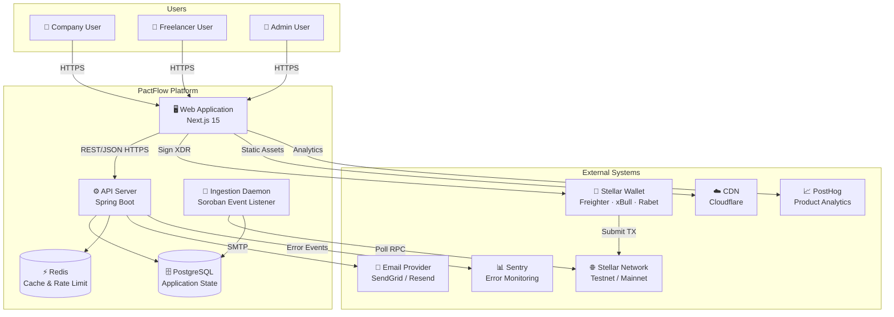

### 2.2 Container Diagram (C4 Level 2)

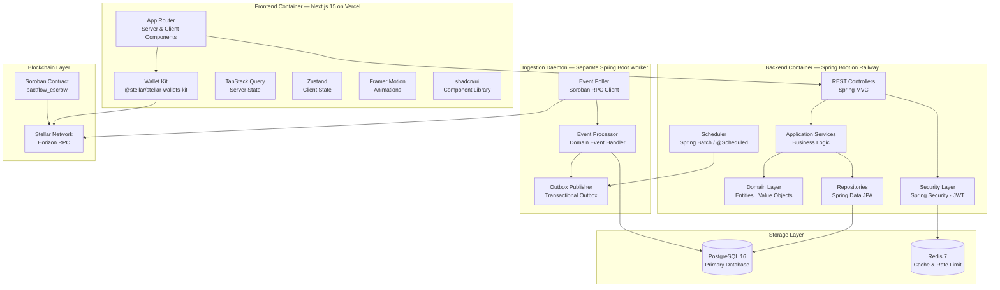

### 2.3 Component Diagram (C4 Level 3 — Backend)

```mermaid
graph TB
    subgraph Infrastructure Layer
        C[Controllers\nAuthController\nProjectController\nMilestoneController\nEscrowController\nNotificationController\nAnalyticsController]
        SEC[Security Config\nJWT Filter\nCORS Config\nRateLimit Filter]
        REPO[JPA Repositories\nUserRepository\nProjectRepository\nMilestoneRepository\nEscrowRepository\nTransactionRepository]
        OB[Outbox Processor\nScheduled Relay]
        ING[Ingestion Worker\nSoroban RPC Listener]
    end

    subgraph Application Layer
        AS[Application Services\nAuthService\nProjectService\nMilestoneService\nEscrowService\nNotificationService\nAnalyticsService]
        UC[Use Cases\nRegisterUser\nCreateProject\nFundEscrow\nReleaseMilestone\nProcessRefund]
        DTO[DTOs\nRequest / Response\nMappers]
        VAL[Validators\n@Valid Annotations\nCustom Validators]
    end

    subgraph Domain Layer
        DOM[Domain Models\nUser · Project · Milestone\nEscrowContract · Notification]
        VOP[Value Objects\nEmail · WalletAddress\nMilestoneAmount · TxHash]
        EVT[Domain Events\nProjectCreated\nMilestoneStatusChanged\nPaymentReleased]
        POL[Domain Policies\nMilestoneAmountPolicy\nEscrowEligibilityPolicy]
    end

    C --> AS
    AS --> UC
    UC --> DOM
    UC --> REPO
    AS --> DTO
    C --> VAL
    AS --> EVT
    REPO -.->|implements| DOM
    ING --> AS
    OB --> EVT
    SEC --> C
```

### 2.4 Deployment Diagram

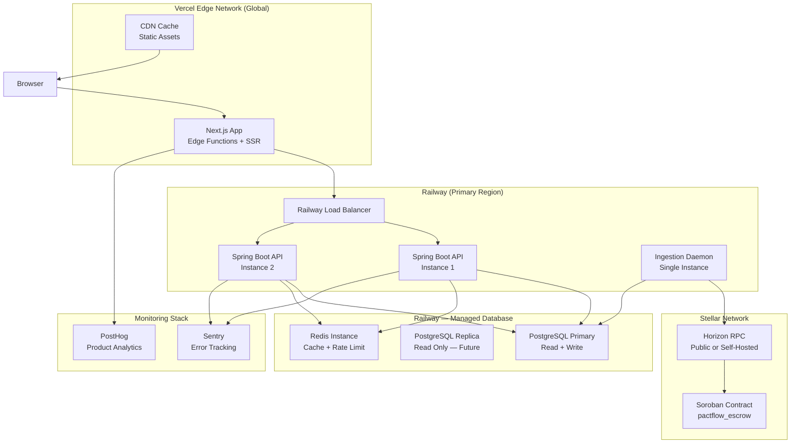

---

## 3. Layered Architecture

PactFlow uses a strict 7-layer architecture. Each layer has a single responsibility and communicates only with adjacent layers via defined interfaces.

```
┌─────────────────────────────────────────────────────────────────┐
│                   PRESENTATION LAYER                            │
│  Next.js App Router · shadcn/ui · Framer Motion · TailwindCSS   │
├─────────────────────────────────────────────────────────────────┤
│                   API LAYER                                     │
│  REST Controllers · Request Validation · Response Mapping       │
├─────────────────────────────────────────────────────────────────┤
│                   APPLICATION LAYER                             │
│  Use Cases · Application Services · DTOs · Event Publishers     │
├─────────────────────────────────────────────────────────────────┤
│                   DOMAIN LAYER                                  │
│  Aggregate Roots · Entities · Value Objects · Domain Events     │
├─────────────────────────────────────────────────────────────────┤
│                   PERSISTENCE LAYER                             │
│  JPA Repositories · Flyway Migrations · PostgreSQL              │
├─────────────────────────────────────────────────────────────────┤
│                   BLOCKCHAIN LAYER                              │
│  Soroban RPC Client · XDR Builder · Event Ingestion Daemon      │
├─────────────────────────────────────────────────────────────────┤
│                   INFRASTRUCTURE LAYER                          │
│  Redis · Email · Scheduler · Outbox Processor · Monitoring      │
└─────────────────────────────────────────────────────────────────┘
```

### 3.1 Layer Dependency Rule

> Dependencies point **inward only**. The Domain Layer has zero dependencies on frameworks, databases, or blockchain SDKs. The Application Layer depends only on the Domain Layer. Infrastructure adapts to the Application Layer's interfaces, never the reverse.

```
Infrastructure → Application → Domain
Persistence    → Application → Domain
API Layer      → Application → Domain
Blockchain     → Application → Domain
```

### 3.2 Layer Descriptions

| Layer | Owner | Responsibility | Technologies |
|---|---|---|---|
| **Presentation** | Frontend Team | Render UI, handle wallet prompts, call API | Next.js 15, TailwindCSS, shadcn/ui |
| **API** | Backend Team | Route requests, validate inputs, map DTOs | Spring MVC, Spring Validation |
| **Application** | Backend Team | Orchestrate use cases, publish domain events | Spring Services, ApplicationEventPublisher |
| **Domain** | Backend Team | Express business rules, enforce invariants | Pure Java — no framework dependencies |
| **Persistence** | Backend Team | Store and retrieve aggregate state | Spring Data JPA, PostgreSQL, Flyway |
| **Blockchain** | Backend Team | Sync on-chain events, build unsigned XDR | Stellar SDK, Soroban RPC Client |
| **Infrastructure** | Platform Team | Cross-cutting: caching, email, scheduling | Redis, SendGrid, Spring @Scheduled |
| **Monitoring** | All Teams | Observability, alerting, analytics | Sentry, PostHog, Spring Actuator |

---

## 4. Frontend Architecture

### 4.1 Technology Stack

| Technology | Version | Purpose |
|---|---|---|
| Next.js | 15.x | React framework with App Router |
| TypeScript | 5.x (strict) | Type safety across all UI code |
| TailwindCSS | 3.x | Utility-first styling |
| shadcn/ui | Latest | Accessible component primitives (Radix UI) |
| Framer Motion | 11.x | Micro-animations and page transitions |
| TanStack Query | 5.x | Server state management, caching, background sync |
| Zustand | 4.x | Lightweight client-side global state |
| @stellar/stellar-wallets-kit | Latest | Multi-wallet abstraction |

### 4.2 Folder Structure

```
frontend/
├── src/
│   ├── app/                        # Next.js App Router
│   │   ├── (auth)/                 # Auth route group — no main nav
│   │   │   ├── login/page.tsx
│   │   │   ├── register/page.tsx
│   │   │   └── layout.tsx
│   │   ├── (dashboard)/            # Authenticated route group
│   │   │   ├── dashboard/page.tsx
│   │   │   ├── projects/
│   │   │   │   ├── page.tsx        # Project list
│   │   │   │   ├── [id]/page.tsx   # Project detail
│   │   │   │   └── new/page.tsx    # Create project
│   │   │   ├── milestones/[id]/page.tsx
│   │   │   ├── transactions/page.tsx
│   │   │   ├── notifications/page.tsx
│   │   │   ├── analytics/page.tsx
│   │   │   └── layout.tsx          # Dashboard shell + nav
│   │   ├── api/                    # Next.js API Route Handlers (BFF)
│   │   │   └── auth/[...nextauth]/ # Session management via httpOnly cookies
│   │   ├── globals.css
│   │   └── layout.tsx              # Root layout, providers
│   ├── components/
│   │   ├── ui/                     # shadcn/ui primitives (generated)
│   │   ├── shared/                 # App-wide reusable components
│   │   │   ├── Header.tsx
│   │   │   ├── Sidebar.tsx
│   │   │   ├── MilestoneStatusBadge.tsx
│   │   │   ├── WalletConnectButton.tsx
│   │   │   └── TransactionCard.tsx
│   │   └── features/               # Feature-specific components
│   │       ├── projects/
│   │       ├── milestones/
│   │       ├── escrow/
│   │       └── analytics/
│   ├── hooks/
│   │   ├── useWallet.ts            # Wallet state & connection
│   │   ├── useProjects.ts          # TanStack Query project hooks
│   │   ├── useMilestones.ts
│   │   ├── useNotifications.ts
│   │   └── useSSE.ts               # Server-Sent Events subscription
│   ├── store/
│   │   ├── walletStore.ts          # Zustand: wallet address, provider
│   │   └── uiStore.ts              # Zustand: sidebar, theme
│   ├── lib/
│   │   ├── api/
│   │   │   ├── client.ts           # Axios/fetch base instance
│   │   │   └── endpoints.ts        # Typed API call functions
│   │   ├── stellar/
│   │   │   ├── walletKit.ts        # WalletKit singleton
│   │   │   └── xdr.ts              # XDR parsing utilities
│   │   └── utils.ts                # Shared utilities
│   ├── types/
│   │   ├── api.ts                  # API response type definitions
│   │   ├── domain.ts               # Domain model types
│   │   └── wallet.ts               # Wallet-related types
│   └── styles/
│       └── design-tokens.css       # CSS custom properties
```

### 4.3 Rendering Strategy

| Page | Rendering | Rationale |
|---|---|---|
| `/login`, `/register` | Server Component + Client Form | SEO-friendly shell; form interactivity on client |
| `/dashboard` | Server Component (data prefetch) | Initial load fast; hydrated for interactivity |
| `/projects` | Server Component + Client Filters | Server-rendered list; client-side filtering |
| `/projects/[id]` | Server Component | Static project detail |
| Milestone actions (approve, submit) | Client Component | Wallet interaction requires client |
| `/analytics` | Server Component | Charts rendered from pre-computed data |
| Notifications bell | Client Component | Real-time badge count via SSE |

### 4.4 State Management Strategy

```
┌──────────────────────────────────────────────────────┐
│                   State Boundaries                    │
│                                                       │
│  Server State (TanStack Query)                        │
│  ├── Projects list + detail                           │
│  ├── Milestones                                       │
│  ├── Notifications                                    │
│  ├── Transaction history                              │
│  └── Analytics data                                   │
│                                                       │
│  Client State (Zustand)                               │
│  ├── Wallet: { address, provider, isConnected }       │
│  ├── UI: { sidebarOpen, theme }                       │
│  └── Pending TX: { hash, milestoneId, status }        │
│                                                       │
│  Server Component State (React RSC)                   │
│  └── Initial page data (auth session, profile)        │
└──────────────────────────────────────────────────────┘
```

### 4.5 Wallet Integration Architecture

The frontend follows a strict separation: wallet interaction is **only for transaction signing**. All business decisions are made by the backend.

```
User Clicks Action
      │
      ▼
Frontend calls Backend API
(e.g., POST /escrow/prepare)
      │
      ▼
Backend builds + returns
unsigned Transaction XDR
      │
      ▼
WalletKit.signTransaction(xdr)
[User approves in wallet extension]
      │
      ▼
WalletKit.submitTransaction(signedXdr)
to Stellar Network directly
      │
      ▼
Frontend shows "Pending" state
SSE stream delivers confirmation
when Ingestion Daemon processes event
```

The `useWallet` hook encapsulates all WalletKit interactions. Components never import WalletKit directly.

### 4.6 Data Fetching & Caching

| Data Type | Strategy | Cache TTL | Invalidation Trigger |
|---|---|---|---|
| Projects list | TanStack Query | 30 seconds | `POST /projects` mutation |
| Project detail | TanStack Query | 60 seconds | `PATCH /projects/{id}` |
| Milestone detail | TanStack Query | 15 seconds | SSE `MILESTONE_STATUS_CHANGED` |
| Notifications | TanStack Query | 10 seconds | SSE `NOTIFICATION_RECEIVED` |
| Analytics | TanStack Query | 5 minutes | Date range change |
| User profile | TanStack Query | 5 minutes | `PATCH /users/me` |

### 4.7 Error Handling

- **API Errors:** Axios interceptor maps RFC 7807 error responses to typed `ApiError` objects. Toast alerts rendered via `sonner` library.
- **React Error Boundaries:** Each major route group wrapped in an `ErrorBoundary` that renders a fallback UI with a "Try Again" action.
- **Wallet Errors:** Caught at the `useWallet` hook level. Surfaces user-friendly messages (e.g., "Wallet extension not found", "Transaction rejected").
- **Network Errors:** TanStack Query's `retry` option (3 retries, exponential backoff) handles transient failures.

### 4.8 Theme & Design System

```
Design Tokens (CSS Custom Properties)
├── --color-brand-primary: hsl(240, 84%, 67%)   # Indigo
├── --color-brand-accent: hsl(158, 64%, 52%)    # Emerald
├── --color-surface-0: hsl(222, 84%, 5%)        # Background
├── --color-surface-1: hsl(222, 47%, 11%)       # Cards
├── --color-surface-2: hsl(217, 33%, 17%)       # Elevated
├── --color-text-primary: hsl(210, 40%, 98%)    # High emphasis
├── --color-text-secondary: hsl(215, 20%, 65%)  # Medium emphasis
├── --color-status-funded: hsl(221, 83%, 65%)   # Blue
├── --color-status-paid: hsl(158, 64%, 52%)     # Green
├── --color-status-refunded: hsl(38, 92%, 50%)  # Amber
└── --color-status-cancelled: hsl(0, 72%, 51%)  # Red
```

---

## 5. Backend Architecture

### 5.1 Technology Stack

| Technology | Version | Purpose |
|---|---|---|
| Java | 21 LTS | Language — Virtual Threads for I/O efficiency |
| Spring Boot | 3.3.x | Application framework |
| Spring Security | 6.x | Authentication, authorization, CORS |
| Spring Data JPA | 3.x | Repository abstraction over Hibernate |
| Spring Validation | 3.x | Declarative input validation |
| Flyway | 10.x | Database schema migrations |
| HikariCP | 5.x | Connection pool |
| Springdoc OpenAPI | 2.x | Auto-generated API docs |
| Lombok | 1.18.x | DTO boilerplate reduction |
| MapStruct | 1.5.x | Compile-time DTO mapping |
| Bucket4j | 8.x | In-memory rate limiting |

### 5.2 Package Structure (Clean Architecture)

```
com.pactflow/
├── domain/
│   ├── user/
│   │   ├── User.java               # Aggregate Root
│   │   ├── WalletConnection.java   # Entity
│   │   ├── Email.java              # Value Object
│   │   ├── WalletAddress.java      # Value Object
│   │   └── UserRepository.java     # Repository Interface (Port)
│   ├── project/
│   │   ├── Project.java
│   │   ├── ProjectStatus.java      # Enum
│   │   ├── ProjectBudget.java      # Value Object
│   │   └── ProjectRepository.java
│   ├── milestone/
│   │   ├── Milestone.java
│   │   ├── MilestoneStatus.java
│   │   ├── Deliverable.java
│   │   ├── MilestoneAmount.java
│   │   └── MilestoneRepository.java
│   ├── escrow/
│   │   ├── EscrowContract.java
│   │   ├── EscrowStatus.java
│   │   ├── BlockchainTransaction.java
│   │   └── EscrowRepository.java
│   └── shared/
│       ├── DomainEvent.java        # Base event interface
│       └── AuditableEntity.java    # Base entity with audit fields
│
├── application/
│   ├── auth/
│   │   ├── AuthService.java
│   │   ├── RegisterUserUseCase.java
│   │   ├── LoginUseCase.java
│   │   └── dto/
│   ├── project/
│   │   ├── ProjectService.java
│   │   ├── CreateProjectUseCase.java
│   │   └── dto/
│   ├── milestone/
│   │   ├── MilestoneService.java
│   │   ├── SubmitMilestoneUseCase.java
│   │   ├── ApproveMilestoneUseCase.java
│   │   └── dto/
│   ├── escrow/
│   │   ├── EscrowService.java
│   │   ├── PrepareEscrowUseCase.java
│   │   └── dto/
│   ├── notification/
│   │   └── NotificationService.java
│   └── analytics/
│       └── AnalyticsService.java
│
└── infrastructure/
    ├── web/
    │   ├── controller/
    │   │   ├── AuthController.java
    │   │   ├── ProjectController.java
    │   │   ├── MilestoneController.java
    │   │   ├── EscrowController.java
    │   │   └── ...
    │   ├── security/
    │   │   ├── JwtAuthFilter.java
    │   │   ├── SecurityConfig.java
    │   │   └── RateLimitFilter.java
    │   └── exception/
    │       └── GlobalExceptionHandler.java
    ├── persistence/
    │   ├── jpa/                    # JPA implementations of domain repositories
    │   ├── entity/                 # JPA @Entity classes (infrastructure detail)
    │   └── migration/              # Flyway SQL scripts
    ├── blockchain/
    │   ├── SorobanRpcClient.java
    │   ├── XdrTransactionBuilder.java
    │   └── ingestion/
    │       ├── SorobanIngestionWorker.java
    │       └── SorobanEventProcessor.java
    ├── cache/
    │   └── RedisConfig.java
    ├── mail/
    │   └── EmailService.java
    └── config/
        ├── ApplicationConfig.java
        └── OpenApiConfig.java
```

### 5.3 Module Interaction Rules

| From Module | To Module | Communication |
|---|---|---|
| `infrastructure.web` | `application` | Direct method call (Spring DI) |
| `application` | `domain` | Direct method call |
| `application` | `infrastructure.persistence` | Via domain Repository interfaces |
| `application` | `infrastructure.blockchain` | Via `EscrowService` Port interface |
| `infrastructure.blockchain.ingestion` | `application` | Direct service call |
| `domain` | _(any)_ | ❌ Zero outgoing dependencies |

### 5.4 Transaction Management

- All write operations within a single bounded context are wrapped in `@Transactional`.
- Cross-context writes use the **Transactional Outbox Pattern** to guarantee at-least-once domain event delivery without distributed transactions.
- Database isolation level: `READ_COMMITTED` (default). `SERIALIZABLE` applied only to escrow-critical paths where optimistic locking alone is insufficient.
- Optimistic locking via `@Version` (JPA) on all aggregate root entities. Conflicts trigger a retry with exponential backoff (max 3 attempts) at the Application Layer.

### 5.5 Exception Handling

```
Spring Controller
    → Application Service
    → Domain Entity (throws DomainException)
    ← Application wraps in ApplicationException
    ← Controller delegates to GlobalExceptionHandler
    → Renders RFC 7807 ProblemDetail JSON response
```

**Exception Hierarchy:**
```
PactFlowException (base)
├── DomainException
│   ├── InvalidStateTransitionException
│   ├── BusinessRuleViolationException
│   └── EntityNotFoundException
├── ApplicationException
│   ├── DuplicateResourceException
│   ├── AuthorizationException
│   └── ValidationException
└── InfrastructureException
    ├── BlockchainCommunicationException
    └── ExternalServiceException
```

---

## 6. Blockchain Architecture

### 6.1 Architecture Philosophy

The blockchain layer in PactFlow is deliberately thin. It has two exclusive functions:

1. **XDR Builder** — constructs unsigned Soroban transaction envelopes when requested by the Application layer.
2. **Ingestion Daemon** — polls Soroban RPC for contract events and translates them into application domain events.

The blockchain layer **never** initiates business logic. It reacts and translates.

### 6.2 Wallet Interaction Flow

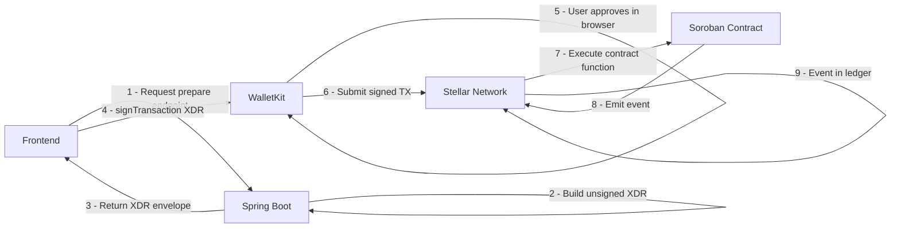

### 6.3 XDR Transaction Builder

The `XdrTransactionBuilder` is responsible for constructing all unsigned transaction envelopes returned by the API:

| API Endpoint | Contract Function | Builder Method |
|---|---|---|
| `POST /escrow/prepare` | `create_escrow` + `fund` | `buildFundEscrowXdr()` |
| `POST /milestones/{id}/approve` | `release_payment` | `buildReleaseMilestoneXdr()` |
| `POST /milestones/{id}/request-refund` | `request_refund` | `buildRefundXdr()` |
| `POST /milestones/{id}/start` | `lock` | `buildLockEscrowXdr()` |

Each builder method:
1. Fetches the latest ledger sequence from Horizon.
2. Builds the contract invocation operation parameters.
3. Wraps in a `TransactionEnvelope` with the source account set to the client's public key.
4. Returns the base64-encoded XDR string.

### 6.4 Ingestion Daemon Architecture

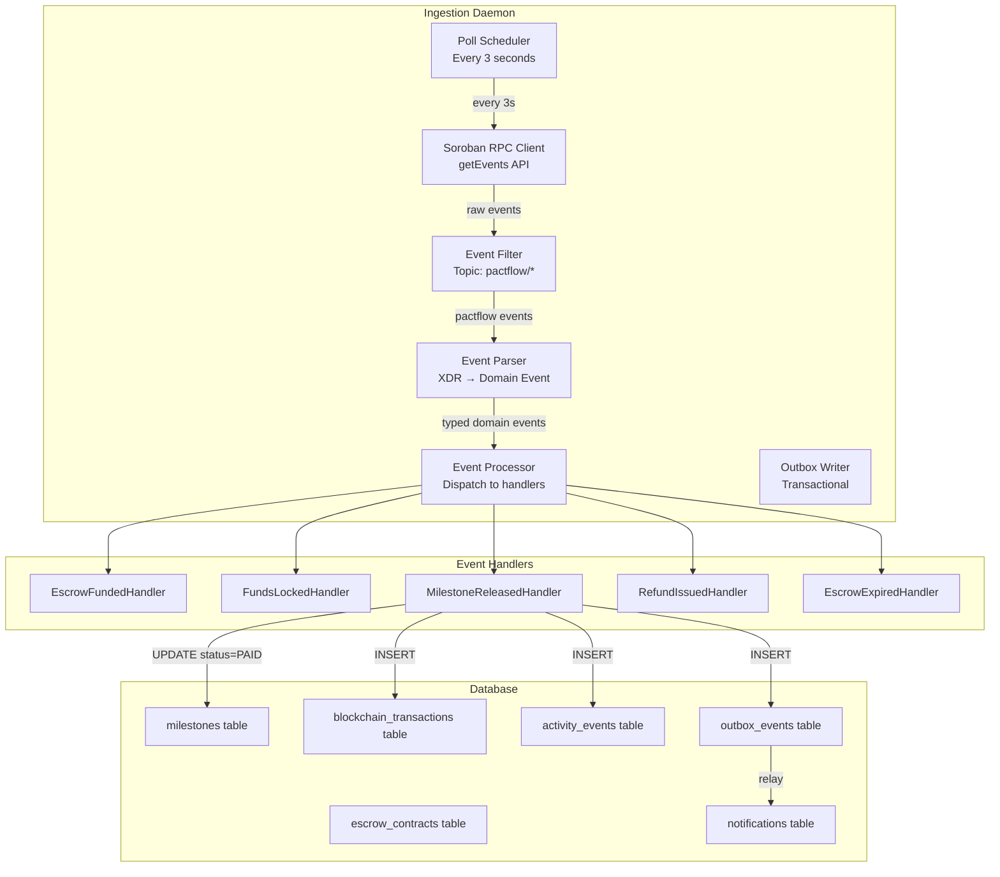

### 6.5 Event Cursor Strategy

The daemon maintains a `last_processed_ledger` cursor in a dedicated `daemon_state` table. On restart:
1. Read `last_processed_ledger` from DB.
2. Resume polling from that ledger + 1.
3. Process events in order.
4. Update cursor atomically in the same transaction as event processing.

This guarantees **exactly-once processing** combined with the idempotency check (event already in `blockchain_transactions` by `tx_hash`).

### 6.6 Retry & Failure Recovery

| Failure Scenario | Recovery Strategy |
|---|---|
| Soroban RPC timeout | Exponential backoff: 3s → 6s → 12s → 24s |
| Event processing exception | Write to `outbox_events` with `status=FAILED`, retry up to 5 times |
| DB write failure during event | Transaction rollback; event re-processed on next poll (idempotent handlers) |
| Daemon crash | On restart, cursor resumes from last committed ledger |
| Network partition | Daemon queues events in memory (bounded buffer); flushes on reconnect |

### 6.7 Confirmation Strategy

PactFlow uses **single ledger confirmation**. Stellar's BFT consensus guarantees finality once a transaction is included in a closed ledger. Unlike Ethereum, there are no block reorganizations. A confirmed Stellar transaction is irreversible.

---

## 7. Database Architecture

### 7.1 Database Technology

| Concern | Technology | Rationale |
|---|---|---|
| Primary store | PostgreSQL 16 | ACID, JSONB, RLS, mature tooling |
| Schema migrations | Flyway 10 | Versioned, repeatable, team-friendly |
| Connection pool | HikariCP | Industry-standard, zero-overhead |
| Cache layer | Redis 7 | Sub-millisecond reads, rate limiting |

### 7.2 Migration Strategy

```
db/migration/
├── V1__create_users_and_sessions.sql
├── V2__create_wallet_connections.sql
├── V3__create_projects.sql
├── V4__create_milestones_and_deliverables.sql
├── V5__create_comments.sql
├── V6__create_escrow_contracts.sql
├── V7__create_blockchain_transactions.sql
├── V8__create_notifications_and_activity.sql
├── V9__create_outbox_events.sql
├── V10__create_analytics_tables.sql
├── V11__create_indexes_tier1.sql
├── V12__create_indexes_tier2.sql
├── V13__create_rls_policies.sql
└── V14__create_triggers_updated_at.sql
```

**Rules:**
- Migration scripts are **immutable** after merge. Never edit a committed migration.
- Destructive changes require a new migration (never in-place delete).
- Every schema change is reviewed for backward compatibility with the running application (zero-downtime deployments require two-phase migrations for column renames).

### 7.3 Connection Pool Configuration

| Parameter | Value | Rationale |
|---|---|---|
| `maximumPoolSize` | 20 (API) + 5 (Daemon) | Sized for Railway's managed PostgreSQL |
| `minimumIdle` | 5 | Keep warm connections ready |
| `connectionTimeout` | 30s | Fail fast; surface connectivity issues |
| `idleTimeout` | 10 minutes | Release unused connections |
| `maxLifetime` | 30 minutes | Prevent connection rot |
| `leakDetectionThreshold` | 60s | Alert on held connections |

### 7.4 Isolation Levels

| Operation | Isolation Level | Reason |
|---|---|---|
| Read operations | `READ_COMMITTED` | Default, no dirty reads, maximum throughput |
| Milestone state transitions | `REPEATABLE_READ` | Prevent phantom reads during state machine checks |
| Escrow status updates (daemon) | `READ_COMMITTED` + optimistic lock | Daemon is single-instance; optimistic lock prevents API race |
| Analytics snapshot writes | `READ_COMMITTED` | Snapshot workers operate on eventually consistent data |

### 7.5 Row-Level Security Policies

Three PostgreSQL roles enforce least-privilege access at the database level:

| Role | Tables | Permissions |
|---|---|---|
| `pactflow_app` | All except escrow writes | SELECT, INSERT, UPDATE (excl. escrow_contracts, blockchain_transactions) |
| `pactflow_ingestion` | `escrow_contracts`, `blockchain_transactions` | INSERT, UPDATE only |
| `pactflow_readonly` | All | SELECT only (used by analytics queries and reporting) |

### 7.6 Caching Architecture

```
┌─────────────────────────────────────────────────────────────┐
│                     Redis Cache Layers                      │
│                                                             │
│  L1 — Session Store                                         │
│  Key: session:{token_hash}                                  │
│  TTL: 15 minutes (matches JWT expiry)                       │
│  Purpose: Validate JWT without DB hit on every request      │
│                                                             │
│  L2 — Rate Limit Counters                                   │
│  Key: ratelimit:{user_id or ip}:{window}                    │
│  TTL: 1 minute sliding window                               │
│  Purpose: Bucket4j distributed rate limiting                │
│                                                             │
│  L3 — Wallet Challenge Nonces                               │
│  Key: walletchallenge:{public_key}                          │
│  TTL: 5 minutes                                             │
│  Purpose: One-time nonce for wallet signature verification  │
│                                                             │
│  L4 — Analytics Snapshots (Future)                          │
│  Key: analytics:platform:{date}                             │
│  TTL: 1 hour                                                │
│  Purpose: Cache pre-computed platform metrics               │
└─────────────────────────────────────────────────────────────┘
```

### 7.7 Future Database Scaling

| Scale Trigger | Strategy |
|---|---|
| Read latency > 200ms | Add PostgreSQL read replica; route analytics queries via `pactflow_readonly` |
| `activity_events` > 10M rows | Partition by `occurred_at` month (RANGE partitioning) |
| `blockchain_transactions` > 5M rows | Partition by `confirmed_at` month |
| Primary write throughput saturated | Vertical scale first, then evaluate Citus horizontal sharding |
| Full-text search needed | Add `tsvector` columns + GIN indexes, or integrate Typesense |

---

## 8. Authentication Architecture

### 8.1 Authentication Flows

PactFlow supports two authentication modes:

1. **Email + Password** — traditional credential authentication.
2. **Wallet Signature** — cryptographic ownership proof for wallet linking.

These are complementary, not alternatives. Users always authenticate with email + password. Wallet linking is an additional step using the wallet signature challenge flow.

### 8.2 JWT Strategy

```
┌─────────────────────────────────────────────────────────────┐
│  Access Token                                               │
│  Algorithm: HS256 (MVP) → RS256 (production)               │
│  TTL: 15 minutes                                            │
│  Payload: { sub, email, accountType, sessionId, iat, exp }  │
│  Storage: Memory only (never localStorage)                  │
│  Transport: Authorization: Bearer header                    │
│                                                             │
│  Refresh Token                                              │
│  Type: Opaque random 256-bit value                          │
│  Storage: httpOnly, Secure, SameSite=Strict cookie          │
│  DB Storage: SHA-256 hash in user_sessions table            │
│  TTL: 30 days                                               │
│  Rotation: Every refresh call issues a new token            │
└─────────────────────────────────────────────────────────────┘
```

### 8.3 Token Validation Pipeline

```
Incoming Request
      │
      ▼
JwtAuthFilter (Spring Security)
      │
      ├─── Missing/malformed header → 401
      │
      ▼
Parse JWT → Validate signature + expiry
      │
      ├─── Invalid signature / expired → 401
      │
      ▼
Check session in Redis (sessionId from payload)
      │
      ├─── Session not found → 401 (forced logout)
      │
      ▼
Load UserDetails from DB (on cache miss)
      │
      ▼
Set SecurityContext → Proceed to Controller
```

### 8.4 RBAC Model

| Role | Account Type | Capabilities |
|---|---|---|
| `ROLE_COMPANY` | Company users | Create projects, fund escrow, approve milestones, request refunds |
| `ROLE_FREELANCER` | Freelancer users | Start milestones, submit deliverables, post comments |
| `ROLE_ADMIN` | Internal staff | View all resources, deactivate users, view platform analytics |
| `ROLE_DAEMON` | Ingestion service | Write to escrow_contracts and blockchain_transactions only |

Authorization is enforced at two levels:
1. **Method-level** (`@PreAuthorize`) — coarse-grained role checks in controllers.
2. **Service-level** — fine-grained ownership checks (e.g., "is this user the project's client?").

### 8.5 Wallet Authentication Detail

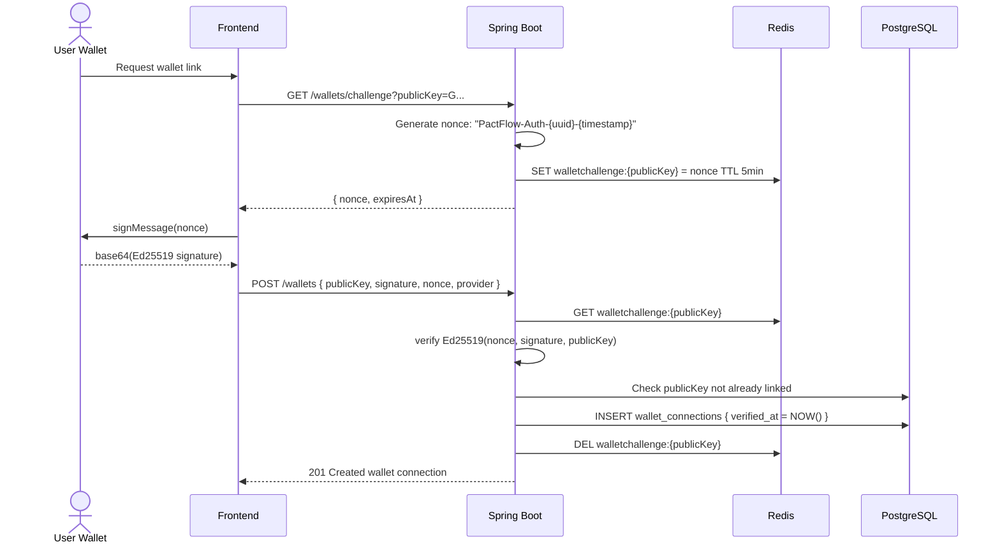

---

## 9. API Communication

### 9.1 Request Processing Pipeline

```
Client Request
      │
      ▼
[1] Rate Limit Filter (Bucket4j + Redis)
      │── 429 if limit exceeded ──►
      ▼
[2] CORS Filter
      │── 403 if origin not allowed ──►
      ▼
[3] JWT Auth Filter
      │── 401 if invalid/missing token ──►
      ▼
[4] Spring MVC DispatcherServlet
      │
      ▼
[5] Controller Method
      │
      ▼
[6] @Valid Bean Validation
      │── 422 if validation fails ──►
      ▼
[7] Application Service
      │── 409 if business rule violated ──►
      │── 404 if entity not found ──►
      │── 403 if not authorized ──►
      ▼
[8] Response Mapping (MapStruct DTO)
      │
      ▼
[9] Global Exception Handler (fallback)
      │── 500 for unexpected exceptions ──►
      ▼
Response to Client
```

### 9.2 Pagination Strategy

All list endpoints use **offset-based pagination** in Level 4, with cursor-based pagination available via the `cursor` parameter for high-throughput endpoints.

```
Request: GET /projects?page=2&pageSize=20&sortBy=createdAt&sortDir=desc
Response: {
  "data": [...],
  "pagination": {
    "page": 2, "pageSize": 20, "totalItems": 47,
    "totalPages": 3, "hasNextPage": true, "hasPreviousPage": true
  }
}
```

UUID v7 primary keys enable efficient cursor-based pagination in future: `GET /projects?cursor={last_uuid}&pageSize=20`.

### 9.3 Retry & Timeout Strategy

| Scenario | Client-Side Behaviour |
|---|---|
| Network timeout (5s) | Retry with exponential backoff: 1s, 2s, 4s (max 3) |
| 429 Rate Limited | Wait `Retry-After` header value, then retry |
| 5xx Server Error | Retry once after 2s for idempotent GET requests |
| 4xx Client Error | Do not retry; surface error to user |
| Wallet submission timeout | Show "pending" UI; SSE will confirm via event |

### 9.4 API Versioning Lifecycle

```
v1 (Current — MVP)
  │
  ├── Breaking change needed (e.g., rename field)
  │
  ▼
v2 Introduced alongside v1
  │
  ├── 12-month deprecation window for v1
  ├── Deprecation header added to all v1 responses:
  │   Deprecation: Sat, 12 Jul 2027 00:00:00 GMT
  │   Sunset: Sat, 12 Jul 2027 00:00:00 GMT
  │
  ▼
v1 Decommissioned (client migration complete)
```

---

## 10. Request Lifecycle

### 10.1 User Login

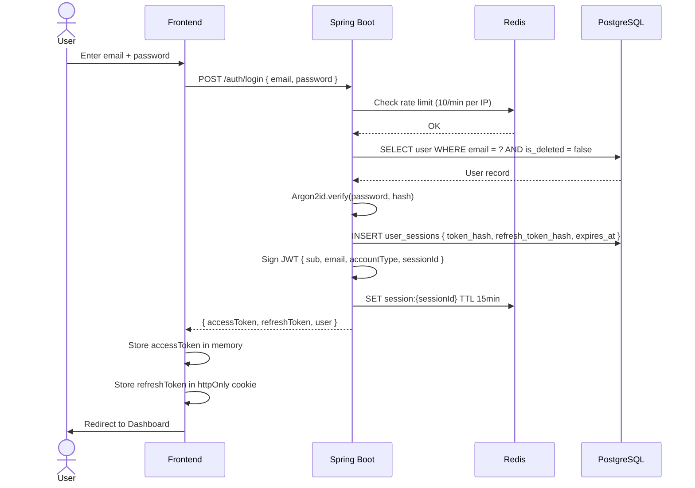

### 10.2 Wallet Connection

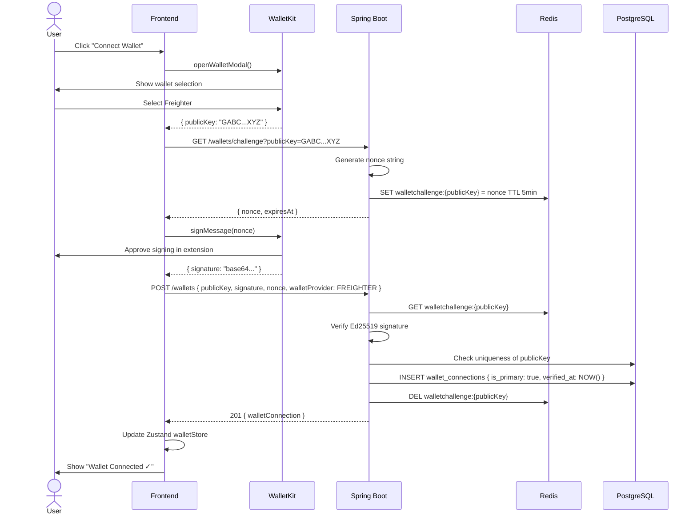

### 10.3 Create Project

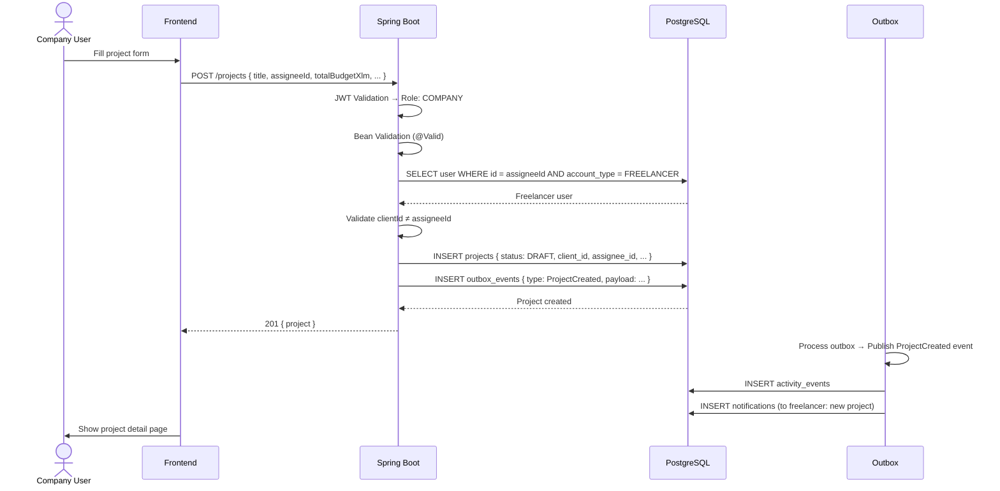

### 10.4 Fund Escrow

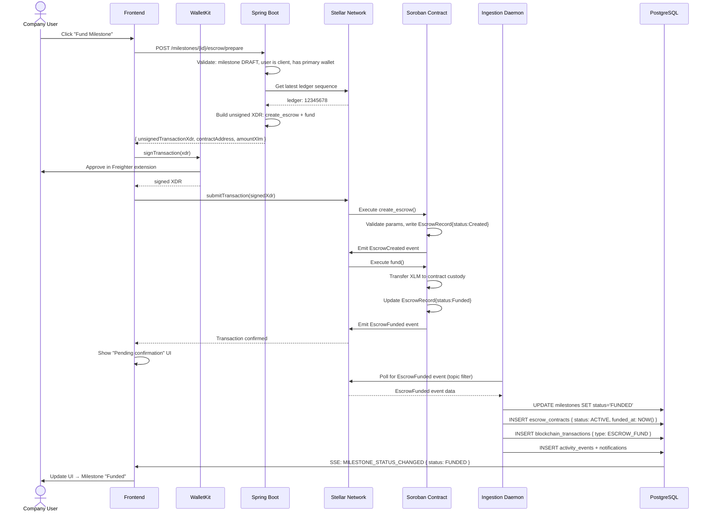

### 10.5 Submit Milestone

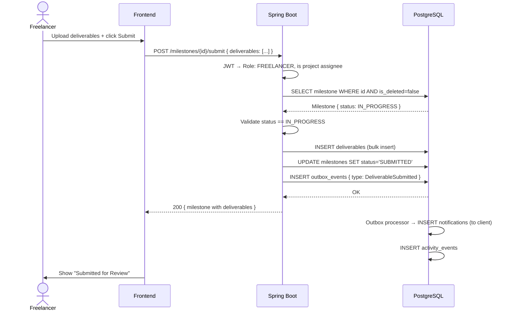

### 10.6 Approve Milestone & Release Payment

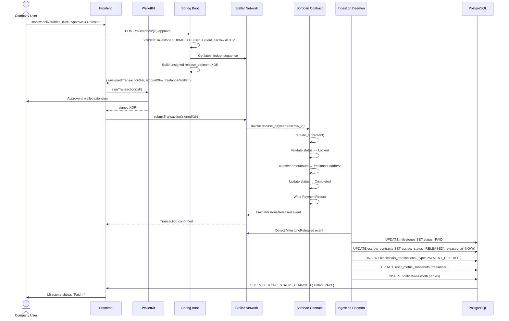

### 10.7 Refund Flow

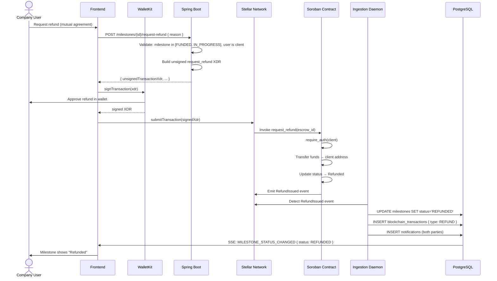

---

## 11. Event Architecture

### 11.1 Event Flow Overview

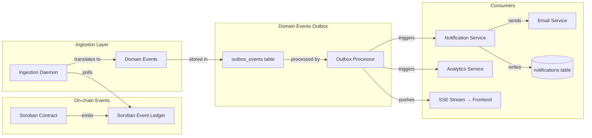

### 11.2 Domain Event Catalog

| Event | Publisher | Consumers | Data |
|---|---|---|---|
| `UserRegistered` | AuthService | NotificationService | userId, email, accountType |
| `WalletLinked` | WalletService | NotificationService | userId, publicKey |
| `ProjectCreated` | ProjectService | NotificationService, Analytics | projectId, clientId, assigneeId |
| `ProjectStatusChanged` | ProjectService | NotificationService | projectId, oldStatus, newStatus |
| `MilestoneCreated` | MilestoneService | NotificationService | milestoneId, projectId, amount |
| `MilestoneStatusChanged` | MilestoneService | NotificationService, Analytics | milestoneId, oldStatus, newStatus |
| `DeliverableSubmitted` | MilestoneService | NotificationService | milestoneId, deliverableId |
| `CommentPosted` | CommentService | NotificationService | commentId, projectId, authorId |
| `EscrowFunded` | Ingestion Daemon | MilestoneService, Analytics | escrowId, milestoneId, amountXlm |
| `PaymentReleased` | Ingestion Daemon | MilestoneService, Analytics, Notification | escrowId, milestoneId, freelancerId |
| `EscrowRefunded` | Ingestion Daemon | MilestoneService, Analytics, Notification | escrowId, milestoneId, clientId |
| `EscrowExpired` | Ingestion Daemon | MilestoneService, Notification | escrowId, milestoneId |

### 11.3 Transactional Outbox Pattern

```
Application Service
  ├── BEGIN TRANSACTION
  │   ├── Write domain state to primary tables
  │   └── INSERT event to outbox_events { status: PENDING }
  └── COMMIT
                          ↓
Outbox Processor (@Scheduled every 1 second)
  ├── SELECT * FROM outbox_events WHERE status = 'PENDING' LIMIT 50
  ├── For each event:
  │   ├── Dispatch to event handler
  │   ├── UPDATE outbox_events SET status = 'PROCESSED'
  │   └── On failure: UPDATE outbox_events SET status = 'FAILED', retry_count++
  └── Dead-letter events (retry_count >= 5): alert + manual review
```

**Guarantee:** Events are never lost even if the application crashes between the primary write and event dispatch. The outbox is always committed atomically with the domain state change.

### 11.4 Real-Time Event Delivery (SSE)

The `GET /api/v1/events/stream` endpoint maintains a persistent SSE connection per authenticated user. When the outbox processor dispatches events that are relevant to the connected user, they are pushed in real-time without polling.

```
SSE Connection Lifecycle:
  1. Frontend connects: GET /events/stream (JWT in header)
  2. Server registers user's SSE emitter
  3. Outbox processor dispatches event → checks all active emitters
  4. If emitter.userId matches event.recipientId → push event
  5. Client receives event → invalidates relevant TanStack Query cache
  6. UI re-renders with fresh data
```

---

## 12. Monitoring Architecture

### 12.1 Observability Pillars

```
┌─────────────────────────────────────────────────────────────────┐
│  THREE PILLARS OF OBSERVABILITY                                 │
│                                                                 │
│  Logs           Metrics            Traces                       │
│  ────────────   ─────────────────  ──────────────────────────   │
│  Structured     Spring Actuator    Spring Cloud Sleuth           │
│  JSON logs      Prometheus format  Trace ID in all logs          │
│  Correlation    JVM metrics        Cross-service correlation      │
│  IDs            DB pool metrics    Sentry performance monitoring  │
│  Error context  Ledger lag metrics                              │
└─────────────────────────────────────────────────────────────────┘
```

### 12.2 Structured Logging

Every log entry follows a machine-parseable JSON format:

```json
{
  "timestamp": "2026-07-12T07:00:00.000Z",
  "level": "INFO",
  "service": "pactflow-api",
  "traceId": "4bf92f3577b34da6a3ce929d0e0e4736",
  "spanId": "00f067aa0ba902b7",
  "userId": "01923abc-...",
  "requestId": "req_01923def-...",
  "event": "MILESTONE_FUNDED",
  "milestoneId": "01923mno-...",
  "message": "Milestone funded via on-chain event. Transitioning to FUNDED status."
}
```

**Log Levels:**
- `ERROR` — Unexpected failures, exceptions, data integrity issues
- `WARN` — Retried operations, degraded service, approaching limits
- `INFO` — State transitions, user actions, event processing
- `DEBUG` — Detailed flow (disabled in production)

### 12.3 Spring Actuator Endpoints

| Endpoint | Purpose | Access |
|---|---|---|
| `/actuator/health` | Liveness + readiness probes | Public (Railway probe) |
| `/actuator/health/liveness` | Is the JVM alive? | Public |
| `/actuator/health/readiness` | DB + Redis connected? | Public |
| `/actuator/metrics` | Prometheus metrics | Internal only |
| `/actuator/info` | Build version, git commit | Internal only |

### 12.4 Custom Metrics

| Metric | Type | Description |
|---|---|---|
| `pactflow.escrow.funded.count` | Counter | Total escrows funded |
| `pactflow.payment.released.total_xlm` | Gauge | Total XLM released |
| `pactflow.ingestion.lag.ledgers` | Gauge | Ledgers behind current network tip |
| `pactflow.api.requests.p95` | Histogram | 95th percentile API response time |
| `pactflow.milestone.state_transition.errors` | Counter | Invalid state transition attempts |
| `pactflow.outbox.pending.count` | Gauge | Unprocessed outbox events |
| `pactflow.db.pool.utilization` | Gauge | HikariCP connection usage |

### 12.5 Sentry Integration

```
Backend:
  - All uncaught exceptions automatically captured
  - User context (userId, accountType) attached to events
  - Performance monitoring on all Spring MVC requests
  - Ingestion daemon errors: separate Sentry project

Frontend:
  - React Error Boundary captures and reports rendering errors
  - API error responses logged with trace ID
  - Wallet transaction failures captured with public key context
```

### 12.6 PostHog Integration

Events tracked (no PII):

| Event | Trigger | Properties |
|---|---|---|
| `user_registered` | Registration complete | accountType |
| `wallet_connected` | Wallet verified | walletProvider |
| `project_created` | Project saved | (no PII) |
| `milestone_funded` | EscrowFunded event | amountXlm |
| `milestone_paid` | PaymentReleased event | amountXlm |
| `page_view` | Route change | pageName |

### 12.7 Health Check Architecture

```
Railway Deployment Health Probes:
  Liveness: GET /actuator/health/liveness → 200 if JVM running
  Readiness: GET /actuator/health/readiness → 200 if DB + Redis healthy

Readiness checks:
  ├── PostgreSQL: SELECT 1
  ├── Redis: PING
  └── Soroban RPC: GET /health (Horizon endpoint)

If readiness fails → Railway removes instance from load balancer rotation
If liveness fails after 3 consecutive failures → Railway restarts container
```

### 12.8 Alerting Strategy

| Alert | Threshold | Severity | Action |
|---|---|---|---|
| API P95 latency | > 1000ms for 5 min | Warning | Investigate slow queries |
| API error rate | > 1% 5xx for 2 min | Critical | PagerDuty on-call |
| Ingestion lag | > 100 ledgers behind | Warning | Check daemon health |
| Ingestion lag | > 1000 ledgers behind | Critical | Immediate investigation |
| Outbox backlog | > 1000 pending events | Warning | Processor health check |
| DB pool utilization | > 80% | Warning | Scale API instances |
| Contract pause event | Any | Critical | Security incident procedure |

---

## 13. DevOps Architecture

### 13.1 Environment Strategy

| Environment | Purpose | Infrastructure | Trigger |
|---|---|---|---|
| `development` | Local dev | Docker Compose (local) | Manual |
| `staging` | Pre-production testing | Railway (staging project) | PR merge to `main` |
| `production` | Live users | Railway (production project) | Manual promote from staging |

### 13.2 Docker Architecture

```
docker-compose.yml (Development)
├── pactflow-api        # Spring Boot (port 8080)
├── pactflow-daemon     # Ingestion worker (port 8081)  
├── postgres            # PostgreSQL 16 (port 5432)
├── redis               # Redis 7 (port 6379)
└── mailhog             # Local email capture (port 8025)
```

**Production Docker Images:**
- Multi-stage builds: builder stage (JDK 21 + Maven) → runtime stage (JRE 21 minimal).
- Images tagged by git commit SHA: `pactflow-api:a1b2c3d`.
- Images pushed to GitHub Container Registry (GHCR).

### 13.3 GitHub Actions CI/CD Pipeline

```mermaid
graph LR
    PR[Pull Request] --> CI

    subgraph CI Pipeline
        CI[ci.yml] --> LINT[Lint\nCheckstyle + ESLint]
        LINT --> BUILD[Build\nMaven + npm run build]
        BUILD --> TEST[Unit Tests\nJUnit + Jest]
        TEST --> ITEST[Integration Tests\nTestcontainers]
        ITEST --> SEC[Security Scan\nDependabot + OWASP]
        SEC --> COVERAGE[Coverage Gate\n≥ 80% required]
    end

    COVERAGE -->|All pass| MERGE[Merge to main]

    subgraph CD Pipeline
        MERGE --> STAGE_DEPLOY[deploy-staging.yml]
        STAGE_DEPLOY --> DOCKER_BUILD[Docker Build\n& Push to GHCR]
        DOCKER_BUILD --> RAILWAY_STAGE[Deploy to Railway\nStaging]
        RAILWAY_STAGE --> SMOKE[Smoke Tests\nPlaywright E2E]
        SMOKE -->|Manual approval| PROD_DEPLOY[deploy-production.yml]
        PROD_DEPLOY --> RAILWAY_PROD[Deploy to Railway\nProduction]
        RAILWAY_PROD --> VERIFY[Post-Deploy Verify\nHealth Check Probe]
    end
```

### 13.4 Environment Variables & Secrets

| Category | Variables | Storage |
|---|---|---|
| Database | `DB_URL`, `DB_USERNAME`, `DB_PASSWORD` | Railway Secret Variables |
| Redis | `REDIS_URL`, `REDIS_PASSWORD` | Railway Secret Variables |
| JWT | `JWT_SECRET_KEY` (HS256 key, 256+ bits) | Railway Secret Variables |
| Stellar | `STELLAR_NETWORK`, `HORIZON_URL`, `SOROBAN_RPC_URL` | Railway Config Variables |
| Email | `EMAIL_API_KEY`, `EMAIL_FROM_ADDRESS` | Railway Secret Variables |
| Monitoring | `SENTRY_DSN`, `POSTHOG_API_KEY` | Railway Config Variables |
| Admin | `PACTFLOW_ADMIN_ADDRESS` | Railway Config Variables |

**Rules:**
- Secrets never committed to git — `.gitignore` enforces `.env.local` and `application-local.yml`.
- Secret rotation: JWT secret rotated quarterly; all active sessions invalidated on rotation.
- No secret ever appears in application logs.

### 13.5 Deployment Strategy

**Zero-Downtime Deployments:**
1. Railway deploys new container alongside running container.
2. Health probe on new container (`/actuator/health/readiness`).
3. Load balancer switches traffic to new container on health pass.
4. Old container gracefully drained (`SIGTERM` → 30s grace period).
5. Old container terminated.

**Rollback Strategy:**
- Railway supports instant rollback to previous deploy with one click.
- Database migrations are backward-compatible (additive only), so rollback is safe.
- Git tag every production deploy: `release/v1.x.x`.

### 13.6 Release Strategy

- **GitFlow Light:** `main` is always deployable. Features developed in `feat/*` branches.
- **Semantic Versioning:** `MAJOR.MINOR.PATCH`. API version bumps on MAJOR changes.
- **Release Notes:** Auto-generated from Conventional Commit messages via `release-please`.
- **Canary releases (Future Level 5):** Railway's traffic splitting for gradual rollout.

---

## 14. Scalability

### 14.1 Scaling Tiers

#### Tier 1 — 100 Users (MVP Launch)

```
Architecture: Single-instance
  - 1x Spring Boot API (Railway Starter)
  - 1x Ingestion Daemon
  - 1x PostgreSQL (Railway Managed, 1GB)
  - 1x Redis (Railway Managed, 256MB)
  - Vercel Hobby (Frontend)

Performance characteristics:
  - DB connection pool: 10
  - No caching of application data
  - All writes on primary DB
  - Estimated cost: ~$50/month
```

#### Tier 2 — 1,000 Users (Growth)

```
Architecture: Multi-instance
  - 2x Spring Boot API instances (Railway)
  - 1x Ingestion Daemon (single, idempotent)
  - PostgreSQL upgraded (2GB RAM, SSD)
  - Redis upgraded (512MB)
  - Cloudflare CDN for static assets
  - Redis L3 session cache activated

Performance characteristics:
  - DB connection pool: 20 per instance
  - Redis session caching reduces DB auth hits by ~90%
  - Estimated cost: ~$200/month
```

#### Tier 3 — 10,000 Users (Scale)

```
Architecture: Optimized multi-instance
  - 3-4x Spring Boot API instances (auto-scaled)
  - PostgreSQL with read replica
  - Analytics queries routed to read replica
  - Redis cluster (1GB)
  - CDN caching for API responses (GET endpoints)
  - activity_events table partitioned by month

Performance characteristics:
  - Read/write split reduces primary DB load ~60%
  - P95 API response < 200ms
  - Estimated cost: ~$800/month
```

#### Tier 4 — 100,000 Users (Maturity)

```
Architecture: Cloud-native distributed
  - 5-10x Spring Boot API instances
  - AWS RDS PostgreSQL (multi-AZ) or Neon
  - 2x read replicas (analytics, reporting)
  - ElastiCache Redis cluster
  - Background jobs moved to dedicated workers
  - S3/R2 for deliverable file storage
  - Full-text search: Typesense or Meilisearch sidecar

Performance characteristics:
  - DB connection pooling via PgBouncer (transaction mode)
  - P95 API response < 150ms
  - Estimated cost: ~$3,000-5,000/month
```

#### Tier 5 — 1,000,000 Users (Global Scale)

```
Architecture: Global distributed
  - Kubernetes (EKS/GKE) for API orchestration
  - Multi-region PostgreSQL (Citus or CockroachDB)
  - Global Redis (Upstash or Redis Cloud Global)
  - CDN-first: most read operations cached at edge
  - Message queue: Kafka for domain event streaming
  - Dedicated microservices: Notification, Analytics, Search
  - Soroban: Self-hosted Horizon + RPC nodes

Performance characteristics:
  - P95 global API response < 100ms
  - Zero single points of failure
  - Estimated cost: ~$30,000+/month
```

### 14.2 Database Scaling Strategy

```
Phase 1: Vertical (current)
  └─ Increase PostgreSQL RAM/CPU on Railway

Phase 2: Read Replica
  └─ Route: GET /analytics, GET /transactions → Replica
  └─ Route: All writes → Primary

Phase 3: Partitioning
  └─ activity_events BY RANGE (occurred_at) monthly
  └─ blockchain_transactions BY RANGE (confirmed_at) monthly

Phase 4: PgBouncer
  └─ Transaction-mode pooling
  └─ Reduces connection overhead for high-concurrency APIs

Phase 5: Horizontal Sharding (if needed)
  └─ Citus extension: shard by user_id
  └─ Each shard on dedicated hardware
```

### 14.3 Caching Scaling Strategy

| Level | Cache Target | Technology | Invalidation |
|---|---|---|---|
| L1 — In-Process | JVM heap cache (Caffeine) | Caffeine | TTL + size eviction |
| L2 — Distributed | Redis | Redis | Event-driven + TTL |
| L3 — HTTP | Cloudflare CDN | CDN Rules | `Cache-Control` headers |
| L4 — DB Query | PostgreSQL `pg_stat_statements` | DB internal | Automatic |

---

## 15. Security Architecture

### 15.1 Security Perimeter & Trust Boundaries

```
┌─────────────────────────────────────────────────────────────┐
│  UNTRUSTED ZONE                                             │
│  • Public Internet                                          │
│  • Browser Clients                                          │
│  • Wallet Extensions (browser-sandboxed)                    │
│  • Stellar Network (public blockchain — trustless)          │
├─────────────────────────────────────────────────────────────┤
│  DMZ / EDGE                                                 │
│  • Cloudflare (DDoS protection, WAF, CDN)                   │
│  • Vercel Edge (Next.js serving)                            │
│  • Railway Load Balancer (TLS termination)                  │
├─────────────────────────────────────────────────────────────┤
│  TRUSTED ZONE                                               │
│  • Spring Boot API instances                                │
│  • Ingestion Daemon (internal, no public port)              │
│  • PostgreSQL (VPC-private, no public endpoint)             │
│  • Redis (VPC-private, auth required)                       │
└─────────────────────────────────────────────────────────────┘
```

### 15.2 Zero-Trust Principles

1. **Every request is authenticated.** No internal trust between services without auth tokens.
2. **Least privilege everywhere.** DB roles, API roles, and OS users have minimal permissions.
3. **Network segmentation.** PostgreSQL and Redis are never exposed to the public internet.
4. **Verify, don't trust.** JWT signature verified on every request. Wallet addresses re-validated on every escrow operation.

### 15.3 Threat Mitigations

| Threat | Mitigation |
|---|---|
| **SQL Injection** | JPA parameterised queries only. Raw SQL never constructed from user input. |
| **XSS** | Comment content sanitised server-side (strip HTML). CSP headers on all responses. |
| **CSRF** | Refresh tokens in `SameSite=Strict` httpOnly cookies. Double-submit cookie pattern for form POSTs. |
| **Replay Attacks** | JWT includes `jti` (JWT ID). Stellar sequence numbers prevent on-chain replay. |
| **Rate Limiting** | Bucket4j per-IP (auth) and per-user (API) with Redis backing. |
| **Brute Force** | Account lockout after 10 failed login attempts (30-minute cooldown). |
| **Wallet Signature Spoofing** | Ed25519 verification via `soroban_sdk.require_auth()`. Nonces expire in 5 minutes. |
| **Session Hijacking** | httpOnly cookies prevent JS access. `Secure` flag enforces HTTPS-only. |
| **Secrets Exposure** | Secrets in Railway env vars. `.gitignore` enforces no secrets in repo. Audit on every PR. |
| **Admin Fund Theft** | Admin role has zero access to `release_payment`, `request_refund` contract functions. |
| **IDOR** | Ownership checks at Service layer for every resource access. JWT `sub` always verified against DB. |
| **DDoS** | Cloudflare WAF + rate limiting at network edge. |
| **Supply Chain** | Dependabot automated dependency updates. OWASP dependency check in CI. |

### 15.4 Audit Logging

Every security-relevant action produces an audit log entry with:

```json
{
  "timestamp": "2026-07-12T07:00:00Z",
  "traceId": "4bf92f3577b34da6a3ce929d0e0e4736",
  "event": "WALLET_LINKED",
  "userId": "01923abc-...",
  "ipAddress": "203.0.113.42",
  "userAgent": "Mozilla/5.0...",
  "publicKey": "GABC...XYZ",
  "outcome": "SUCCESS"
}
```

Audited events: login, logout, register, wallet link, wallet unlink, project create, escrow fund initiation, payment approve, refund request, admin deactivation.

---

## 16. Architecture Decision Records

### ADR-001: Spring Boot over Node.js

**Decision:** Use Spring Boot (Java 21) for the backend API.  
**Context:** The backend handles financial business logic, state machine enforcement, and escrow coordination.  
**Rationale:**
- Java 21 Virtual Threads provide non-blocking I/O without callback hell.
- Spring Security provides battle-tested, enterprise-grade authentication.
- Strong typing enforces business rule correctness at compile time.
- Hibernate/JPA provides ORM with optimistic locking support.
- Rich ecosystem for Stellar SDK integration (official Java SDK).
- Better performance characteristics under sustained load vs. Node.js single-thread.
**Rejected Alternatives:** Node.js/Express (weaker typing, less structured), Go (smaller team familiarity), Python/FastAPI (slower JVM-equivalent startup, weaker concurrency).

---

### ADR-002: PostgreSQL over MongoDB

**Decision:** Use PostgreSQL 16 as the primary database.  
**Context:** PactFlow stores strongly-relational data: users → projects → milestones → escrow contracts.  
**Rationale:**
- ACID compliance guarantees escrow state is never corrupted.
- Foreign keys enforce referential integrity at DB level.
- JSONB supports flexible metadata without schema rigidity.
- Row-Level Security enables database-level access control.
- Optimistic locking via `version` column — native to Postgres.
- Full-text search via `tsvector` (no external search service needed at MVP).
- Flyway migrations are SQL — reviewable, versionable, auditable.
**Rejected Alternatives:** MongoDB (eventual consistency inappropriate for financial data), MySQL (weaker JSONB support, no RLS), CockroachDB (operational complexity for MVP).

---

### ADR-003: Next.js 15 App Router

**Decision:** Use Next.js 15 with App Router for the frontend.  
**Context:** The UI must be fast, accessible, and SEO-friendly for marketing pages.  
**Rationale:**
- Server Components enable zero-JS data fetching for initial renders.
- App Router provides co-located loading.tsx and error.tsx.
- Vercel deployment is frictionless with built-in CDN and Edge Functions.
- React 19 concurrent features improve perceived performance.
- TypeScript-first from project inception.
**Rejected Alternatives:** Vite + React SPA (no SSR, worse SEO, slower initial load), Remix (smaller ecosystem), SvelteKit (team preference for React).

---

### ADR-004: Soroban Smart Contracts on Stellar

**Decision:** Use Soroban (Stellar's smart contract platform) for escrow.  
**Context:** The platform needs cryptographic financial guarantees without centralized custody.  
**Rationale:**
- Stellar's 5-second finality is ideal for UX (instant confirmation).
- XLM transaction fees are fractions of a cent (mass adoption viable).
- Soroban is Wasm-based — contracts are deterministic, auditable, and sandboxed.
- Official Stellar Wallets Kit provides multi-wallet support out of the box.
- No single admin can steal funds (contract-enforced).
- One contract per escrow isolates risk — no shared state across milestones.
**Rejected Alternatives:** Ethereum/Solidity (high gas fees, 15-second blocks), Solana (Rust complexity, ecosystem instability), multi-sig Stellar accounts (no programmable release conditions).

---

### ADR-005: REST over GraphQL

**Decision:** Use REST APIs with OpenAPI documentation.  
**Context:** The API serves a web frontend with predictable data access patterns.  
**Rationale:**
- REST is cacheable at CDN and HTTP layers — GraphQL POST requests are not.
- Simpler to rate-limit per endpoint (REST) vs. per-field (GraphQL).
- Springdoc OpenAPI auto-generates typed client SDKs.
- Team has deeper REST expertise.
- Resource-oriented APIs map cleanly to the domain (projects, milestones, etc.).
- Incremental field additions are non-breaking (REST is additive).
**Rejected Alternatives:** GraphQL (over-fetching solved by tight REST design; N+1 solved by query-specific DTOs), tRPC (not cross-language compatible with Spring Boot backend).

---

### ADR-006: JWT + Refresh Token Rotation

**Decision:** Use short-lived JWT access tokens (15 min) with rotating opaque refresh tokens (30 days).  
**Context:** Need stateless authentication with the ability to invalidate sessions.  
**Rationale:**
- Short access token TTL limits blast radius of token theft.
- Refresh token rotation means each token is single-use — replay of a stolen refresh token is detectable.
- Storing only SHA-256 hashes of refresh tokens means DB compromise doesn't expose tokens.
- httpOnly + SameSite=Strict cookie prevents JavaScript-based token theft.
**Rejected Alternatives:** Session tokens only (requires DB lookup on every request), long-lived JWT (cannot revoke without key rotation), OAuth2 (operational complexity for MVP — future Level 5 SSO).

---

### ADR-007: Stellar Wallets Kit

**Decision:** Use `@stellar/stellar-wallets-kit` for wallet integration.  
**Context:** Users may have different Stellar wallet providers (Freighter, xBull, Rabet, Lobstr).  
**Rationale:**
- Single SDK abstracts all wallet providers behind a uniform interface.
- Official Stellar Foundation project — maintained, secure.
- Modal wallet selector provides smooth UX without custom UI.
- Ed25519 signature handling is abstracted from application code.
**Rejected Alternatives:** Direct Freighter SDK only (excludes other wallets, fragile), WalletConnect (Ethereum-first, poor Stellar support), custom implementation (high security risk).

---

### ADR-008: Transactional Outbox for Domain Events

**Decision:** Use the Transactional Outbox Pattern for domain event delivery.  
**Context:** Domain events must be delivered reliably even if the application crashes.  
**Rationale:**
- Eliminates the dual-write problem (write to DB + publish event is not atomic without distributed transactions).
- Events committed to `outbox_events` in the same transaction as the domain state change — atomically.
- Outbox processor retries failed deliveries (up to 5 times).
- No Kafka or message broker required at MVP scale.
- Dead-letter events surface in monitoring for manual intervention.
**Rejected Alternatives:** Spring Application Events only (lost on crash), Kafka (operational complexity for MVP), RabbitMQ (same concern).

---

## 17. Future Expansion

### 17.1 How Level 5+ is Supported Without Rewrites

```mermaid
graph LR
    L4[Level 4 Architecture]

    subgraph L5 ["Level 5 — Disputes + Reputation"]
        D1[Dispute Service\nNew application module]
        D2[ReputationService\nNew application module]
        D3[arbitrator slot\nAlready in EscrowRecord]
    end

    subgraph L6 ["Level 6 — AI + GitHub"]
        G1[AI Module\n/api/beta/ai namespace]
        G2[GitHub Webhook Handler\nNew infrastructure.webhook module]
        G3[deliverables.GITHUB_PR\nAlready in schema]
    end

    subgraph L7 ["Level 7 — Global Scale"]
        S1[Kafka Migration\nReplace Outbox]
        S2[Microservices Split\nExtract Notification, Analytics]
        S3[Multi-Region DB\nCitus or CockroachDB]
    end

    L4 -->|Additive modules| L5
    L5 -->|Additive modules| L6
    L6 -->|Infrastructure upgrade| L7
```

### 17.2 Expansion Extension Points

| Feature | Pre-built Hook | Location | Change Type |
|---|---|---|---|
| Dispute Resolution | `arbitrator_wallet_address` in escrow | DB schema + Contract | Additive |
| AI Assistant | `POST /api/beta/ai/*` namespace | New controller module | Additive |
| Reputation System | `user_metric_snapshots` table | Analytics context | Additive |
| GitHub Integration | `delivery_type = 'GITHUB_PR'` | Deliverables schema | Additive |
| Agency Accounts | `account_type` enum extensible | Users table | Additive (new enum value) |
| Mobile App | REST API unchanged | Frontend only | Zero backend change |
| Mainnet | `network` config variable | Config + Contract | Config change |
| Webhooks | `POST /webhooks` | New API resource | Additive |
| SSO / OAuth2 | New auth provider in Spring Security | Security config | Additive |
| Payroll | `is_strict_deadline` + recurring scheduler | New scheduling module | Additive |

### 17.3 What Will NOT Change

- REST API v1 endpoint contracts (new versions alongside, never breaking)
- Database primary key scheme (UUID v7)
- Stellar wallet address validation
- JWT payload structure (only additive claims)
- Domain event schema (only additive fields)
- Outbox event processing mechanics
- Contract `platform_reference_id` hashing scheme

---

## 18. Risks

### 18.1 Technical Risks

| Risk | Probability | Impact | Mitigation |
|---|---|---|---|
| Soroban RPC instability (testnet) | High | High | Self-hosted Horizon fallback; retry strategy in daemon |
| PostgreSQL data corruption | Low | Critical | Daily backups; point-in-time recovery; replica |
| JWT secret compromise | Low | Critical | Environment-only storage; quarterly rotation |
| Ingestion daemon falling behind | Medium | High | Monitoring alert at 100 ledgers lag; horizontal scaling |
| HikariCP connection exhaustion | Medium | Medium | Pool size monitoring; Actuator alerts |
| Redis OOM | Low | Medium | Memory limit with LRU eviction policy |
| Flyway migration failure on deploy | Medium | High | Two-phase migration pattern; rollback tested in CI |

### 18.2 Product Risks

| Risk | Probability | Impact | Mitigation |
|---|---|---|---|
| Low freelancer adoption | Medium | High | Freemium model; invite-only beta |
| Company distrust of crypto | Medium | Medium | Abstract XLM complexity; show only USD equivalent |
| Wallet UX friction | High | Medium | WalletKit smooth modal; clear instructions |
| Stellar mainnet XLM volatility | Medium | Medium | USDC escrow (asset_code already parameterised) |
| Competitive response (Upwork, Fiverr) | Low | Medium | Trust differentiation; community moat |

### 18.3 Operational Risks

| Risk | Probability | Impact | Mitigation |
|---|---|---|---|
| Railway service outage | Low | High | PagerDuty alert; failover runbook |
| Vercel cold starts | Low | Low | Edge functions; `connection: keep-alive` |
| Sentry quota exceeded | Medium | Low | Alert on 80% quota; increase limit |
| Email delivery failure | Medium | Medium | Retry queue; monitoring on bounce rate |
| Team key-person dependency | High | High | Documentation-first culture; ADRs; pair programming |

### 18.4 Blockchain Risks

| Risk | Probability | Impact | Mitigation |
|---|---|---|---|
| Soroban network upgrade breaking changes | Medium | High | Contract version check; upgrade testing on testnet |
| Stellar network partition | Very Low | Critical | Event cursor ensures no events are missed on reconnect |
| Contract bug discovered post-deploy | Low | Critical | Pause function; upgrade mechanism; bug bounty program |
| XLM price spike increases fees | Low | Low | Stellar fees are minimal; multi-asset support prepared |
| Wallet provider deprecation | Low | Medium | WalletKit abstraction; add new provider without code change |

### 18.5 Deployment Risks

| Risk | Probability | Impact | Mitigation |
|---|---|---|---|
| Breaking DB migration in production | Medium | Critical | Migration tested in staging first; rollback script ready |
| Docker image build failure | Low | Medium | CI failure stops deployment; previous image still running |
| Secret rotation causes session invalidation | Low | Low | Communicate to users; rolling rotation |
| Railway plan limit exceeded | Medium | Medium | Monitor usage; upgrade plan proactively |

---

## 19. Development Guidelines

### 19.1 Coding Standards

**Java (Backend):**
- Google Java Style Guide enforced by Checkstyle.
- Lombok allowed for DTOs and configuration classes only. Domain entities must be written explicitly.
- MapStruct for all DTO ↔ Domain mappings (compile-time, zero-reflection overhead).
- `@NotNull` annotations on all non-null method parameters and return types.
- No `System.out.println` — use SLF4J logger with structured args.
- Custom exceptions must extend `PactFlowException` base class.

**TypeScript (Frontend):**
- `strict: true` in `tsconfig.json` — no implicit `any`.
- Barrel exports (`index.ts`) in each component directory.
- No `console.log` in committed code — use the monitoring service.
- All API response types defined in `types/api.ts`.
- Component props interfaces exported and documented.

**Rust (Soroban Contracts):**
- `cargo fmt` and `cargo clippy` must pass before commit.
- All public functions documented with rustdoc comments.
- Error enum variants exhaustively documented.
- No `unwrap()` in contract code — all results explicitly handled.

### 19.2 Git Workflow

```
Branch Types:
  feat/   — New features (feat/milestone-submission)
  fix/    — Bug fixes (fix/escrow-status-race)
  chore/  — Tooling, dependencies (chore/upgrade-spring-3.4)
  docs/   — Documentation (docs/add-adr-009)
  test/   — Test additions (test/escrow-integration-tests)

Commit Message Format (Conventional Commits):
  feat(escrow): implement request_refund endpoint
  fix(auth): correct refresh token rotation logic
  chore(deps): upgrade stellar SDK to 0.45.0
  docs(adr): add ADR-009 for Bucket4j selection

Pull Request Rules:
  - Target branch: main
  - Required: 1 reviewer approval
  - Required: CI pipeline green (lint + test + coverage)
  - Merge strategy: Squash commit
  - PR title must follow Conventional Commits format
```

### 19.3 Testing Requirements

| Test Type | Tool | Coverage Target | When |
|---|---|---|---|
| Backend Unit | JUnit 5 + Mockito | ≥ 80% domain + service | Every PR |
| Backend Integration | Testcontainers + PostgreSQL | All API endpoints | Every PR |
| Smart Contract | Soroban test framework | ≥ 90% function coverage | Every contract change |
| Frontend Unit | Jest + Testing Library | Key components | Every PR |
| E2E | Playwright | Core user journeys | Every staging deploy |
| Security | OWASP Dependency Check | No critical CVEs | Weekly + per PR |

**E2E Test Journeys (must all pass before production deploy):**
1. Register as Company → Create Project → Add Milestone
2. Register as Freelancer → Connect Wallet
3. Company funds escrow → Freelancer submits → Company approves → Payment released
4. Company requests refund → Verify milestone REFUNDED
5. View activity timeline → View transaction history → View analytics

### 19.4 Documentation Standards

| Document | Location | Update Trigger |
|---|---|---|
| Architecture Decisions | `docs/adr/ADR-XXX.md` | Any significant technical decision |
| API Specification | `docs/API_SPECIFICATION.md` | Any endpoint change |
| Domain Model | `docs/DOMAIN_MODEL.md` | Any schema change |
| Smart Contract Spec | `docs/SMART_CONTRACT_SPEC.md` | Any contract change |
| OpenAPI / Swagger | Auto-generated at `/swagger-ui.html` | Any controller change |
| README | `/README.md` | Every release |
| Runbooks | `docs/runbooks/*.md` | New operational procedure |
| Changelog | `CHANGELOG.md` | Every release (auto-generated) |

### 19.5 Definition of Done

A ticket is **DONE** when ALL of the following are satisfied:

- [ ] Code written following coding standards
- [ ] Unit tests written with ≥ 80% coverage of new code
- [ ] Integration tests passing in CI
- [ ] No new linting errors or warnings
- [ ] Security review: no SQL injection, XSS, or auth bypass vectors
- [ ] Flyway migration committed (if schema changed)
- [ ] OpenAPI spec updated (if endpoint changed)
- [ ] ADR written (if architectural decision made)
- [ ] PR reviewed and approved by ≥ 1 team member
- [ ] Deployed to staging and smoke-tested
- [ ] Monitoring alert configured (if new critical path introduced)

---

*End of PactFlow System Architecture Document v1.0*

*This document is the engineering team's single source of architectural truth. Changes to core architectural decisions require a new ADR and revision to this document. Minor additions (new endpoints, new table columns) should be reflected in the corresponding specialist documents (API_SPECIFICATION.md, DOMAIN_MODEL.md) and a brief changelog entry in this document.*
